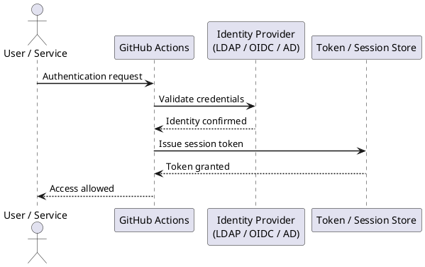

---
tags:
  - github-actions
  - security
---
# GitHub Actions — Authentication

```yaml
# Default token usage
jobs:
  build:
    runs-on: ubuntu-24.04
    steps:
      - uses: actions/checkout@v4
        with:
          token: ${{ secrets.GITHUB_TOKEN }}

      - name: Call GitHub API
        run: |
          curl -H "Authorization: Bearer ${{ secrets.GITHUB_TOKEN }}" \
               https://api.github.com/repos/${{ github.repository }}
```

```bash
# Create a fine-grained PAT at:
# GitHub → Settings → Developer settings → Personal access tokens → Fine-grained tokens

# Store as a repository secret, then reference in workflows
- name: Cross-repo checkout
  uses: actions/checkout@v4
  with:
    repository: myorg/other-repo
    token: ${{ secrets.PAT_TOKEN }}
```
```d2
direction: right

githubToken: "GITHUB_TOKEN\nAuto-generated per run\nScoped to repo" {shape: rectangle}
ghApi: "GitHub API\nGHCR / Releases" {shape: rectangle}
oidc: "OIDC JWT\nShort-lived token\nno stored secrets" {shape: rectangle}
cloudProv: "AWS / GCP / Azure" {shape: rectangle}
pat: "Fine-grained PAT\nStored as repo secret\nDays to years" {shape: rectangle}
otherRepo: "Other repos\nadmin ops" {shape: rectangle}
classicPat: "Classic PAT\nBroad scope\nAvoid — legacy" {shape: rectangle}

githubToken -> ghApi
oidc -> cloudProv
pat -> otherRepo
```



## Before you begin

- **Access:** Admin credentials on all affected systems
- **Change management:** security changes require CAB approval in most environments
- **Rollback plan:** document current state before any security control change
- **Testing:** validate in a non-production environment first where possible

---

---

## See also

- [GitHub Actions — Access Control](../access-control/)
- [GitHub Actions — Hardening](../hardening/)
- [GitHub Actions — Encryption](../encryption/)
