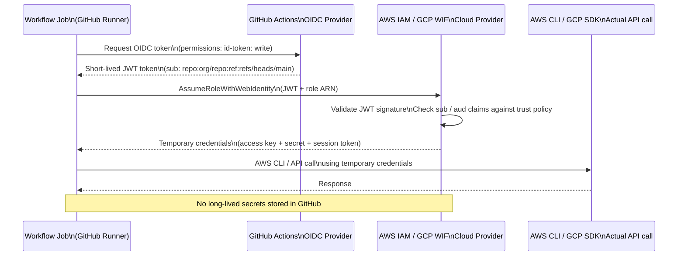
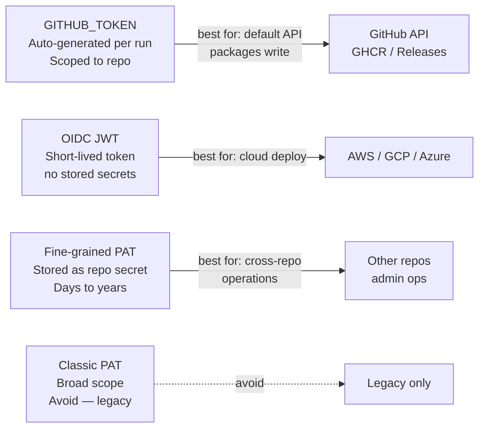

# GitHub Actions — Authentication

> Part of the [GitHub Actions Security](../) reference.

---

## GITHUB_TOKEN

Every workflow run is automatically granted a `GITHUB_TOKEN` — a short-lived token scoped to the repository and the run.

```yaml
# Default token usage
jobs:
  build:
    runs-on: ubuntu-24.04
    steps:
      - uses: actions/checkout@v4
        with:
          token: ${{ secrets.GITHUB_TOKEN }}

      - name: Call GitHub API
        run: |
          curl -H "Authorization: Bearer ${{ secrets.GITHUB_TOKEN }}" \
               https://api.github.com/repos/${{ github.repository }}
```

The token expires when the workflow job finishes. Grant only the permissions needed.

## OIDC — Keyless Cloud Authentication



OIDC lets workflows authenticate to cloud providers without storing long-lived credentials as secrets.

```yaml
# AWS OIDC setup
permissions:
  id-token: write
  contents: read

steps:
  - name: Configure AWS credentials via OIDC
    uses: aws-actions/configure-aws-credentials@v4
    with:
      role-to-assume: arn:aws:iam::123456789012:role/github-actions-role
      aws-region: eu-west-1

  - name: Use AWS CLI
    run: aws s3 ls s3://my-bucket
```

```yaml
# GCP OIDC setup
- name: Authenticate to GCP
  uses: google-github-actions/auth@v2
  with:
    workload_identity_provider: projects/123/locations/global/workloadIdentityPools/github/providers/github
    service_account: deploy@myproject.iam.gserviceaccount.com
```

## Personal Access Tokens (PAT)

PATs are used when `GITHUB_TOKEN` lacks sufficient scope (e.g., cross-repository operations).

```bash
# Create a fine-grained PAT at:
# GitHub → Settings → Developer settings → Personal access tokens → Fine-grained tokens

# Store as a repository secret, then reference in workflows
- name: Cross-repo checkout
  uses: actions/checkout@v4
  with:
    repository: myorg/other-repo
    token: ${{ secrets.PAT_TOKEN }}
```

## Authentication Reference

| Method | Scope | Lifetime | Best for |
|---|---|---|---|
| `GITHUB_TOKEN` | Current repo | Single run | Default — most operations |
| OIDC | Cloud provider | Token per request | AWS, GCP, Azure — no stored secrets |
| Fine-grained PAT | Selected repos | Days to years | Cross-repo, admin operations |
| Classic PAT | All repos | Set by user | Legacy — avoid where possible |


