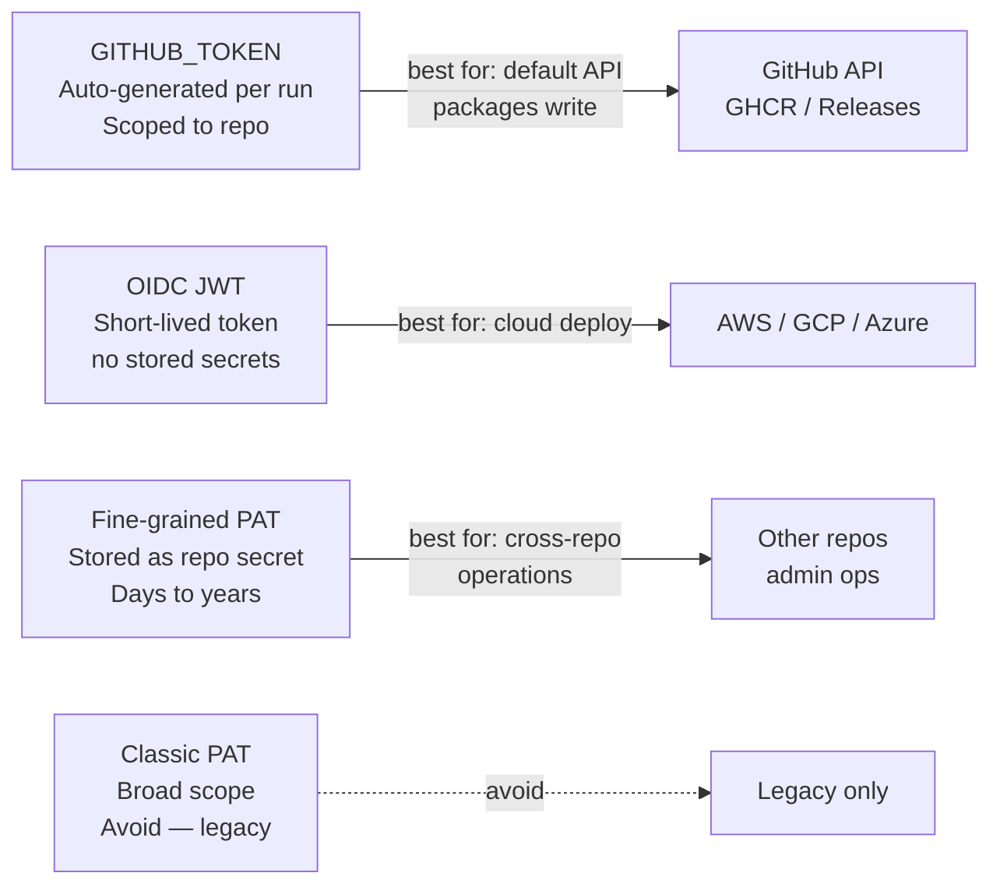

# GitHub Actions — Authentication


<div class="kb-summary">
> Part of the [GitHub Actions Security](../index.md) reference.
</div>

---

## GITHUB_TOKEN

Every workflow run is automatically granted a `GITHUB_TOKEN` — a short-lived token scoped to the repository and the run.

```yaml
# Default token usage
jobs:
  build:
    runs-on: ubuntu-24.04
    steps:
      - uses: actions/checkout@v4
        with:
          token: ${{ secrets.GITHUB_TOKEN }}

      - name: Call GitHub API
        run: |
          curl -H "Authorization: Bearer ${{ secrets.GITHUB_TOKEN }}" \
               https://api.github.com/repos/${{ github.repository }}
```
┌─────────────────────────────────── GitHub Actions — Authentication ───────────────────────────────────┐
│   ┌───────────────────────────────────────────────────────────────────────────────────────────────┐   │
│   │ GitHub Actions authentication: GITHUB_TOKEN for GitHub API; OIDC for cloud; secrets for others│   │
│   │    OIDC preferred for AWS/Azure/GCP — no stored secrets; short-lived token per workflow run   │   │
│   │      Service accounts: use GitHub Apps (fine-grained token) over PATs for org-wide access     │   │
│   └───────────────────────────────────────────────────────────────────────────────────────────────┘   │
│                                                                                                       │
│   ┌──────────────────────────────────────────────┐  ┌─────────────────────────────────────────────┐   │
│   │                 GitHub Auth                  │  │              Cloud Auth (OIDC)              │   │
│   │          GITHUB_TOKEN: auto per job          │  │       aws-actions/configure-aws-creds       │   │
│   │        GitHub App: installation token        │  │       role-to-assume: arn:aws:iam::...      │   │
│   │          PAT: scoped personal token          │  │           Azure: azure/login@<sha>          │   │
│   │        Deploy key: repo-level SSH key        │  │        GCP: auth.yml with workload id       │   │
│   └──────────────────────────────────────────────┘  └─────────────────────────────────────────────┘   │
│                                                                                                       │
│   ┌───────────────────────────────────────────────────────────────────────────────────────────────┐   │
│   │ GitHub App      = machine identity; fine-grained permissions; short-lived installation tokens │   │
│   │        PAT           = Personal Access Token; scoped to user; avoid for org automation        │   │
│   │      OIDC token    = JWT issued by GitHub; cloud trusts issuer; exchanged for cloud cred      │   │
│   └───────────────────────────────────────────────────────────────────────────────────────────────┘   │
└───────────────────────────────────────────────────────────────────────────────────────────────────────┘
```
```sql

## Personal Access Tokens (PAT)

PATs are used when `GITHUB_TOKEN` lacks sufficient scope (e.g., cross-repository operations).

```bash
# Create a fine-grained PAT at:
# GitHub → Settings → Developer settings → Personal access tokens → Fine-grained tokens

# Store as a repository secret, then reference in workflows
- name: Cross-repo checkout
  uses: actions/checkout@v4
  with:
    repository: myorg/other-repo
    token: ${{ secrets.PAT_TOKEN }}
```

## Authentication Reference

| Method | Scope | Lifetime | Best for |
|---|---|---|---|
| `GITHUB_TOKEN` | Current repo | Single run | Default — most operations |
| OIDC | Cloud provider | Token per request | AWS, GCP, Azure — no stored secrets |
| Fine-grained PAT | Selected repos | Days to years | Cross-repo, admin operations |
| Classic PAT | All repos | Set by user | Legacy — avoid where possible |


