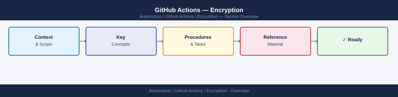
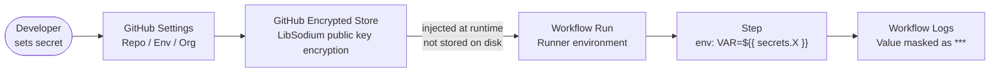

---
tags:
  - github-actions
  - security
---
# GitHub Actions — Encryption


<div class="kb-summary">
GitHub Actions encryption: encrypted secrets storage, environment-level secret scoping, OIDC token federation for AWS and Azure, and artifact encryption policies.

*Applies to: GitHub Actions*
</div>



---

```d2
direction: down

secrets_management: "Secrets Management" {shape: rectangle}
masking_dynamic_values: "Masking Dynamic Values" {shape: rectangle}

secrets_management -> masking_dynamic_values: hardens
```

## Before you begin

- **Access:** Admin credentials on all affected systems
- **Change management:** security changes require CAB approval in most environments
- **Rollback plan:** document current state before any security control change
- **Testing:** validate in a non-production environment first where possible

---

## Secrets Management




## Masking Dynamic Values

```yaml
# Mask a dynamically generated value in logs
- name: Get token
  id: auth
  run: |
    TOKEN=$(get-token.sh)
    echo "::add-mask::$TOKEN"
    echo "token=$TOKEN" >> "$GITHUB_OUTPUT"

# Never echo a secret directly — it will appear as ***
# but the pattern is still bad practice:
# run: echo ${{ secrets.MY_SECRET }}  # avoid this
```

---

## See also

- [GitHub Actions — Hardening](../hardening/)
- [GitHub Actions — Authentication](../authentication/)
- [GitHub Actions — Access Control](../access-control/)
