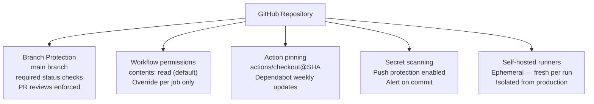

# GitHub Actions — Hardening

> Part of the [GitHub Actions Security](../index.md) reference.

---

## Minimal Permissions



## Pinning Action Versions

Third-party actions should be pinned to a specific commit SHA to prevent supply-chain attacks.

```yaml
# Avoid floating tags like @main or @master
steps:
  - uses: actions/checkout@v4           # semver tag (acceptable)

  # Preferred: pin to the exact SHA
  - uses: actions/checkout@11bd71901bbe5b1630ceea73d27597364c9af683  # v4.2.2
```

Use Dependabot to keep pinned actions up to date automatically:

```yaml
# .github/dependabot.yml
version: 2
updates:
  - package-ecosystem: github-actions
    directory: /
    schedule:
      interval: weekly
    groups:
      actions:
        patterns: ["*"]
```

## Branch Protection

Require workflow checks to pass before merging and prevent force-pushes.

```bash
# Enable branch protection with required status checks
gh api --method PUT /repos/OWNER/REPO/branches/main/protection \
  --input - <<'EOF'
{
  "required_status_checks": {
    "strict": true,
    "contexts": ["build", "test"]
  },
  "enforce_admins": true,
  "required_pull_request_reviews": {
    "required_approving_review_count": 1
  },
  "restrictions": null
}
EOF
```

## Hardening Reference

| Control | Recommendation |
|---|---|
| Token permissions | Use `permissions:` block; default to `contents: read` |
| Action pinning | Pin to SHA; use Dependabot for updates |
| Branch protection | Require status checks and PR reviews on main |
| Self-hosted runners | Isolate from production; use ephemeral runners |
| Secret scanning | Enable push protection to block commits with secrets |
| Audit log | Review `gh api /orgs/OWNER/audit-log` for anomalies |


