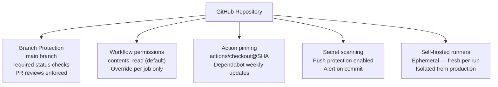
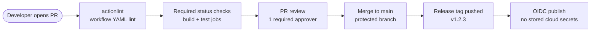

# GitHub Actions — Hardening


<div class="kb-summary">
> Part of the [GitHub Actions Security](../index.md) reference.
</div>

---

## Minimal Permissions


┌───────────────────────────────────── GitHub Actions — Hardening ──────────────────────────────────────┐
│   ┌───────────────────────────────────────────────────────────────────────────────────────────────┐   │
│   │    Harden GitHub Actions against supply chain attacks, secret exposure, and privilege abuse   │   │
│   │   Org settings: restrict allowed actions, require approval for first-time fork contributors   │   │
│   │    Self-hosted runner: ephemeral mode, isolated network, minimal tools, no persistent state   │   │
│   └───────────────────────────────────────────────────────────────────────────────────────────────┘   │
│                                                                                                       │
│   ┌──────────────────────────────────────────────┐  ┌─────────────────────────────────────────────┐   │
│   │             Org-Level Hardening              │  │               Runner Hardening              │   │
│   │        Allowed actions: only verified        │  │         Ephemeral: --ephemeral flag         │   │
│   │          Fork PR approval required           │  │          Network: egress allowlist          │   │
│   │       Secrets: no org secrets in forks       │  │           No admin tools on runner          │   │
│   │         Branch protection on default         │  │       Read-only filesystem where poss       │   │
│   │         Audit log enabled + exported         │  │       Separate runner per environment       │   │
│   └──────────────────────────────────────────────┘  └─────────────────────────────────────────────┘   │
│                                                                                                       │
│   ┌───────────────────────────────────────────────────────────────────────────────────────────────┐   │
│   │       Ephemeral runner = deregisters after each job; prevents state leakage between runs      │   │
│   │     Egress allowlist = firewall rules on runner host limiting outbound to known endpoints     │   │
│   │ Audit log        = org-level log of all Actions events; export to SIEM for long-term retention│   │
│   └───────────────────────────────────────────────────────────────────────────────────────────────┘   │
└───────────────────────────────────────────────────────────────────────────────────────────────────────┘

Use Dependabot to keep pinned actions up to date automatically:

```yaml
# .github/dependabot.yml
version: 2
updates:
  - package-ecosystem: github-actions
    directory: /
    schedule:
      interval: weekly
    groups:
      actions:
        patterns: ["*"]
```

## Branch Protection

Require workflow checks to pass before merging and prevent force-pushes.

```bash
# Enable branch protection with required status checks
gh api --method PUT /repos/OWNER/REPO/branches/main/protection \
  --input - <<'EOF'
{
  "required_status_checks": {
    "strict": true,
    "contexts": ["build", "test"]
  },
  "enforce_admins": true,
  "required_pull_request_reviews": {
    "required_approving_review_count": 1
  },
  "restrictions": null
}
EOF
```

## Hardening Reference

| Control | Recommendation |
|---|---|
| Token permissions | Use `permissions:` block; default to `contents: read` |
| Action pinning | Pin to SHA; use Dependabot for updates |
| Branch protection | Require status checks and PR reviews on main |
| Self-hosted runners | Isolate from production; use ephemeral runners |
| Secret scanning | Enable push protection to block commits with secrets |
| Audit log | Review `gh api /orgs/OWNER/audit-log` for anomalies |


