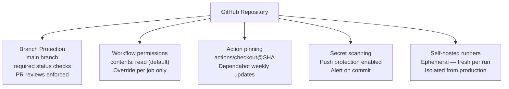

---
tags:
  - github-actions
  - security
---
# GitHub Actions — Hardening

<div class="kb-summary">
GitHub Actions hardening: pinning actions to commit SHAs, restricting workflow triggers, disabling token permissions, branch protection rules, and audit log review.

*Applies to: GitHub Actions*
</div>

---

```d2
direction: down

minimal_permissions: "Minimal Permissions" {shape: rectangle}
branch_protection: "Branch Protection" {shape: rectangle}
hardening_reference: "Hardening Reference" {shape: rectangle}

minimal_permissions -> branch_protection: hardens
branch_protection -> hardening_reference: hardens
```

## Before you begin

- **Access:** Admin credentials on all affected systems
- **Change management:** security changes require CAB approval in most environments
- **Rollback plan:** document current state before any security control change
- **Testing:** validate in a non-production environment first where possible

---

## Minimal Permissions



## Branch Protection

Require workflow checks to pass before merging and prevent force-pushes.

```bash
# Enable branch protection with required status checks
gh api --method PUT /repos/OWNER/REPO/branches/main/protection \
  --input - <<'EOF'
{
  "required_status_checks": {
    "strict": true,
    "contexts": ["build", "test"]
  },
  "enforce_admins": true,
  "required_pull_request_reviews": {
    "required_approving_review_count": 1
  },
  "restrictions": null
}
EOF
```

## Hardening Reference

| Control | Recommendation |
|---|---|
| Token permissions | Use `permissions:` block; default to `contents: read` |
| Action pinning | Pin to SHA; use Dependabot for updates |
| Branch protection | Require status checks and PR reviews on main |
| Self-hosted runners | Isolate from production; use ephemeral runners |
| Secret scanning | Enable push protection to block commits with secrets |
| Audit log | Review `gh api /orgs/OWNER/audit-log` for anomalies |


---

## See also

- [GitHub Actions — Authentication](../authentication/)
- [GitHub Actions — Access Control](../access-control/)
- [GitHub Actions — Encryption](../encryption/)
