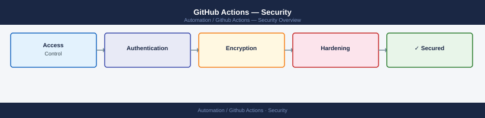

---
tags:
  - github-actions
  - security
---
# GitHub Actions — Security

Workflow secrets management, OIDC token auth, permission scoping, branch protection, and GitHub Actions runner hardening.

*Applies to: GitHub Actions*

<a class="kb-card" href="authentication/">
  <strong>Authentication</strong>
  GitHub tokens, OIDC, and authentication configuration.
</a>

<a class="kb-card" href="access-control/">
  <strong>Access Control</strong>
  Repository permissions, environments, and least privilege.
</a>

<a class="kb-card" href="encryption/">
  <strong>Encryption</strong>
  Secrets management and encrypted communication.
</a>

<a class="kb-card" href="hardening/">
  <strong>Hardening</strong>
  Security baselines and workflow security practices.
</a>

