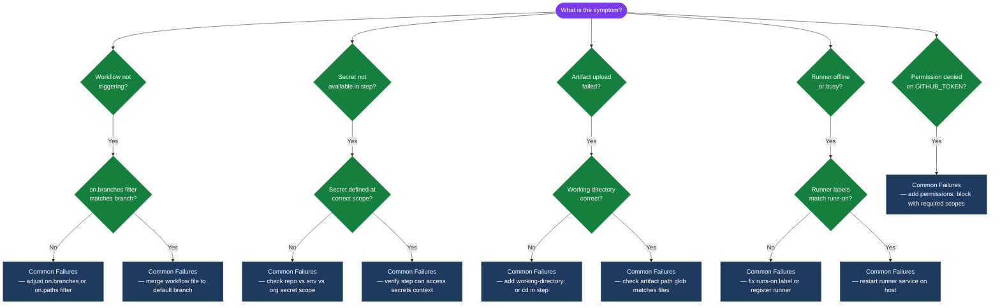

---
tags:
  - github-actions
  - troubleshooting
search:
  boost: 1.5
---
# GitHub Actions — Common Issues


<div class="kb-summary">
Part of the [GitHub Actions Troubleshooting](../index.md) reference.

*Applies to: GitHub Actions*
</div>

---

## Diagnostic Flow



---

## Before you begin

- **Access:** Admin credentials on all affected systems
- **Gather first:** recent error message text, event timestamps, and affected object names
- **Scope:** confirm whether the issue affects a single object, host, cluster, or site
- **Escalation:** open a vendor support ticket before running any destructive step
- **Logging:** document each command and output — required if escalation is needed

---

## Common Failures


```text
┌─────────────────────────────────── GitHub Actions — Common Issues ────────────────────────────────────┐
│   ┌───────────────────────────────────────────────────────────────────────────────────────────────┐   │
│   │                     Most frequent GitHub Actions failures and their fixes                     │   │
│   └───────────────────────────────────────────────────────────────────────────────────────────────┘   │
│                                                                                                       │
│   ┌───────────────────────────────────────────────────────────────────────────────────────────────┐   │
│   │                             Issue: Job queued but never picked up                             │   │
│   │     Cause A: no runner with matching labels → fix: add label to runner or change runs-on:     │   │
│   │    Cause B: all runners busy → fix: scale runner pool or add GitHub-hosted runner fallback    │   │
│   │               Cause C: runner offline → fix: sudo ./svc.sh start on runner host               │   │
│   └───────────────────────────────────────────────────────────────────────────────────────────────┘   │
│                                                                                                       │
│   ┌───────────────────────────────────────────────────────────────────────────────────────────────┐   │
│   │                                Issue: OIDC token request fails                                │   │
│   │       Cause A: permissions: id-token: write missing → fix: add to workflow permissions:       │   │
│   │      Cause B: cloud trust policy wrong → fix: verify sub claim matches workflow ref/repo      │   │
│   │       Cause C: wrong region/audience → fix: check aws-actions configure-creds parameters      │   │
│   └───────────────────────────────────────────────────────────────────────────────────────────────┘   │
│                                                                                                       │
│   ┌───────────────────────────────────────────────────────────────────────────────────────────────┐   │
│   │                             Issue: Workflow not triggering on push                            │   │
│   │        Cause A: on: branches filter does not match current branch → fix: adjust filter        │   │
│   │       Cause B: workflow file not on default branch → fix: merge to default branch first       │   │
│   └───────────────────────────────────────────────────────────────────────────────────────────────┘   │
└───────────────────────────────────────────────────────────────────────────────────────────────────────┘
```

---

## Verify resolution

- Confirm the original symptom no longer occurs
- Check logs for any residual errors related to the issue
- Monitor for 10–15 minutes to confirm the fix is stable

---

## See also

- [GitHub Actions — Diagnostics](../diagnostics/)
- [GitHub Actions — Escalation](../escalation/)
- [GitHub Actions — Health Checks](../../operations/health-checks/)
