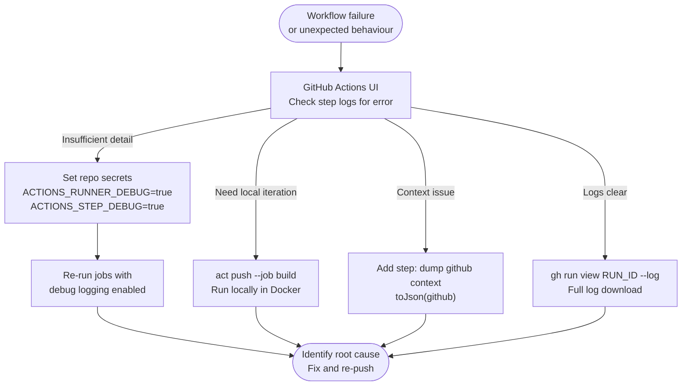

# GitHub Actions — Diagnostics

> Part of the [GitHub Actions Troubleshooting](../index.md) reference.

---

## Debug Logging


```

```yaml
# Add a debug step to print all context objects
- name: Dump GitHub context
  env:
    GITHUB_CONTEXT: ${{ toJson(github) }}
  run: echo "$GITHUB_CONTEXT"

- name: Dump runner context
  env:
    RUNNER_CONTEXT: ${{ toJson(runner) }}
  run: echo "$RUNNER_CONTEXT"
```

## Running Workflows Locally with act

`act` runs GitHub Actions locally using Docker, shortening the feedback loop.

```bash
# Install act (macOS)
brew install act

# List available jobs
act --list

# Run the default push event
act push

# Run a specific job
act push --job build

# Run with a specific secret
act push -s MY_SECRET=value

# Use a smaller runner image
act push -P ubuntu-24.04=catthehacker/ubuntu:act-24.04

# Dry-run (no execution)
act --dryrun push
```

## Inspecting Workflow Runs

```bash
# List recent workflow runs
gh run list --repo owner/repo --limit 20

# View a specific run
gh run view 12345678

# Watch a run in real time
gh run watch 12345678

# Download logs from a failed run
gh run download 12345678 --dir ./run-logs

# Re-run only failed jobs
gh run rerun 12345678 --failed

# Cancel a running workflow
gh run cancel 12345678
```
