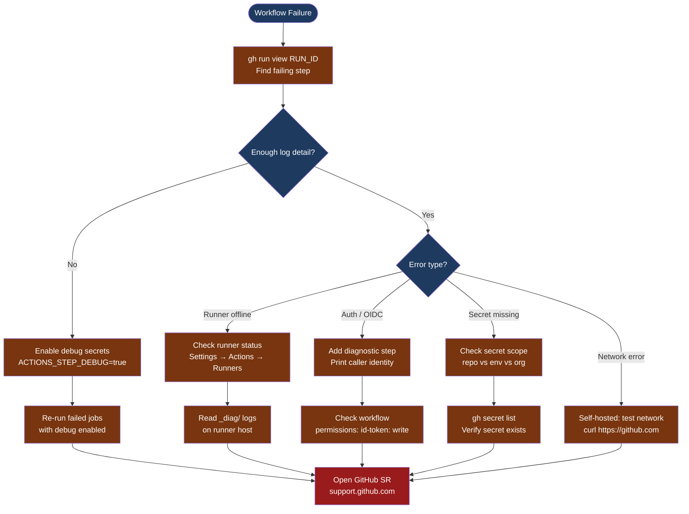

---
tags:
  - github-actions
  - troubleshooting
search:
  boost: 1.5
---
# GitHub Actions — Diagnostics

<div class="kb-summary">
GitHub Actions diagnostic commands: enable step-level debug logging, inspect run logs with gh CLI, diagnose self-hosted runner failures, debug OIDC and secret injection issues, and collect runner _diag/ logs for GitHub support cases.

*Applies to: GitHub Actions (Cloud and self-hosted runners)*
</div>



```d2
direction: down

symptom: Identify Symptom {shape: diamond}
step_1_inspect_run_logs_with_gh_cli: "Step 1 — Inspect run logs with gh CLI" {shape: rectangle}
step_2_enable_debug_logging: "Step 2 — Enable debug logging" {shape: rectangle}
step_3_diagnose_oidc_and_authenticat: "Step 3 — Diagnose OIDC and authentication issues" {shape: rectangle}
step_4_check_secrets_and_variables: "Step 4 — Check secrets and variables" {shape: rectangle}
step_5_diagnose_selfhosted_runner_is: "Step 5 — Diagnose self-hosted runner issues" {shape: rectangle}
log_locations: "Log locations" {shape: rectangle}
resolution: Resolve or Escalate {shape: oval}

symptom -> step_1_inspect_run_logs_with_gh_cli: investigate
symptom -> step_2_enable_debug_logging: investigate
symptom -> step_3_diagnose_oidc_and_authenticat: investigate
symptom -> step_4_check_secrets_and_variables: investigate
symptom -> step_5_diagnose_selfhosted_runner_is: investigate
symptom -> log_locations: investigate
step_1_inspect_run_logs_with_gh_cli -> resolution
step_2_enable_debug_logging -> resolution
step_3_diagnose_oidc_and_authenticat -> resolution
step_4_check_secrets_and_variables -> resolution
step_5_diagnose_selfhosted_runner_is -> resolution
log_locations -> resolution
```

## Before you begin

- **Access:** Repository admin or Actions write access; `gh` CLI authenticated (`gh auth login`)
- **Gather first:** the run ID (shown in the Actions UI URL), the failing step name, and the exact error text from the step log
- **Scope:** confirm whether the failure is in a specific step, a specific job, only on self-hosted runners, or all workflows in the repository
- **Secrets caution:** debug secrets (`ACTIONS_STEP_DEBUG`, `ACTIONS_RUNNER_DEBUG`) cause verbose output that may include environment variable values — never set these in public repositories

---

## Step 1 — Inspect run logs with gh CLI

```bash
# List recent workflow runs for a repository
gh run list --repo <owner>/<repo> --limit 20
# Output columns: STATUS, TITLE, WORKFLOW, BRANCH, EVENT, ID, ELAPSED

# View a specific run summary
gh run view <run-id>
# Shows: job list, each job's status, timing

# View detailed logs for a run (all jobs)
gh run view <run-id> --log
# Streams the complete log; useful for piping through grep

# View only failing steps (faster for long runs)
gh run view <run-id> --log-failed

# Download all log artifacts as a ZIP
gh run download <run-id> --dir ./run-logs-<run-id>
# Each job gets its own directory; each step has a log file

# Watch a currently-running workflow in real time
gh run watch <run-id>

# Search logs for a specific error pattern
gh run view <run-id> --log | grep -i "error\|failed\|exit code"
```

---

## Step 2 — Enable debug logging

Debug logging is activated by setting repository (or environment) secrets — not variables.

```text
To enable in GitHub UI:
  1. Navigate to: Repository → Settings → Secrets and variables → Actions
  2. Click "New repository secret"
  3. Add: Name = ACTIONS_STEP_DEBUG, Value = true
  4. Add: Name = ACTIONS_RUNNER_DEBUG, Value = true
  5. Re-run the failing jobs: Actions → select the run → Re-run failed jobs

ACTIONS_STEP_DEBUG = true  → enables verbose output for each step (e.g., shows npm install details, docker build layers)
ACTIONS_RUNNER_DEBUG = true → enables verbose host-level runner output (network, process, file system operations)

Remove these secrets when done — they increase log volume significantly.
```

To dump all environment variables in a workflow step (useful for diagnosing secret injection and context issues):

```yaml
- name: Dump environment
  run: env | sort
  # WARNING: this will print all env vars including injected secrets as masked values
  # Secrets show as *** but their PRESENCE is confirmed

- name: Dump GitHub context
  run: echo '${{ toJSON(github) }}'

- name: Dump runner context
  run: echo '${{ toJSON(runner) }}'
```

---

## Step 3 — Diagnose OIDC and authentication issues

GitHub Actions can obtain short-lived cloud tokens via OIDC. If OIDC fails, verify the workflow permissions and the cloud trust policy.

```yaml
# Required permission block for OIDC token issuance
permissions:
  id-token: write
  contents: read
```

```bash
# Add a diagnostic step in the workflow to verify identity after OIDC
# For AWS:
- name: Verify OIDC identity
  run: aws sts get-caller-identity
  # Expected JSON: { "UserId": "...", "Account": "123456789012", "Arn": "arn:aws:sts::..." }
  # If fails: "An error occurred (AccessDenied)" → OIDC trust policy is not matching the token claims

# For Azure:
- name: Verify Azure identity
  run: az account show
  # Expected: subscription details showing the service principal

# GitHub OIDC token claims that the cloud trust policy must match:
#   iss:  https://token.actions.githubusercontent.com
#   sub:  repo:<owner>/<repo>:ref:refs/heads/<branch>   (or :environment:<name>)
#   aud:  sts.amazonaws.com (AWS) or api://AzureADTokenExchange (Azure)
```

**If OIDC fails with "AccessDenied" or "InvalidIdentityToken":**
1. Verify the workflow has `permissions: id-token: write`
2. Check the cloud trust policy `Condition` block — the `sub` claim must match the exact branch or environment
3. For GitHub Enterprise: verify the OIDC provider URL matches your GHE instance hostname

---

## Step 4 — Check secrets and variables

```bash
# List all secrets defined in a repository (names only; values are never shown)
gh secret list --repo <owner>/<repo>

# List secrets for a specific environment
gh secret list --repo <owner>/<repo> --env <environment-name>

# List organization-level secrets
gh secret list --org <org-name>

# Set a secret from CLI (e.g., to update a rotated credential)
gh secret set MY_SECRET --repo <owner>/<repo> < /path/to/secret-value.txt
```

**Secret scope troubleshooting:**
- If a secret is set at org level but the job uses it via an environment, confirm the environment has the org secret listed under "Inherited secrets"
- If the secret is `***` in the log but the step still fails auth, the secret value itself may be wrong — re-set it
- If `${{ secrets.MY_SECRET }}` evaluates to an empty string, the secret name is likely misspelled or the wrong scope (repo vs env)

---

## Step 5 — Diagnose self-hosted runner issues

```bash
# Check runner registration status in GitHub
# Repository → Settings → Actions → Runners
# Status: Idle (healthy), Offline (not connected), Active (running a job)

# On the self-hosted runner host:
cd /path/to/actions-runner

# Check runner service status (if configured as a service)
# On Linux (systemd):
sudo systemctl status actions.runner.<org>-<repo>.<runner-name>.service
sudo journalctl -u actions.runner.*.service -n 100 --no-pager

# On Windows:
Get-Service -DisplayName "GitHub Actions Runner*" | Select-Object Name, Status

# Read runner diagnostic logs
ls _diag/
# Files: Runner_<date>-<timestamp>-utc.log, Worker_<date>-<timestamp>-utc.log
# Runner_*.log: runner host registration and job reception
# Worker_*.log: individual job execution (one file per job run)

tail -200 _diag/Runner_*.log | grep -i "error\|warn\|fail"
tail -200 _diag/Worker_*.log | grep -i "error\|warn\|fail"

# Test network from runner host
curl -v https://github.com            # Must succeed (443)
curl -v https://api.github.com        # GitHub API endpoint
curl -v https://objects.githubusercontent.com  # Artifact/cache endpoint
nslookup github.com                   # DNS must resolve
```

**Common self-hosted runner problems:**
- `Runner is offline` → runner service crashed or host rebooted without auto-start; check systemd service
- `No runners matching labels` → job `runs-on` label doesn't match any registered runner; check label assignments
- `Workflow is pending` → all matching runners are busy; check runner concurrency limits
- `Token has expired` → runner registration token expired; re-register: `./config.sh --url <url> --token <new-token>`

---

## Log locations

| Component | Path / Location | What to look for |
|---|---|---|
| Run logs | GitHub UI → Actions → select run → download logs | Step-level output and timing |
| Runner diagnostics | `<runner-dir>/_diag/Runner_*.log` | Registration errors, job pickup failures |
| Job execution | `<runner-dir>/_diag/Worker_*.log` | Per-job execution trace |
| Runner service | `journalctl -u actions.runner.*.service` (Linux) | Service start/stop/crash events |
| GitHub audit log | Organization → Settings → Audit log | Workflow permission changes, secret access |

---

## See also

- [GitHub Actions — Common Issues](../common-issues/)
- [GitHub Actions — Escalation](../escalation/)
- [GitHub Actions — Health Checks](../../operations/health-checks/)

## Verify resolution

- The failing workflow run completes with a green checkmark on the same branch
- `gh run view <run-id>` shows all jobs as `completed` with `conclusion: success`
- If debug secrets were added, remove `ACTIONS_STEP_DEBUG` and `ACTIONS_RUNNER_DEBUG` after resolution
- For self-hosted runners: `systemctl status actions.runner.*` shows `active (running)` with no recent restarts
- Run the workflow 2–3 more times to confirm the fix is stable
