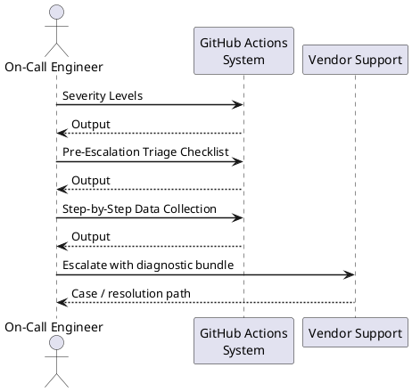
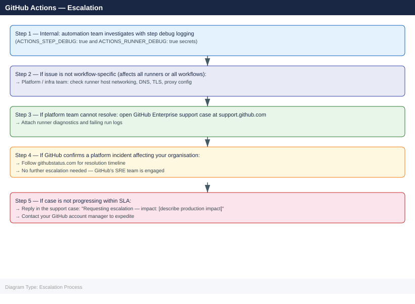

---
tags:
  - github-actions
  - troubleshooting
search:
  boost: 1.5
---
# GitHub Actions — Escalation

<div class="kb-summary">
GitHub Actions escalation: when to escalate to GitHub Enterprise Support, how to collect runner diagnostics, how to open a support case, and internal escalation path for workflow and runner failures.

*Applies to: GitHub Actions (cloud + self-hosted runners)*
</div>



## Before you begin

- **Access:** Repository admin or org owner access; for Enterprise support, account admin access to the GitHub Enterprise contract
- **Gather first:** run ID, workflow name, runner name, and exact error message from the failed job log
- **Scope:** confirm whether the issue affects a single workflow, all workflows on one runner, or all runners org-wide
- **Platform check:** always check `githubstatus.com` before escalating — GitHub incidents account for many runner and API failures
- **Logging:** enable step debug logging first (`ACTIONS_STEP_DEBUG: true` secret) to capture detailed output

---

## Severity Levels

| Severity | Definition | Escalation Path |
|---|---|---|
| Critical | CI/CD completely blocked for production deployments; secret leak suspected | Immediate: platform team + GitHub Enterprise support by phone |
| High | All self-hosted runners offline; OIDC auth broken for all workflows | Same day: platform team → open GitHub Enterprise case |
| Medium | Single runner type failing; specific workflow failing consistently | Next business day: automation team investigation |
| Low | Intermittent runner timeout; occasional step failure with clear retry | Team: investigate with step debug logging |

## Pre-Escalation Triage Checklist

Run through this before opening a GitHub Enterprise support case.

| Check | Command / Action | Expected |
|---|---|---|
| GitHub platform status | `curl https://www.githubstatus.com/api/v2/status.json \| jq '.status'` | `description: "All Systems Operational"` |
| GitHub Actions status | Check githubstatus.com → Actions component | No active incident |
| Issue affects all runners | Test with a minimal workflow on a different runner label | If only one runner, it is a runner issue |
| Minimal workflow reproduces issue | Create a 3-step test workflow and trigger manually | Confirm if issue is workflow-specific or runner-global |
| Runner registration valid | Organization Settings → Actions → Runners | Runner shows "Active" or "Idle" |
| Runner version current | Compare runner version to github.com/actions/runner/releases | Outdated runner versions cause authentication errors |
| OIDC token endpoint reachable | Check workflow has `id-token: write` permission | OIDC requires explicit permission declaration |

---

## Step-by-Step Data Collection

Collect all of the following before opening a support case.

### 1. Get the failing run details

```bash
# Install GitHub CLI if not present: https://cli.github.com/
gh auth login

# View run details and logs for a specific run ID
gh run view <run-id> --log

# Download all logs for a run (saves to ./run-<id>/)
gh run download <run-id> --dir ./run-logs-$(date +%F)

# List recent failed runs for a repository
gh run list --status failure --limit 20
```


```text title="Expected output"
? What is your preferred protocol for git operations? HTTPS
? Authenticate Git with your GitHub credentials? Yes
? How would you like to authenticate GitHub CLI? Login with a web browser

! First copy your one-time code: F4D2-A8C9
Press Enter to open github.com in your browser...
✓ Authentication complete. Logged in as devops-admin

Name                                    Status      Conclusion  Workflow              Run ID    Created
Deploy to Production                    completed   failure     deploy.yml            8472651   2024-01-15T14:32:10Z
Build and Test Suite                    completed   failure     ci.yml                8472598   2024-01-15T13:18:45Z
Security Scan                           completed   success     security.yml          8472547   2024-01-15T12:05:22Z
Unit Tests                              completed   failure     test.yml              8472489   2024-01-15T11:42:18Z
...

Downloading logs for run 8472651...
✓ Downloaded to ./run-logs-2024-01-15/
```

!!! warning "Common errors"
    **`authentication required`** — Run `gh auth login` first to authenticate with GitHub.
    **`HTTP 404: Not Found`** — Verify the run ID exists and you have access to the repository with `gh run list`.
    **`permission denied while trying to connect to the Docker daemon`** — This is a workflow runtime issue, not a CLI issue; check the run logs with `gh run view <run-id> --log` to see the actual failure in the Actions environment.
### 2. Collect self-hosted runner diagnostics

```bash
# Runner diagnostics are in _diag/ under the runner install directory
ls -la /opt/actions-runner/_diag/

# Collect the most recent runner log files
ls -lt /opt/actions-runner/_diag/ | head -10
cp /opt/actions-runner/_diag/*.log /tmp/runner-diag-$(date +%F)/

# Get runner registration info (includes runner ID and org)
cat /opt/actions-runner/.runner

# Check runner service status (Linux)
sudo systemctl status actions.runner.*.service

# Check runner service status (macOS)
launchctl list | grep actions.runner

# Get runner application version
cat /opt/actions-runner/package.json | python3 -c "import sys,json; d=json.load(sys.stdin); print(d.get('version','unknown'))"
```


```text title="Expected output"
total 2048
drwxr-xr-x  8 runner runner    4096 Jan 15 10:42 .
drwxr-xr-x  5 runner runner    4096 Jan 10 09:15 ..
-rw-r--r--  1 runner runner  512000 Jan 15 10:42 Worker_20250115-104215_abc123de.log
-rw-r--r--  1 runner runner  384000 Jan 15 10:15 Worker_20250115-101530_xyz789ab.log
-rw-r--r--  1 runner runner  256000 Jan 15 09:45 Runner_20250115-094512_def456gh.log
-rw-r--r--  1 runner runner  128000 Jan 15 09:12 Runner_20250115-091200_ijk012mn.log
-rw-r--r--  1 runner runner   64000 Jan 15 08:30 Startup_20250115-083000_opq345rs.log
...
{
  "runnerId": 42,
  "runnerName": "ubuntu-runner-01",
  "runnerGroupId": 1,
  "workFolder": "_work"
}
● actions.runner.myorg.ubuntu-runner-01.service - GitHub Actions Runner (myorg.ubuntu-runner-01)
     Loaded: loaded (/etc/systemd/system/actions.runner.myorg.ubuntu-runner-01.service; enabled; vendor preset: enabled)
     Active: active (running) since Mon 2025-01-15 08:22:14 UTC; 2h 20min ago
     Main PID: 3847 (Runner.Listener)
       CGroup: /system.slice/actions.runner.myorg.ubuntu-runner-01.service
2.315.0
```

!!! warning "Common errors"
    **`cat: /opt/actions-runner/.runner: No such file or directory`** — Verify the runner is installed in /opt/actions-runner and re-run the installation script if the directory is missing.
    **`sudo: systemctl: command not found`** — Use `launchctl list | grep actions.runner` on macOS instead, or verify systemd is available on Linux systems.
    **`json.decoder.JSONDecodeError: Expecting value: line 1 column 1 (char 0)`** — Ensure /opt/actions-runner/package.json exists and is valid JSON; reinstall the runner if the file is corrupted.
### 3. Collect OIDC configuration (for OIDC/cloud auth issues)

```bash
# Check OIDC subject customization for the repo
gh api /repos/{owner}/{repo}/actions/oidc/customization/sub

# Check org-level OIDC policy
gh api /orgs/{org}/actions/oidc/customization/issuer

# Verify the workflow has correct permissions
grep -A5 'permissions:' .github/workflows/failing-workflow.yml
```


```text title="Expected output"
{
  "use_default": false,
  "include_claim_keys": [
    "repo",
    "context",
    "actor"
  ]
}
{
  "issuer_url": "https://token.actions.githubusercontent.com",
  "audiance": "sts.amazonaws.com"
}
permissions:
  id-token: write
  contents: read
  deployments: write
```

!!! warning "Common errors"
    **`HTTP 404: Not Found`** — Verify the repository slug format is correct and the repo exists with `gh repo view {owner}/{repo}`.
    **`Error: Not enough permissions to access this endpoint`** — Ensure your GitHub token has `admin:org_hook` and `repo` scopes by running `gh auth status`.
### 4. Export audit log (Enterprise only)

```bash
# Export last 100 audit log entries (requires org admin or enterprise admin)
gh api "/orgs/{org}/audit-log?phrase=action:workflows&per_page=100" \
  --paginate | python3 -c "import sys,json; [print(json.dumps(e)) for e in json.load(sys.stdin)]" \
  > audit-log-$(date +%F).jsonl
```


```text title="Expected output"
{"timestamp":"2024-01-15T14:32:18Z","action":"workflows.approve_workflow_run","actor":"alice-dev","org":"acme-corp","repo":"backend-service","workflow_id":2847,"conclusion":"success"}
{"timestamp":"2024-01-15T14:28:55Z","action":"workflows.disable_workflow","actor":"bob-admin","org":"acme-corp","repo":"infra-automation","workflow_name":"deploy-prod.yml","reason":"manual_disable"}
{"timestamp":"2024-01-15T13:45:22Z","action":"workflows.create_workflow_run","actor":"ci-bot","org":"acme-corp","repo":"frontend-app","branch":"main","workflow_id":1923}
{"timestamp":"2024-01-15T13:12:09Z","action":"workflows.approve_workflow_run","actor":"carol-lead","org":"acme-corp","repo":"data-pipeline","run_number":487}
{"timestamp":"2024-01-15T12:58:33Z","action":"workflows.update_workflow","actor":"alice-dev","org":"acme-corp","repo":"backend-service","file":".github/workflows/test.yml"}
...
```

!!! warning "Common errors"
    **`gh: Unauthorized (HTTP 403)`** — Verify your GitHub token has `admin:org_hook` and `read:org` scopes, or request org admin to grant audit log access.
    **`jq: parse error: Invalid JSON text at line 1`** — Remove the `python3` JSON processor and use `gh api --jq '.[] | @json'` instead for cleaner parsing.
    **`No such file or directory`** — Ensure the output directory exists and you have write permissions; create it with `mkdir -p logs/` before running the command.
### 5. Write the timeline

Create a plain text file:

```text
GitHub org / repo: myorg/myrepo
Runner label: self-hosted, linux, x64
Runner hostname: runner-001.example.com
Runner version: 2.314.1

Issue first observed: 2026-06-15 10:30 UTC
Last known good run: 2026-06-15 09:00 UTC
Workflow: deploy-production.yml (Job: build)
Run ID: 9876543210

Error message:
  Error: Process completed with exit code 1
  ##[error]Runner received signal: SIGTERM

Changes in 24h before issue:
  - Runner host OS updated (Ubuntu 22.04 kernel update applied)
  - No workflow changes

Blast radius:
  - All jobs on self-hosted runners are failing
  - GitHub-hosted runner jobs are not affected
```

---

## How to Open a GitHub Enterprise Support Case

1. Go to **support.github.com** and sign in with your Enterprise account.
   - If you cannot access the portal: contact your GitHub account manager to verify your Enterprise entitlement.

2. Click **Open a new ticket**.

3. Under **Product area**, select **Actions** for runner or workflow issues.

4. Under **Priority**, select:
   - **Urgent**: CI/CD completely blocked for production; security incident involving secrets
   - **High**: All runners offline; OIDC broken for the organisation
   - **Normal**: Single workflow or runner type failing
   - **Low**: Questions, feature requests, documentation issues

5. In the **Subject** field, write one sentence: `GitHub Actions self-hosted runner [runner-name] exiting with SIGTERM since [date/time] — all jobs failing`.

6. In the **Description**, paste:
   - GitHub org name and runner hostname
   - Failing run IDs (at least 3 examples)
   - Runner version and OS
   - Timeline (from step 5 above)
   - The `_diag/` log contents

7. Under **Attachments**, upload:
   - Runner diagnostic logs from `_diag/`
   - Workflow YAML file (`failing-workflow.yml`)
   - Run log download from `gh run download`
   - Audit log export (if OIDC or secret issue)

8. Click **Submit**. You will receive a ticket number by email.

---

## Escalation Path



---

## What NOT to Do

| Do NOT do this | Why | What to do instead |
|---|---|---|
| Delete and re-register the runner while jobs are queued | Queued jobs stay assigned to the old runner and will never run | Drain the runner first: disable it in org settings, wait for queue to clear |
| Rotate organisation secrets during an active incident | All in-flight workflows will fail immediately with auth errors | Only rotate after confirming the exact secret affected; communicate the outage window |
| Force-cancel all running jobs without notifying teams | May corrupt state in downstream systems (deployments, database migrations) | Identify which jobs are safe to cancel; cancel only after team review |
| Enable `ACTIONS_STEP_DEBUG` on production workflows permanently | Leaks environment variables and sensitive inputs to logs | Enable only for isolated debug runs; remove the secret immediately after |
| Downgrade the runner binary manually | Unsigned binaries may not authenticate; runner auto-updates will re-upgrade | Pin runner versions at org level through GitHub settings, not manual binary replacement |

---

## Useful Commands for Case Updates

```bash
# Confirm current GitHub platform status (include in every case update)
curl -s https://www.githubstatus.com/api/v2/components.json | \
  python3 -c "import sys,json; [print(f'{c[\"name\"]}: {c[\"status\"]}') for c in json.load(sys.stdin)['components']]"

# Get all failed runs in the last 24 hours across a repository
gh run list --status failure --created ">=2026-06-14" --json databaseId,displayTitle,conclusion,createdAt | \
  python3 -m json.tool

# Check if runner is receiving dispatched jobs
gh api /orgs/{org}/actions/runners --jq '.runners[] | {id, name, status, busy}'

# View specific step failure in a run
gh run view <run-id> --job <job-id> --log | grep -A10 "Error\|##\[error\]"

# Check workflow permissions
gh api /repos/{owner}/{repo}/actions/permissions/workflow

# List org-level secrets (names only, not values)
gh secret list --org {org}
```


```text title="Expected output"
GitHub: operational
Actions: operational
API Requests: operational
Webhooks: operational
Pages: operational
Codespaces: operational

[
  {
    "databaseId": 8947562341,
    "displayTitle": "Deploy to production",
    "conclusion": "failure",
    "createdAt": "2026-06-14T18:32:15Z"
  },
  {
    "databaseId": 8947501289,
    "displayTitle": "Unit tests",
    "conclusion": "failure",
    "createdAt": "2026-06-14T14:21:09Z"
  },
  {
    "databaseId": 8947445672,
    "displayTitle": "Build and push image",
    "conclusion": "failure",
    "createdAt": "2026-06-14T09:15:43Z"
  }
]

{
  "runners": [
    {
      "id": 742,
      "name": "ubuntu-runner-01",
      "status": "online",
      "busy": true
    },
    {
      "id": 741,
      "name": "ubuntu-runner-02",
      "status": "online",
      "busy": false
    },
    {
      "id": 739,
      "name": "macos-runner-prod",
      "status": "offline",
      "busy": false
    }
  ]
}

2026-06-14T18:32:15Z ##[error] Docker image build failed: exit code 1
2026-06-14T18:32:16Z Error: failed to push image to registry.example.com/app:latest
2026-06-14T18:32:17Z ##[error] Authentication token expired

{
  "enabled": true,
  "allowed_actions": "all",
  "selected_actions_url": ""
}

✓ SECRET_REGISTRY_TOKEN
✓ SLACK_WEBHOOK_URL
✓ DATABASE_PASSWORD
✓ DEPLOY_KEY
```

!!! warning "Common errors"
    **`gh: command not found`** — Install GitHub CLI with `brew install gh` (macOS) or `apt-get install gh` (Linux), then authenticate with `gh auth login`.
    **`HTTP 401: Bad credentials`** — Verify your GitHub token is valid and has `repo` and `admin:org_hook` scopes by running `gh auth status`.
    **`jq: command not found`** — Install jq with `brew install jq` (macOS) or `apt-get install jq` (Linux) for JSON filtering support.
---

## See also

- [GitHub Actions — Diagnostics](../diagnostics/)
- [GitHub Actions — Common Issues](../common-issues/)

---

## Verify resolution

- Confirm a re-triggered run on the affected runner completes successfully
- Check `_diag/` logs on the runner — no `Error` or `SIGTERM` entries during the new run
- Verify the specific job that was failing (build, deploy, test) passes end-to-end
- Monitor for 2–3 runs to confirm the fix is stable before removing any workarounds
