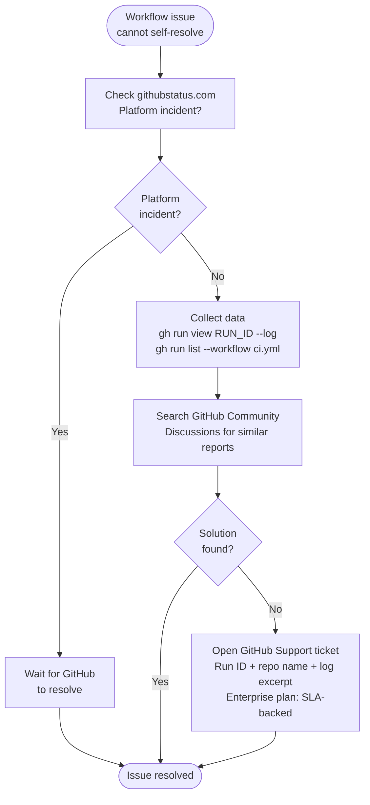

# GitHub Actions — Escalation

> Part of the [GitHub Actions Troubleshooting](../index.md) reference.

---

## GitHub Status and Known Issues

Before escalating, check whether the issue is a platform-wide incident.

```bash
# Check GitHub's status page
open https://githubstatus.com

# Subscribe to status notifications via the GitHub Status API
curl https://www.githubstatus.com/api/v2/status.json | jq '.status'
```
```

## Escalation Checklist

- [ ] Confirmed issue is not on the [GitHub Status page](https://githubstatus.com)
- [ ] Captured the full run ID and workflow file name
- [ ] Downloaded run logs: `gh run download RUN_ID --dir ./run-logs`
- [ ] Identified the exact step, error message, and exit code
- [ ] Reproduced the issue or confirmed it is consistent
- [ ] Checked GitHub Community discussions for similar reports
- [ ] Raised a support ticket with run ID, repo name, and log excerpt


