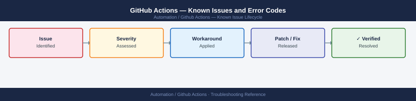

---
tags:
  - troubleshooting
  - github-actions
  - automation
  - known-issues
---
# GitHub Actions — Known Issues and Error Codes

<div class="kb-summary">
Catalog of known GitHub Actions bugs, error codes, and workarounds covering self-hosted runners, workflow failures, and secrets.

*Applies to: GitHub Actions (cloud), GitHub Enterprise self-hosted runners*
</div>



```d2
direction: down

symptom: Identify Symptom {shape: diamond}
selfhosted_runners: "Self-Hosted Runners" {shape: rectangle}
secrets_and_permissions: "Secrets and Permissions" {shape: rectangle}
workflow_failures: "Workflow Failures" {shape: rectangle}
resolution: Resolve or Escalate {shape: oval}

symptom -> selfhosted_runners: investigate
symptom -> secrets_and_permissions: investigate
symptom -> workflow_failures: investigate
selfhosted_runners -> resolution
secrets_and_permissions -> resolution
workflow_failures -> resolution
```

## Before you begin

- GitHub Actions errors appear in the workflow run UI → expand failed step.
- Self-hosted runner logs: `<runner-dir>/_diag/Runner_*.log`.
- Most self-hosted runner issues are outbound connectivity (TCP 443 to github.com) or permissions.

## Self-Hosted Runners

| Error / Symptom | Affected Versions | Cause | Workaround / Fix | Fixed In |
|---|---|---|---|---|
| Runner shows `Offline` in GitHub | Any | Runner service stopped or TCP 443 to github.com blocked | Restart runner: `./svc.sh start` (Linux) or Services.msc (Windows); verify TCP 443 outbound | N/A |
| Runner idle — jobs not picked up | Any | Runner labels don't match workflow `runs-on` label | Match runner labels in Settings → Actions → Runners to workflow `runs-on` | N/A |
| `Error: Process completed with exit code 1` — generic | Any | Script error in job step | Check step output; add `set -e` to bash scripts for early exit on error | N/A |

## Secrets and Permissions

| Error / Symptom | Affected Versions | Cause | Workaround / Fix | Fixed In |
|---|---|---|---|---|
| Secret shows `***` in log but job fails with auth error | Any | Secret value incorrect or missing from environment level | Check secret is set at correct scope (repo/org/env); update value | N/A |
| `Resource not accessible by integration` — GitHub API call | Any | GITHUB_TOKEN lacks required permission | Add permission to workflow: `permissions: {contents: read, issues: write}` | N/A |

## Workflow Failures

| Error / Symptom | Affected Versions | Cause | Workaround / Fix | Fixed In |
|---|---|---|---|---|
| Workflow not triggering on push | Any | Branch filter or path filter not matching; or workflow YAML syntax error | Validate YAML; check `on.push.branches` filter | N/A |
| Job stuck in `Queued` indefinitely | Any | No available runner matching labels | Check runner availability in Settings → Actions → Runners | N/A |

## See also

- [GitHub Actions — Common Issues](common-issues/)
- [Ansible — Known Issues](../../ansible/troubleshooting/known-issues.md)
- [Terraform — Known Issues](../../terraform/troubleshooting/known-issues.md)
