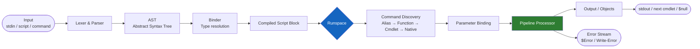

# PowerShell — How It Works

PowerShell is a cross-platform task automation shell built on .NET. This page covers the execution engine, pipeline model, remoting, module system, and runspace architecture.

---

## PowerShell Core vs Windows PowerShell

| Attribute | Windows PowerShell | PowerShell Core / PowerShell 7+ |
|---|---|---|
| Runtime | .NET Framework 4.x | .NET 6 / 7 / 8 (cross-platform) |
| Platforms | Windows only | Windows, Linux, macOS |
| Version | 5.1 (final, no new features) | 7.x (active development) |
| Module support | Full Windows module library | Some Windows-only modules unavailable |
| Remoting | WinRM only | WinRM + SSH |
| Release cadence | Security patches only | Active feature releases |
| `$PSVersionTable.PSEdition` | `Desktop` | `Core` |

Always target PowerShell 7 for new automation unless a dependency is hard-bound to Desktop edition.

---

## Execution Engine

The PowerShell execution engine processes input through the **parser** → **AST (Abstract Syntax Tree)** → **runtime** against the active **runspace**.



### Pipeline Processing

Objects flow between cmdlets without serialisation — full .NET objects pass in memory between pipeline stages.

```powershell
Get-Process |
    Where-Object { $_.CPU -gt 10 } |
    Select-Object Name, Id, CPU |
    Sort-Object CPU -Descending |
    Export-Csv -Path /tmp/high_cpu.csv -NoTypeInformation
```

- `begin {}` block runs once before pipeline input arrives
- `process {}` block runs once per input object (`$_` / `$PSItem`)
- `end {}` block runs once after all input is consumed

---

## Remoting

### WinRM (Windows Remote Management)

WinRM uses HTTP (5985) or HTTPS (5986) and SOAP/WSMan.

```powershell
Enable-PSRemoting -Force
Test-WSMan -ComputerName srv-prod-01 -Authentication Default

Invoke-Command -ComputerName srv-prod-01 -ScriptBlock {
    Get-Service -Name WinRM
}

$session = New-PSSession -ComputerName srv-prod-01 -Credential (Get-Credential)
Invoke-Command -Session $session -ScriptBlock { hostname }
Remove-PSSession $session
```

### SSH Remoting (PowerShell 7+)

```powershell
# /etc/ssh/sshd_config: Subsystem powershell /usr/bin/pwsh -sshs -NoLogo
$session = New-PSSession -HostName linux-host-01 -UserName svcaccount -SSHTransport
Invoke-Command -Session $session -ScriptBlock { uname -a }
```

---

## Module System

A module is a directory containing a manifest (`.psd1`) and script files (`.psm1`) or binary DLLs.

```text
MyModule/
├── MyModule.psd1
├── MyModule.psm1
├── Public/
│   ├── Get-Widget.ps1
│   └── Set-Widget.ps1
└── Private/
    └── Invoke-WidgetApi.ps1
```

```powershell
Install-Module -Name PSFramework -Scope CurrentUser -Repository PSGallery
Import-Module MyModule -RequiredVersion 2.3.1
Get-Module MyModule | Select-Object -ExpandProperty ExportedFunctions
```

---

## Runspace Model

A runspace is an isolated instance of the PowerShell execution environment. For parallelism, multiple runspaces can be managed via runspace pools.

```powershell
$pool = [RunspaceFactory]::CreateRunspacePool(1, 8)
$pool.Open()

$jobs = foreach ($server in $servers) {
    $ps = [PowerShell]::Create()
    $ps.RunspacePool = $pool
    [void]$ps.AddScript({
        param($s)
        Test-Connection -ComputerName $s -Count 1 -Quiet
    }).AddArgument($server)

    [PSCustomObject]@{
        Server     = $server
        PowerShell = $ps
        Handle     = $ps.BeginInvoke()
    }
}

$results = foreach ($job in $jobs) {
    [PSCustomObject]@{
        Server = $job.Server
        Online = $job.PowerShell.EndInvoke($job.Handle)[0]
    }
    $job.PowerShell.Dispose()
}

$pool.Close(); $pool.Dispose()
```

PowerShell 7 also exposes `ForEach-Object -Parallel` for moderate parallelism:

```powershell
$servers | ForEach-Object -Parallel {
    Test-Connection -ComputerName $_ -Count 1 -Quiet
} -ThrottleLimit 10
```

---

## Key Automatic Variables

| Variable | Description |
|---|---|
| `$_` / `$PSItem` | Current pipeline object |
| `$PSVersionTable` | Runtime version information |
| `$Error` | Array of recent error records (newest at index 0) |
| `$LASTEXITCODE` | Exit code of the last native command |
| `$PSCommandPath` | Full path of the running script file |
| `$PSScriptRoot` | Directory containing the running script |
| `$env:PSModulePath` | Module search paths |
| `$ErrorActionPreference` | Default action on non-terminating errors |
