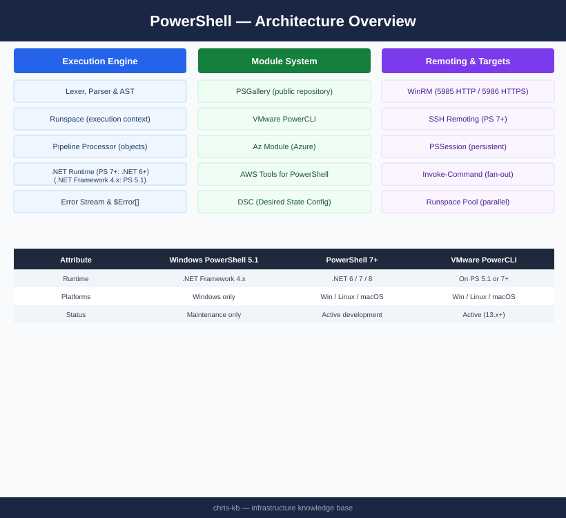

# PowerShell — Architecture

<div class="kb-summary">
Cross-platform automation shell on .NET; execution engine processes input through parser → AST → runspace → pipeline; remoting via WinRM (5985/5986) or SSH; module system with PSGallery distribution; runspace pools for parallelism.
</div>

```
┌────────────────────────────────────── PowerShell — Architecture ──────────────────────────────────────┐
│   ┌───────────────────────────────────────────────────────────────────────────────────────────────┐   │
│   │   PowerShell architecture: runtime on .NET; cmdlets call .NET APIs; pipeline passes objects   │   │
│   │    Remoting: Invoke-Command, Enter-PSSession → WinRM (Windows) or SSH transport (PS7/Linux)   │   │
│   │          Modules: binary (compiled .dll) or script (.psm1); loaded from PSModulePath          │   │
│   └───────────────────────────────────────────────────────────────────────────────────────────────┘   │
│                                                                                                       │
│   ┌──────────────────────────────────────────────┐  ┌─────────────────────────────────────────────┐   │
│   │                 How It Works                 │  │               Design Standards              │   │
│   │        Script → PSParser → AST → exec        │  │      Verb-Noun naming (approved verbs)      │   │
│   │         Pipeline: object not string          │  │         CmdletBinding + param block         │   │
│   │          Module autoload from path           │  │          Error handling: try/catch          │   │
│   │        Runspaces: parallel execution         │  │        Pester tests for all functions       │   │
│   │            Remoting: WinRM / SSH             │  │            PSScriptAnalyzer lint            │   │
│   └──────────────────────────────────────────────┘  └─────────────────────────────────────────────┘   │
│                                                                                                       │
│   ┌───────────────────────────────────────────────────────────────────────────────────────────────┐   │
│   │     Physical: PS runs on Windows, Linux, macOS; remoting requires WinRM (Win) or SSH (PS7)    │   │
│   └───────────────────────────────────────────────────────────────────────────────────────────────┘   │
└───────────────────────────────────────────────────────────────────────────────────────────────────────┘
```
```powershell
┌────────────────────────────────────── PowerShell — Architecture ──────────────────────────────────────┐
│   ┌───────────────────────────────────────────────────────────────────────────────────────────────┐   │
│   │   PowerShell architecture: runtime on .NET; cmdlets call .NET APIs; pipeline passes objects   │   │
│   │    Remoting: Invoke-Command, Enter-PSSession → WinRM (Windows) or SSH transport (PS7/Linux)   │   │
│   │          Modules: binary (compiled .dll) or script (.psm1); loaded from PSModulePath          │   │
│   └───────────────────────────────────────────────────────────────────────────────────────────────┘   │
│                                                                                                       │
│   ┌──────────────────────────────────────────────┐  ┌─────────────────────────────────────────────┐   │
│   │                 How It Works                 │  │               Design Standards              │   │
│   │        Script → PSParser → AST → exec        │  │      Verb-Noun naming (approved verbs)      │   │
│   │         Pipeline: object not string          │  │         CmdletBinding + param block         │   │
│   │          Module autoload from path           │  │          Error handling: try/catch          │   │
│   │        Runspaces: parallel execution         │  │        Pester tests for all functions       │   │
│   │            Remoting: WinRM / SSH             │  │            PSScriptAnalyzer lint            │   │
│   └──────────────────────────────────────────────┘  └─────────────────────────────────────────────┘   │
│                                                                                                       │
│   ┌───────────────────────────────────────────────────────────────────────────────────────────────┐   │
│   │     Physical: PS runs on Windows, Linux, macOS; remoting requires WinRM (Win) or SSH (PS7)    │   │
│   └───────────────────────────────────────────────────────────────────────────────────────────────┘   │
└───────────────────────────────────────────────────────────────────────────────────────────────────────┘
```


<div class="kb-grid kb-grid-3">

<a class="kb-card" href="how-it-works/">
  <strong>How It Works</strong>
  <span>Execution engine, pipeline, remoting (WinRM/SSH), module system, and runspace model.</span>
</a>

<a class="kb-card" href="integrations/">
  <strong>Integrations</strong>
  <span>Integration with other platforms and external systems.</span>
</a>

<a class="kb-card" href="design-standards/">
  <strong>Design Standards</strong>
  <span>Sizing guidelines, design standards, and best practices.</span>
</a>

</div>

## PowerShell Core vs Windows PowerShell

| Attribute | Windows PowerShell | PowerShell 7+ |
|---|---|---|
| Runtime | .NET Framework 4.x | .NET 6 / 7 / 8 (cross-platform) |
| Platforms | Windows only | Windows, Linux, macOS |
| Version | 5.1 (final) | 7.x (active development) |
| Remoting | WinRM only | WinRM + SSH |
| Release cadence | Security patches only | Active feature releases |

## Execution Engine


