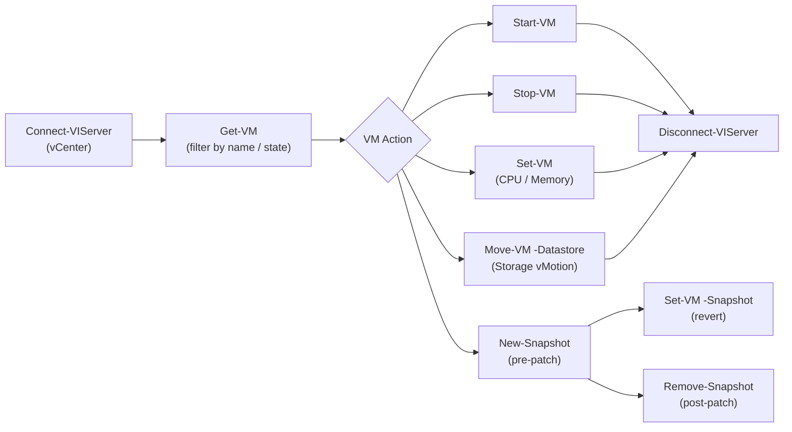

# PowerShell — Integrations

## PowerCLI VM Management Flow


```

### Get-VM and Filtering

```powershell
# List all VMs
Get-VM

# Filter by name pattern
Get-VM -Name 'web*'

# Filter by power state
Get-VM | Where-Object { $_.PowerState -eq 'PoweredOff' }

# VMs on a specific host
Get-VMHost -Name esx01.example.com | Get-VM

# Get VM hardware details
Get-VM web01 | Select-Object Name, NumCpu, MemoryGB, PowerState,
    @{N='ProvisionedGB';E={[math]::Round($_.ProvisionedSpaceGB,2)}}
```

### Set-VM and VM Configuration

```powershell
# Change vCPU and memory (VM must be powered off for most changes)
Get-VM -Name web01 | Set-VM -NumCpu 4 -MemoryGB 8 -Confirm:$false

# Add a network adapter
Get-VM web01 | New-NetworkAdapter -NetworkName 'VM Network' -Type VMXNET3 -StartConnected

# Add a hard disk
Get-VM web01 | New-HardDisk -CapacityGB 100 -StorageFormat Thin -Confirm:$false

# Power operations
Start-VM -VM web01 -Confirm:$false
Stop-VM -VM web01 -Confirm:$false
Restart-VM -VM web01 -Confirm:$false
Suspend-VM -VM web01 -Confirm:$false
```

### Snapshots

```powershell
# Create a snapshot before patching
New-Snapshot -VM web01 -Name 'Pre-patch-$(Get-Date -Format yyyyMMdd)' `
    -Description 'Snapshot before OS patching' -Memory:$false -Quiesce:$false

# List all snapshots for a VM
Get-Snapshot -VM web01

# List all snapshots across all VMs (useful for audit)
Get-VM | Get-Snapshot | Select-Object VM, Name, Created, SizeMB |
    Sort-Object Created | Format-Table -AutoSize

# Revert to a snapshot
Set-VM -VM web01 -Snapshot (Get-Snapshot -VM web01 -Name 'Pre-patch-*') -Confirm:$false

# Remove a specific snapshot
Remove-Snapshot -Snapshot (Get-Snapshot -VM web01 -Name 'Pre-patch-*') -Confirm:$false

# Remove all snapshots for a VM
Get-Snapshot -VM web01 | Remove-Snapshot -RemoveChildren -Confirm:$false
```

### Datastores and Storage

```powershell
# List all datastores with capacity info
Get-Datastore | Select-Object Name,
    @{N='CapacityGB';E={[math]::Round($_.CapacityGB,0)}},
    @{N='FreeGB';E={[math]::Round($_.FreeSpaceGB,0)}},
    @{N='UsedPct';E={[math]::Round((1-$_.FreeSpaceGB/$_.CapacityGB)*100,1)}} |
    Sort-Object UsedPct -Descending | Format-Table

# Move a VM to a different datastore
Move-VM -VM web01 -Datastore (Get-Datastore 'SSD-01') -Confirm:$false
```

### PowerCLI Command Reference

| Cmdlet | Purpose |
|---|---|
| `Get-VM` | List VMs |
| `Start-VM / Stop-VM` | Power on/off |
| `New-Snapshot / Remove-Snapshot` | Snapshot management |
| `Get-VMHost` | List ESXi hosts |
| `Get-Datastore` | List datastores |
| `Move-VM` | Migrate VM via Storage vMotion |
| `Get-VIEvent` | Query vCenter event log |
| `Invoke-VMScript` | Run script inside guest OS |

## Windows

The `ActiveDirectory` module ships with RSAT or Windows Server.

```powershell
# Install RSAT AD tools (Windows 10/11)
Add-WindowsCapability -Online -Name Rsat.ActiveDirectory.DS-LDS.Tools~~~~0.0.1.0

Import-Module ActiveDirectory

# Search for a user
Get-ADUser -Filter { SamAccountName -eq 'jdoe' } -Properties *

# Find all disabled accounts
Get-ADUser -Filter { Enabled -eq $false } -Properties LastLogonDate |
    Select-Object SamAccountName, Name, LastLogonDate

# Reset a password
Set-ADAccountPassword -Identity jdoe -Reset `
    -NewPassword (ConvertTo-SecureString 'NewP@ss1' -AsPlainText -Force)

# Unlock a locked account
Unlock-ADAccount -Identity jdoe

# Create a new user
New-ADUser -Name "Jane Doe" -SamAccountName jdoe2 -UserPrincipalName jdoe2@example.com `
    -AccountPassword (ConvertTo-SecureString 'TempP@ss1' -AsPlainText -Force) `
    -Enabled $true -Path "OU=Staff,DC=example,DC=com"

# Add user to a group
Add-ADGroupMember -Identity "Domain Admins" -Members jdoe
```

### Disk Management

```powershell
# List all disks
Get-Disk | Select-Object Number, FriendlyName, Size, PartitionStyle, OperationalStatus

# List partitions and volumes
Get-Partition | Select-Object DiskNumber, PartitionNumber, DriveLetter, Size, Type
Get-Volume | Select-Object DriveLetter, FileSystem, Size, SizeRemaining, HealthStatus

# Initialize and format a new disk
Initialize-Disk -Number 1 -PartitionStyle GPT
New-Partition -DiskNumber 1 -UseMaximumSize -DriveLetter D
Format-Volume -DriveLetter D -FileSystem NTFS -NewFileSystemLabel 'Data' -Confirm:$false

# Resize a partition (extend to fill available space)
$maxSize = (Get-PartitionSupportedSize -DriveLetter C).SizeMax
Resize-Partition -DriveLetter C -Size $maxSize
```

### Services

```powershell
# List services with status
Get-Service | Where-Object { $_.Status -eq 'Stopped' -and $_.StartType -eq 'Automatic' } |
    Select-Object Name, DisplayName, StartType | Format-Table

# Start, stop, restart
Start-Service -Name wuauserv
Stop-Service -Name Spooler -Force
Restart-Service -Name W32Time

# Change start type
Set-Service -Name Spooler -StartupType Disabled

# Create a new service
New-Service -Name MyService -BinaryPathName 'C:\Services\myapp.exe' `
    -DisplayName 'My Application Service' -StartupType Automatic -Description 'Runs myapp'
```

### Event Logs

```powershell
# Query System event log for errors in last 24 hours
Get-WinEvent -FilterHashtable @{
    LogName   = 'System'
    Level     = 2        # 2=Error, 3=Warning, 4=Information
    StartTime = (Get-Date).AddHours(-24)
} | Select-Object TimeCreated, Id, Message | Format-Table -Wrap

# Query Application log for specific event ID
Get-WinEvent -FilterHashtable @{ LogName = 'Application'; Id = 1000 } -MaxEvents 20

# Export events to CSV
Get-WinEvent -LogName System -MaxEvents 100 |
    Select-Object TimeCreated, LevelDisplayName, Id, Message |
    Export-Csv -Path C:\Reports\events.csv -NoTypeInformation
```

### WMI and CIM

```powershell
# Get OS information
Get-CimInstance -ClassName Win32_OperatingSystem |
    Select-Object Caption, Version, OSArchitecture, LastBootUpTime

# List installed software
Get-CimInstance -ClassName Win32_Product |
    Select-Object Name, Version, InstallDate | Sort-Object Name

# Get hardware info
Get-CimInstance -ClassName Win32_ComputerSystem |
    Select-Object Name, Manufacturer, Model, TotalPhysicalMemory
```

### Windows Administration Reference

| Area | Key Cmdlets |
|---|---|
| Active Directory | `Get-ADUser`, `Set-ADAccountPassword`, `New-ADUser`, `Add-ADGroupMember` |
| Disk | `Get-Disk`, `Get-Partition`, `Get-Volume`, `Resize-Partition` |
| Services | `Get-Service`, `Start-Service`, `Stop-Service`, `Set-Service` |
| Event Logs | `Get-WinEvent`, `Get-EventLog` (legacy) |
| WMI/CIM | `Get-CimInstance`, `Invoke-CimMethod` |
| Firewall | `Get-NetFirewallRule`, `New-NetFirewallRule`, `Set-NetFirewallRule` |
