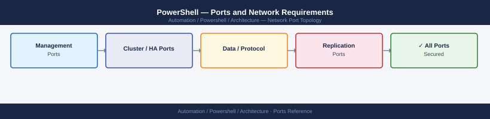

---
tags:
  - powershell
  - automation
  - networking
  - firewall
  - ports
  - windows
---
# PowerShell — Ports and Network Requirements

<div class="kb-summary">
Firewall port reference for PowerShell remoting. PowerShell itself has no listening ports. The relevant ports are WinRM (Windows) and SSH (cross-platform) for remote sessions and Invoke-Command.

*Applies to: PowerShell 7.x / Windows PowerShell 5.1*
</div>


## WinRM — Windows Remoting (Primary)

| Port | Protocol | Source | Destination | Purpose |
|---|---|---|---|---|
| 5985 | TCP | PS remoting source host | Windows target | WinRM HTTP — unencrypted; avoid in production |
| 5986 | TCP | PS remoting source host | Windows target | WinRM HTTPS — encrypted; required for production |

## SSH-Based PS Remoting (Cross-Platform)

| Port | Protocol | Source | Destination | Purpose |
|---|---|---|---|---|
| 22 | TCP | PS remoting source | Linux or Windows target (with OpenSSH) | SSH transport for `Enter-PSSession` / `Invoke-Command` |

## PowerShell to Infrastructure APIs

When scripts call remote APIs (vCenter, REST, etc.):

| Port | Protocol | Destination | Purpose |
|---|---|---|---|
| 443 | TCP | API targets (vCenter, Azure, REST services) | HTTPS API calls from PowerShell scripts |
| 1433 | TCP | SQL Server | Invoke-Sqlcmd / SQL queries |

## Firewall Zone Summary

| From | To | Ports | Notes |
|---|---|---|---|
| PS source (Ansible, jump host, CI) | Windows targets | 5986 | WinRM HTTPS — production |
| PS source | Linux / Windows (OpenSSH) | 22 | SSH-based PS remoting |
| PS source | API endpoints | 443 | REST API calls from scripts |

## Verify

```powershell
# Test WinRM connectivity from source
Test-WSMan -ComputerName <target> -UseSSL

# Test PS Session
$s = New-PSSession -ComputerName <target> -UseSSL -Credential (Get-Credential)
Invoke-Command -Session $s { $env:COMPUTERNAME }

# Test SSH-based remoting
Enter-PSSession -HostName <linux-host> -UserName ansible
```

## See also

- [PowerShell — Architecture](../how-it-works/)
- [Windows Server — Ports](../../../compute/windows-server/architecture/ports.md)
- [Ansible — Ports](../../ansible/architecture/ports.md)
