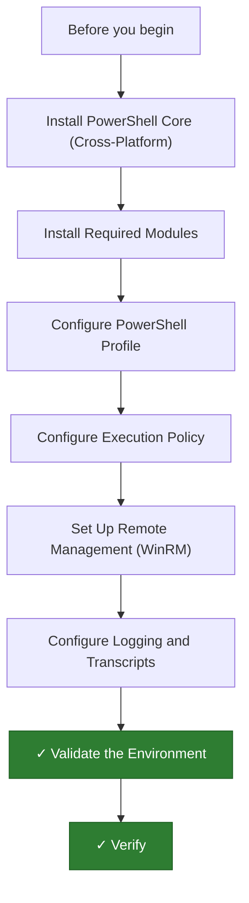

---
tags:
  - deployment
  - powershell
search:
  boost: 1.5
---
# PowerShell — Environment Setup

This guide covers the initial setup of a PowerShell automation environment: installing
PowerShell Core, loading required modules, configuring a profile and execution policy,
enabling remote management, and turning on logging.

---



```d2
direction: right

plan: "Plan" {shape: oval}
install_powershell_core_crossplatfor: "Install PowerShell Core (Cross-Platform)" {shape: rectangle}
install_required_modules: "Install Required Modules" {shape: rectangle}
configure_powershell_profile: "Configure PowerShell Profile" {shape: rectangle}
configure_execution_policy: "Configure Execution Policy" {shape: rectangle}
set_up_remote_management_winrm: "Set Up Remote Management (WinRM)" {shape: rectangle}
configure_logging_and_transcripts: "Configure Logging and Transcripts" {shape: rectangle}
validate: "Validate" {shape: oval}

plan -> install_powershell_core_crossplatfor
install_powershell_core_crossplatfor -> install_required_modules
install_required_modules -> configure_powershell_profile
configure_powershell_profile -> configure_execution_policy
configure_execution_policy -> set_up_remote_management_winrm
set_up_remote_management_winrm -> configure_logging_and_transcripts
configure_logging_and_transcripts -> validate
```

## Before you begin

- **Access:** Admin credentials on all affected systems
- **Environment:** DNS, NTP, and network connectivity verified before starting
- **Change management:** change request approved; maintenance window scheduled
- **Rollback:** snapshot or backup taken immediately before deployment begins
- **Time estimate:** 30–90 minutes — do not start if less than 2 hours are available

---

## Install PowerShell Core (Cross-Platform)

**Windows**

```powershell
winget install Microsoft.PowerShell
```

Alternatively, download the `.msi` installer from the
[GitHub releases page](https://github.com/PowerShell/PowerShell/releases).

**Linux (Debian/Ubuntu)**

```bash
sudo apt install powershell
```

**Linux (RHEL/Fedora/Rocky)**

```bash
sudo dnf install powershell
```

**Verify**

```bash
pwsh --version
```

---

## Install Required Modules

```powershell
Install-Module -Name PSWindowsUpdate, Az, VMware.PowerCLI -Scope CurrentUser -Force
```

| Module | Purpose |
|---|---|
| `PSWindowsUpdate` | Manage Windows Updates programmatically |
| `Az` | Azure resource management |
| `VMware.PowerCLI` | vSphere / ESXi automation |

Verify and update:

```powershell
Get-Module -ListAvailable | Select-Object Name, Version | Sort-Object Name
Update-Module -Force
```

---

## Configure PowerShell Profile

The profile script runs automatically at the start of every `pwsh` session.

```powershell
# Find profile path
$PROFILE

# Create if it does not exist
New-Item -Path $PROFILE -ItemType File -Force

# Open for editing
code $PROFILE
```

Example profile:

```powershell
Import-Module VMware.PowerCLI
Import-Module Az
Set-Alias -Name k -Value kubectl
$env:KUBECONFIG = "$HOME/.kube/config"
```

Reload without restarting:

```powershell
. $PROFILE
```

---

## Configure Execution Policy

`RemoteSigned` allows local scripts and requires signing for scripts downloaded
from the internet.

```powershell
Set-ExecutionPolicy RemoteSigned -Scope CurrentUser
Get-ExecutionPolicy -List
```

**Enterprise (GPO):** `Computer Configuration → Administrative Templates →
Windows Components → Windows PowerShell → Turn on Script Execution`
→ set to `Allow local scripts and remote signed scripts`.

Do not use `Unrestricted` or `Bypass` in production.

---

## Set Up Remote Management (WinRM)

**On each target host** (run as administrator):

```powershell
Enable-PSRemoting -Force
```

**On the management workstation**, add trusted targets:

```powershell
Set-Item WSMan:\localhost\Client\TrustedHosts -Value "192.168.1.50,srv-prod-01"
```

**Test connectivity**:

```powershell
Test-WSMan -ComputerName srv-prod-01
```

If the command hangs, check: Firewall allows TCP 5985/5986, WinRM service is
running, and the target hostname resolves.

---

## Configure Logging and Transcripts

Start a transcript to record a full session:

```powershell
Start-Transcript -Path C:\Logs\ps-session.log -Append
# ... run commands ...
Stop-Transcript
```

**GPO-based logging:** `Computer Configuration → Administrative Templates →
Windows Components → Windows PowerShell`

Enable **Turn on Module Logging** and **Turn on PowerShell Script Block Logging**.

View events in **Event Viewer**:
`Applications and Services Logs → Microsoft → Windows → PowerShell → Operational`
(Event ID 4103 = module log, 4104 = script block content).

---

## Validate the Environment

```powershell
# PowerShell version
$PSVersionTable

# Available modules
Get-Module -ListAvailable | Select-Object Name, Version | Sort-Object Name

# Remote connectivity
Test-WSMan -ComputerName <remote-host>

# Execution policy
Get-ExecutionPolicy -List

# Smoke test
Write-Output "PowerShell environment is ready."
```

| Check | Expected |
|---|---|
| `$PSVersionTable.PSVersion` | 7.x.x |
| `Get-Module -ListAvailable` | Az, VMware.PowerCLI present |
| `Test-WSMan` | Returns WinRM version without error |
| `Get-ExecutionPolicy -Scope CurrentUser` | `RemoteSigned` |

---

## Verify

- Confirm the service or component is running and reachable
- Check management UI for any errors or warnings
- Run a basic functional test (login, read, write) to confirm end-to-end operation

---

## See also

- [Powershell — Procedures](../operations/procedures/)
- [Powershell — Common Issues](../troubleshooting/common-issues/)
- [Powershell — How It Works](../architecture/how-it-works/)
