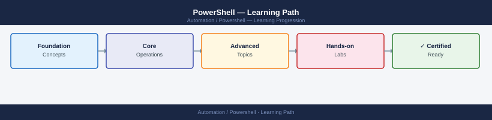

---
tags:
  - learning-path
  - powershell
---
# PowerShell — Learning Path

Recommended reading order for PowerShell infrastructure automation. Follow these stages in order to build a complete mental model before working with it in production.

*Applies to: PowerShell 7.x*

| Stage | Focus | Time investment |
|-------|-------|----------------|
| 1 — Architecture | Object pipeline, module system, remoting | 3–4 h |
| 2 — Deployment | Module distribution, Gallery, scheduled tasks | 2 h |
| 3 — Operations | Transcripts, remoting, scheduled execution | ongoing |
| 4 — Security | JEA, SecureString, PSScriptAnalyzer, signing | 2–3 h |
| 5 — Troubleshooting | $Error, -Verbose, WinRM events, transcripts | as needed |

---

## Stage 1 — Architecture

**Goal**: Understand PowerShell's object pipeline model, module system, and remoting transport before writing scripts that run against production systems.

**Read in this order**:

- [How It Works](../architecture/how-it-works/) — pipeline object model (passing .NET objects, not text), cmdlet verb-noun convention, module loading order (`$env:PSModulePath`), and the difference between Windows PowerShell 5.1 and PowerShell 7+ (cross-platform)
- [Design Standards](../architecture/design-standards/) — script and module structure (`ScriptModule.psm1` + `ModuleManifest.psd1`), parameter validation attributes (`[ValidateSet]`, `[ValidateNotNullOrEmpty]`, `[ValidateRange]`), comment-based help (`Get-Help`-compatible), and `$PSCmdlet.ShouldProcess()` for `-WhatIf` support
- [Integrations](../architecture/integrations/) — WS-Man (HTTP/HTTPS) and SSH remoting backends, integration with Active Directory (`ActiveDirectory` module), Azure (`Az` module), VMware PowerCLI, and REST APIs via `Invoke-RestMethod`

**Key concepts before moving on**:

- The pipeline passes objects — `Get-Service | Where-Object Status -eq Running` passes `ServiceController` objects, not text lines
- `$ErrorActionPreference = 'Stop'` turns all non-terminating errors into terminating errors; critical for reliable error handling in automation scripts
- PowerShell 5.1 (Windows PowerShell) and PowerShell 7+ are different products; modules written for 5.1 may not work on 7+ due to API differences
- Remoting (`Invoke-Command`) copies the script block to the remote session and deserialises return objects — complex .NET types become `PSObject` on return

**Why first**: PowerShell's object pipeline and remoting model have important security and correctness implications. Misunderstanding either leads to incorrect output handling and unintended remote execution scope.

---

## Stage 2 — Deployment

**Goal**: Distribute scripts and modules reliably to operator workstations and automation servers.

**Read**:

- [Deploy](../deploy/) — PowerShell Gallery module publication, internal NuGet feed (ProGet, Azure Artifacts) setup, and module deployment via DSC or Ansible `win_psmodule`
- [Install & Upgrade](../operations/install-upgrade/) — PowerShell version management, `#Requires -Modules` and `#Requires -Version` in scripts, and cross-platform compatibility testing with `$PSVersionTable`

**Deployment principles**:

- Publish modules to an internal NuGet feed rather than copying `.psm1` files manually — this enables versioning and `Install-Module -Repository` installation
- Use `#Requires -Modules ModuleName` at the top of every script that depends on an external module
- Test scripts on both 5.1 and 7+ if they must run on both — the PowerShell Compatibility module helps but is not perfect

---

## Stage 3 — Operations

**Goal**: Run PowerShell automation reliably with proper logging, credential handling, and scheduled execution on every shift.

**Read in this order**:

- [Health Checks](../operations/health-checks/) — run the routine first on every shift; scheduled task exit codes and last run result, transcript log review for errors, remoting connectivity checks, and module version currency
- [CLI Reference](../operations/cli-reference/) — `Get-Command`, `Get-Help`, `Get-Member`, `Invoke-Command`, `Enter-PSSession`, `Start-Job`, `Get-Job`, `Register-ScheduledJob` patterns for daily operations
- [Procedures](../operations/procedures/) — adding a new module to a production server, rotating script credentials in the Windows Credential Manager, updating scheduled tasks, and managing execution policy via GPO
- [Backup & Restore](../operations/backup-restore/) — script repository backup (Git remote), module version snapshot to internal feed, and credential store recovery procedure
- [Scripts](../operations/scripts/) — reusable function library: bulk `Invoke-Command` runner, AD object reporter, REST API wrapper with `Invoke-RestMethod`, and Pester unit test stubs for module validation

**Daily rhythm**: Scheduled task history → transcript log review → remote connectivity tests → module update check.

---

## Stage 4 — Security

**Goal**: Enforce safe execution policies, protect credentials, and audit all remote command execution end to end.

**Read**:

- [Access Control](../security/access-control/) — JEA (Just Enough Administration) role capability files and session configurations, constrained language mode, script signing requirements, and PSRemoting endpoint restrictions
- [Authentication](../security/authentication/) — `PSCredential` and `SecureString` creation and safe handling, Windows Credential Manager via `CredentialManager` module, certificate-based PSRemoting authentication, and Kerberos vs NTLM for WS-Man
- [Encryption](../security/encryption/) — HTTPS-only PSRemoting (`UseSSL = $true`), `ConvertTo-SecureString` for in-memory protection, Secret Management module (`Microsoft.PowerShell.SecretManagement`) with a vault backend, and script block logging encryption
- [Hardening](../security/hardening/) — `AllSigned` or `RemoteSigned` execution policy enforced via GPO, PSScriptAnalyzer rules in CI (`Invoke-ScriptAnalyzer`), script block logging via Group Policy (`EnableScriptBlockLogging`), and AMSI integration for malware scanning of script blocks

---

## Stage 5 — Troubleshooting

**Goal**: Diagnose script errors, remoting failures, and module conflicts without destructive re-runs against production systems.

**Read**:

- [Common Issues](../troubleshooting/common-issues/) — WinRM `Access is denied` or connection refused, execution policy blocking a script, module not found on remote host, `PSCredential` null or expired, and object deserialisation loss of methods
- [Diagnostics](../troubleshooting/diagnostics/) — `$Error[0] | Format-List * -Force` for full error detail, `-Verbose` and `-Debug` switches, `Start-Transcript` for full session logging, WinRM event log (`Microsoft-Windows-WinRM/Operational`) analysis, and `Test-WSMan` for connectivity
- [Escalation](../troubleshooting/escalation/) — Microsoft Support for PowerShell and WinRM bugs, PowerShell GitHub repository for open-source issues, and community PowerShell forums (Reddit, PowerShell.org) for configuration questions

**Why last**: Troubleshooting makes most sense once you understand the execution policy model, the remoting transport, and the module loading sequence under normal conditions.

---

## See also

- [PowerShell — Deploy](../deploy/)
- [PowerShell — Procedures](../operations/procedures/)
- [PowerShell — Common Issues](../troubleshooting/common-issues/)
