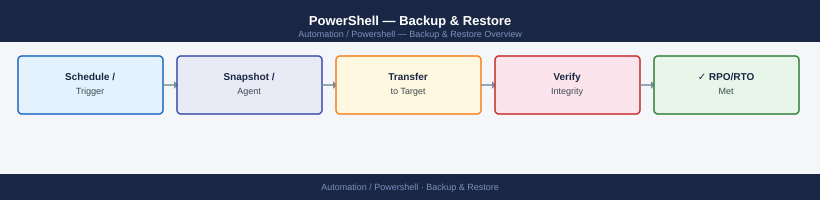

---
tags:
  - operations
  - powershell
---
# PowerShell — Backup & Restore



```powershell
# Locate and back up PowerShell profiles
$ProfilePaths = @(
    $PROFILE.AllUsersAllHosts,
    $PROFILE.AllUsersCurrentHost,
    $PROFILE.CurrentUserAllHosts,
    $PROFILE.CurrentUserCurrentHost
)
$BackupDir = "$env:USERPROFILE\ps-backup-$(Get-Date -Format 'yyyyMMdd')"
New-Item -Path $BackupDir -ItemType Directory -Force | Out-Null
foreach ($p in $ProfilePaths) {
    if (Test-Path $p) {
        Copy-Item $p $BackupDir -Force
        Write-Host "Backed up: $p"
    }
}
```


## Before you begin

- **Access:** Admin credentials on all affected systems
- **Timing:** safe to run during business hours unless a step is marked ⚠ (causes interruption)
- **Dependencies:** no active upgrades or migrations on the same infrastructure
- **Logging:** capture command output — paste into the change record on completion

---

---

## Verify

- Confirm the operation completed without errors in the log or management UI
- Verify the expected state change is visible (service running, object created, config applied)
- Document the outcome in the change record

---

## See also

- [PowerShell — Procedures](../procedures/)
- [PowerShell — Health Checks](../health-checks/)
- [PowerShell — Common Issues](../../troubleshooting/common-issues/)
