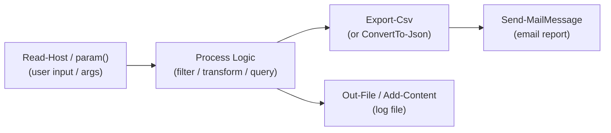

# PowerShell — CLI Reference


<div class="kb-summary">
PowerShell is Microsoft's cross-platform command shell and scripting language. Unlike the old CMD prompt, PowerShell works with objects — every command outputs structured data you can pipe, filter, sort, and transform.
</div>

 The `VMware.PowerCLI` module extends PowerShell with hundreds of cmdlets for managing vSphere, making it the primary automation tool for VMware infrastructure.

> Works on Windows, macOS, and Linux (PowerShell 7+). VMware PowerCLI requires `Install-Module VMware.PowerCLI`.

## Script Execution Pipeline


```
┌───────────────────────────────────── PowerShell — CLI Reference ──────────────────────────────────────┐
│   ┌───────────────────────────────────────────────────────────────────────────────────────────────┐   │
│   │               Essential PowerShell commands for daily infrastructure operations               │   │
│   └───────────────────────────────────────────────────────────────────────────────────────────────┘   │
│                                                                                                       │
│   ┌──────────────────────────────────────────────┐  ┌─────────────────────────────────────────────┐   │
│   │                Core Commands                 │  │               Utility Commands              │   │
│   │          Get-Command -Module <name>          │  │             Measure-Object -Sum             │   │
│   │             Get-Help <cmd> -Full             │  │         Where-Object { $_.X -eq Y }         │   │
│   │            Get-Member (alias: gm)            │  │           Select-Object -First 10           │   │
│   │          Get-Module -ListAvailable           │  │          Sort-Object -Property Name         │   │
│   │             Import-Module <name>             │  │         Group-Object -Property Type         │   │
│   └──────────────────────────────────────────────┘  └─────────────────────────────────────────────┘   │
│                                                                                                       │
│   ┌──────────────────────────────────────────────┐  ┌─────────────────────────────────────────────┐   │
│   │                File and Data                 │  │               Remote Execution              │   │
│   │           Get-Content, Set-Content           │  │         Invoke-Command -ScriptBlock         │   │
│   │            Import-Csv, Export-Csv            │  │            Enter-PSSession <host>           │   │
│   │       ConvertTo-Json, ConvertFrom-Json       │  │          Copy-Item -ToSession $sess         │   │
│   │        Invoke-RestMethod (API calls)         │  │             Disconnect-PSSession            │   │
│   └──────────────────────────────────────────────┘  └─────────────────────────────────────────────┘   │
│                                                                                                       │
│   ┌───────────────────────────────────────────────────────────────────────────────────────────────┐   │
│   │    Get-Member     = inspect object properties and methods; essential for pipeline debugging   │   │
│   │  ForEach-Object = pipeline loop; alias: %; $_  is current object; use for per-item processing │   │
│   │              Where-Object   = filter pipeline; alias: ?; $_.Property -eq "value"              │   │
│   └───────────────────────────────────────────────────────────────────────────────────────────────┘   │
└───────────────────────────────────────────────────────────────────────────────────────────────────────┘
```

---

## Files & Filesystem

PowerShell cmdlets for navigating directories, reading and writing files, and working with CSV and JSON data. These work the same on Windows and Linux.

```powershell
# Navigation
Get-Location
Set-Location C:\scripts
Get-ChildItem
Get-ChildItem -Recurse -Filter "*.ps1"

# File operations
New-Item -Path ".\file.txt" -ItemType File
Copy-Item source.txt dest.txt
Move-Item source.txt dest\
Remove-Item file.txt
Get-Content file.txt
Set-Content file.txt "content"
Add-Content file.txt "new line"

# CSV / JSON
Import-Csv data.csv
Export-Csv -Path output.csv -NoTypeInformation
$obj | ConvertTo-Json
$json | ConvertFrom-Json

# Test path (returns true/false — useful in scripts)
Test-Path "C:\scripts\file.ps1"
```

---

## Remoting (PSSession)

PowerShell Remoting lets you run commands on remote machines as if you were logged in. `Invoke-Command` can target dozens of servers at once — essential for large-scale administration.

```powershell
# Interactive session on a remote host
Enter-PSSession -ComputerName <host>
Exit-PSSession

# Persistent session (reuse for multiple commands)
$session = New-PSSession -ComputerName <host>
Invoke-Command -Session $session -ScriptBlock { Get-Service }
Remove-PSSession $session

# Run the same command on multiple hosts in parallel
$servers = @("srv1", "srv2", "srv3")
Invoke-Command -ComputerName $servers -ScriptBlock { hostname }
```

---

## Services & Processes

Query, start, stop, and configure Windows services. Find and kill processes. These are the operational building blocks for Windows system administration.

```powershell
# Services
Get-Service
Get-Service -Name <name>
Start-Service <name>
Stop-Service <name>
Restart-Service <name>
Set-Service -Name <name> -StartupType Automatic

# Processes
Get-Process
Get-Process -Name <name>
Stop-Process -Name <name>
Stop-Process -Id <pid> -Force
```

---

## Error Handling

Control what happens when a cmdlet fails. The default is to keep running — change `$ErrorActionPreference` or use `-ErrorAction` to make failures terminate, or suppress them silently.

```powershell
# Try/catch — catch terminating errors
try {
    Get-VM -Name "nonexistent" -ErrorAction Stop
} catch {
    Write-Error "Failed: $_"
}

# Global error behavior
$ErrorActionPreference = "Stop"      # terminate on any error
$ErrorActionPreference = "Continue"  # default — log and keep going

# Per-command error behavior
Get-VM -Name "test" -ErrorAction SilentlyContinue   # suppress errors
Get-VM -Name "test" -ErrorAction Stop               # force terminating
```

---

## VMware PowerCLI

PowerCLI is the official VMware module for managing vSphere from PowerShell. It connects to vCenter and lets you manage VMs, hosts, clusters, datastores, and more with full scripting capability.

```powershell
# Install and configure
Install-Module VMware.PowerCLI -Scope CurrentUser
Set-PowerCLIConfiguration -InvalidCertificateAction Ignore -Confirm:$false
Set-PowerCLIConfiguration -ParticipateInCeip $false -Confirm:$false

# Connect / disconnect
Connect-VIServer -Server <vcenter> -Credential (Get-Credential)
Disconnect-VIServer -Confirm:$false

# VMs — list and filter
Get-VM
Get-VM -Name <name>
Get-VM | Where-Object { $_.PowerState -eq "PoweredOff" }

# VM power operations
Start-VM -VM <name>
Stop-VM -VM <name> -Confirm:$false
Restart-VM -VM <name> -Confirm:$false
Suspend-VM -VM <name>

# VM configuration
Get-VM <name> | Get-HardDisk
Get-VM <name> | Get-NetworkAdapter
Set-VM -VM <name> -NumCpu 4 -MemoryGB 16 -Confirm:$false

# Snapshots
Get-Snapshot -VM <name>
New-Snapshot -VM <name> -Name "pre-patch" -Memory:$false -Quiesce:$false
Remove-Snapshot -Snapshot <snap> -Confirm:$false
Set-VM -VM <name> -Snapshot <snap> -Confirm:$false    # revert

# Hosts
Get-VMHost
Get-VMHost -Name <hostname>
Get-VMHost | Select-Object Name, PowerState, ConnectionState, Version
Set-VMHost -VMHost <host> -State Maintenance

# Clusters
Get-Cluster
Get-Cluster <name> | Get-VMHost
Get-Cluster | Get-VM

# Datastores
Get-Datastore
Get-Datastore | Select-Object Name, CapacityGB, FreeSpaceGB
Get-Datastore | Where-Object { ($_.FreeSpaceGB / $_.CapacityGB) -lt 0.2 }

# vSAN
Get-VsanView
Get-VsanClusterConfiguration -Cluster <cluster>

# Resource pools
Get-ResourcePool
Get-ResourcePool -Name <name> | Get-VM

# vCenter events
Get-VIEvent -MaxSamples 100
Get-VIEvent -Start (Get-Date).AddHours(-24)

# Tags
Get-Tag
Get-TagCategory
New-Tag -Name <tag> -Category <category>
Get-VM <name> | Get-TagAssignment
New-TagAssignment -Tag <tag> -Entity (Get-VM <name>)
```

---

## Reporting

Generate reports from PowerCLI data — export VM inventories to CSV, produce host utilization summaries, or audit snapshot usage across the environment.

```powershell
# VM inventory to CSV
Get-VM | Select-Object Name, PowerState, NumCpu, MemoryGB,
    @{N="Datastore";E={($_ | Get-Datastore).Name}} |
    Export-Csv -Path vm_inventory.csv -NoTypeInformation

# Host utilization summary
Get-VMHost | Select-Object Name, Version,
    @{N="CPU%";E={[math]::Round($_.CpuUsageMhz / $_.CpuTotalMhz * 100, 1)}},
    @{N="Mem%";E={[math]::Round($_.MemoryUsageGB / $_.MemoryTotalGB * 100, 1)}} |
    Format-Table

# Snapshot report — sorted by size
Get-VM | Get-Snapshot |
    Select-Object VM, Name, Created,
    @{N="SizeGB";E={[math]::Round($_.SizeGB, 2)}} |
    Sort-Object SizeGB -Descending
```
