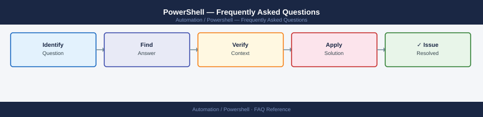

---
tags:
  - powershell
  - faq
  - operations
---
# PowerShell — Frequently Asked Questions

Common questions about PowerShell operations, configuration, and troubleshooting. For step-by-step procedures, see the <a href="index.md">Operations</a> section.

## General

**Q: What version of PowerShell is recommended for enterprise use?**
A: PowerShell 7.4 LTS is the current recommendation. Windows PowerShell 5.1 is still required for some Windows-specific modules (e.g., Active Directory, Exchange). Run `$PSVersionTable` to check.

**Q: How do I check the current PowerShell version?**
A: `$PSVersionTable.PSVersion`

## Configuration

**Q: What is the default execution policy and when should it be changed?**
A: `Restricted` on Windows prevents any scripts from running. Set `RemoteSigned` for enterprise use: `Set-ExecutionPolicy RemoteSigned -Scope LocalMachine`. Never set `Unrestricted` in production.

**Q: How do I enable PowerShell remoting for remote management?**
A: Run `Enable-PSRemoting -Force` on the target. Ensure WinRM service is running. For non-domain environments, add the host to TrustedHosts: `Set-Item WSMan:\localhost\Client\TrustedHosts -Value 'hostname'`.

## Operations

**Q: How do I upgrade PowerShell across many hosts without disruption?**
A: Deploy via SCCM/Intune or DSC. Test on a pilot group first. PowerShell 7 installs side-by-side with 5.1 — no conflict. Use `-Scope AllUsers` for system-wide install.

**Q: What is the correct procedure to add a new PowerShell module to all hosts?**
A: Publish to an internal PSRepository (`Register-PSRepository`), then deploy via DSC or a scheduled task running `Install-Module -Name ModuleName -Repository InternalRepo -Force`.

## Troubleshooting

**Q: Script shows 'WARNING: The names of some imported commands... include unapproved verbs'. What does it mean?**
A: A module exports functions that don't follow Verb-Noun naming (e.g., `Load-Config` instead of `Import-Config`). It's cosmetic; use `-DisableNameChecking` on `Import-Module` to suppress it.

**Q: Script runs slowly on remote hosts — where do I start?**
A: Check if implicit remoting is serializing objects unnecessarily. Use `Invoke-Command` with `ThrottleLimit` tuning. Enable JEA for constrained endpoints. Profile with `Measure-Command`.

## Backup and Recovery

**Q: How often should I back up PowerShell scripts and modules?**
A: Store all scripts in Git. For DSC configurations, version-control the `.ps1` and compiled `.mof` files. Module versions should be pinned in a `requirements.psd1`.

**Q: Can I restore a deleted function from a module without full repo restore?**
A: Yes — `git log -p -- path/to/module.psm1` shows deleted function history. Use `git show <hash>:path/to/module.psm1` to recover a specific version.

## See Also

- [PowerShell Operations](index.md)
- [PowerShell Troubleshooting](../../troubleshooting/index.md)
