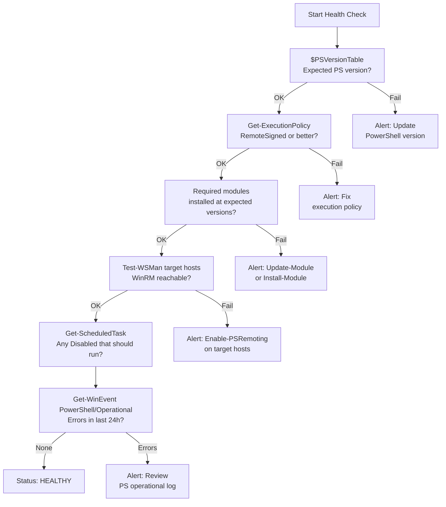

# PowerShell — Health Checks

## PowerShell Environment Health Check Flow



## Daily Checks

| Check | Command | Notes |
|---|---|---|
| [ ] Verify scheduled PowerShell tasks are not disabled | `Get-ScheduledTask | Where-Object {$_.State -eq 'Disabled'}` |  |
| [ ] Check execution policy on managed hosts | `Get-ExecutionPolicy -List` |  |
| [ ] Review script error logs and transcript files for failed scheduled |  |  |
| [ ] Confirm PSGallery or internal module feed is accessible |  |  |
| [ ] Validate service account credentials used by scheduled scripts are |  |  |
| [ ] Review PowerShell event log for script block logging errors | `Get-WinEvent -LogName 'Microsoft-Windows-PowerShell/Operational' -MaxEvents 50` |  |
| [ ] Confirm WinRM is running on remote targets if remoting is in use |  |  |

## Health Check

- [ ] PowerShell version is at expected level on all managed hosts
- [ ] Execution policy permits script execution
- [ ] Required modules are installed and at expected versions
- [ ] Service accounts used by scheduled tasks have valid, non-expired credentials
- [ ] WinRM service is running and reachable on remote targets
- [ ] Transcript logging path is writable and recent transcripts exist
- [ ] PSGallery or internal feed is reachable from the control host
- [ ] No errors in the PowerShell operational event log from the last 24 hours

```powershell
# PowerShell version
$PSVersionTable

# Execution policy (all scopes)
Get-ExecutionPolicy -List

# Installed modules
Get-Module -ListAvailable | Sort-Object Name | Select-Object Name, Version

# Scheduled tasks — flag disabled tasks
Get-ScheduledTask | Where-Object { $_.State -eq 'Disabled' } |
  Select-Object TaskName, TaskPath, State

# Test WinRM connectivity to a remote host
Test-WSMan -ComputerName <hostname>

# Last 50 PowerShell operational log entries
Get-WinEvent -LogName 'Microsoft-Windows-PowerShell/Operational' -MaxEvents 50 |
  Where-Object { $_.LevelDisplayName -in 'Error','Warning' }
```
