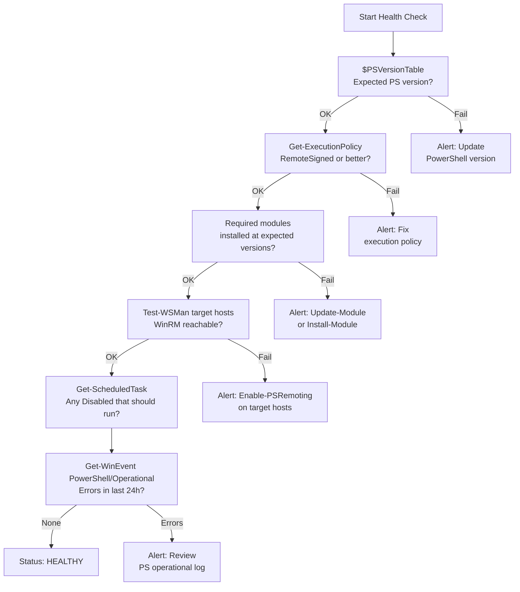

# PowerShell — Health Checks

## PowerShell Environment Health Check Flow


┌───────────────────────────────────── PowerShell — Health Checks ──────────────────────────────────────┐
│   ┌───────────────────────────────────────────────────────────────────────────────────────────────┐   │
│   │  PowerShell health checks: verify PS version, remoting, module currency, and script execution │   │
│   │      Check: $PSVersionTable.PSVersion, Test-WSMan, Get-PSRepository, PSScriptAnalyzer run     │   │
│   └───────────────────────────────────────────────────────────────────────────────────────────────┘   │
│                                                                                                       │
│   ┌──────────────────────────────────────────────┐  ┌─────────────────────────────────────────────┐   │
│   │           Version and Environment            │  │               Remoting Health               │   │
│   │          $PSVersionTable.PSVersion           │  │            Test-WSMan <hostname>            │   │
│   │          Get-Module -ListAvailable           │  │        Test-NetConnection -port 5985        │   │
│   │       Get-InstalledModule (PSGallery)        │  │          Get-PSSessionConfiguration         │   │
│   │          Get-ExecutionPolicy -List           │  │            winrm get winrm/config           │   │
│   │        Invoke-ScriptAnalyzer -Path .         │  │          Check JEA endpoints active         │   │
│   └──────────────────────────────────────────────┘  └─────────────────────────────────────────────┘   │
│                                                                                                       │
│   ┌───────────────────────────────────────────────────────────────────────────────────────────────┐   │
│   │           $PSVersionTable = hash table with PS version, OS, runtime, and build info           │   │
│   │     Test-WSMan      = validates WinRM connectivity and config on remote host; returns XML     │   │
│   │ExecutionPolicy = check per scope: Process, CurrentUser, LocalMachine; Restricted blocks all .p│   │
│   └───────────────────────────────────────────────────────────────────────────────────────────────┘   │
└───────────────────────────────────────────────────────────────────────────────────────────────────────┘
```
