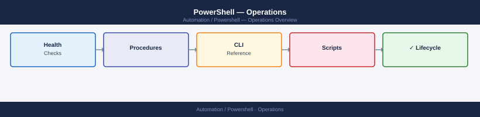

---
tags:
  - operations
  - powershell
---
# PowerShell — Operations

Day-to-day PowerShell administration — script execution, module management, remoting, scheduled jobs, and runbook maintenance.

*Applies to: PowerShell 7.x*

<a class="kb-card" href="cli-reference/">
  <strong>CLI Reference</strong>
  PowerShell command reference with syntax and examples.
</a>

<a class="kb-card" href="health-checks/">
  <strong>Health Checks</strong>
  Daily checks and status verification.
</a>

<a class="kb-card" href="procedures/">
  <strong>Procedures</strong>
  Change readiness, maintenance windows, and operational procedures.
</a>

<a class="kb-card" href="install-upgrade/">
  <strong>Install &amp; Upgrade</strong>
  Version management, module installation, and upgrades.
</a>

<a class="kb-card" href="backup-restore/">
  <strong>Backup &amp; Restore</strong>
  Script backup and configuration restore procedures.
</a>

<a class="kb-card" href="scripts/">
  <strong>Scripts</strong>
  Automation scripts for infrastructure operations.
</a>

