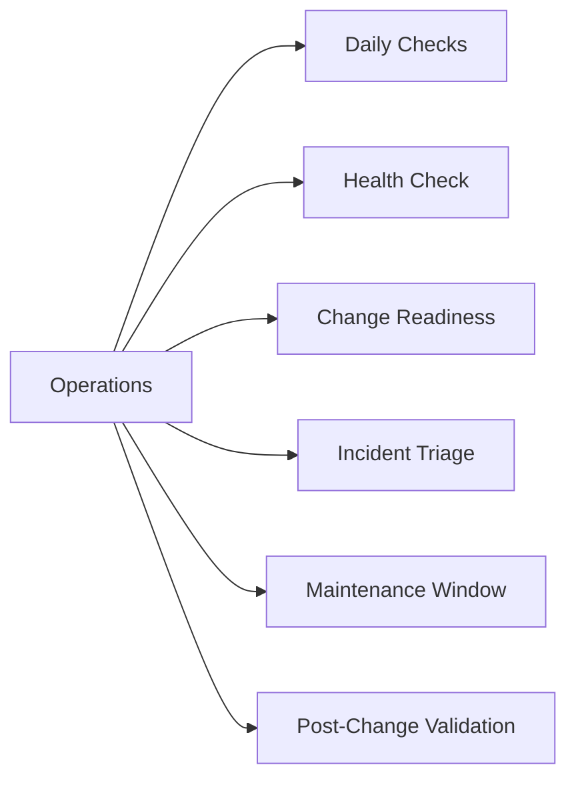

# Operations

> Part of the [PowerShell](../) reference.

---



## Daily Checks


| Check | Command | Notes |
|---|---|---|
| [ ] Verify scheduled PowerShell tasks are not disabled | `Get-ScheduledTask | Where-Object {$_.State -eq 'Disabled'}` |  |
| [ ] Check execution policy on managed hosts | `Get-ExecutionPolicy -List` |  |
| [ ] Review script error logs and transcript files for failed scheduled |  |  |
| [ ] Confirm PSGallery or internal module feed is accessible |  |  |
| [ ] Validate service account credentials used by scheduled scripts are |  |  |
| [ ] Review PowerShell event log for script block logging errors | `Get-WinEvent -LogName 'Microsoft-Windows-PowerShell/Operational' -MaxEvents 50` |  |
| [ ] Confirm WinRM is running on remote targets if remoting is in use |  |  |

## Health Check

- [ ] PowerShell version is at expected level on all managed hosts
- [ ] Execution policy permits script execution
- [ ] Required modules are installed and at expected versions
- [ ] Service accounts used by scheduled tasks have valid, non-expired credentials
- [ ] WinRM service is running and reachable on remote targets
- [ ] Transcript logging path is writable and recent transcripts exist
- [ ] PSGallery or internal feed is reachable from the control host
- [ ] No errors in the PowerShell operational event log from the last 24 hours

```powershell
# PowerShell version
$PSVersionTable

# Execution policy (all scopes)
Get-ExecutionPolicy -List

# Installed modules
Get-Module -ListAvailable | Sort-Object Name | Select-Object Name, Version

# Scheduled tasks — flag disabled tasks
Get-ScheduledTask | Where-Object { $_.State -eq 'Disabled' } |
  Select-Object TaskName, TaskPath, State

# Test WinRM connectivity to a remote host
Test-WSMan -ComputerName <hostname>

# Last 50 PowerShell operational log entries
Get-WinEvent -LogName 'Microsoft-Windows-PowerShell/Operational' -MaxEvents 50 |
  Where-Object { $_.LevelDisplayName -in 'Error','Warning' }
```

## Change Readiness

- [ ] Script tested in non-production environment and output validated
- [ ] Execution policy on target hosts allows the script to run
- [ ] Required modules confirmed installed: `Get-Module -ListAvailable`
- [ ] Transcript logging configured to capture the change: `Start-Transcript -Path <path>`
- [ ] Rollback script or manual revert procedure documented
- [ ] Service account credentials confirmed valid for the duration of the change
- [ ] WinRM connectivity verified to all target hosts before starting

| Item | Status | Notes |
|---|---|---|
| Non-production test | | Pass / Fail |
| Execution policy | | RemoteSigned / AllSigned |
| Required modules installed | | Module names and versions |
| Transcript logging | | Log path configured |
| Rollback script | | Link to script or runbook |

## Incident Triage

- [ ] Re-run the script with `-Verbose` flag to capture detailed execution output
- [ ] Inspect `$Error[0]` or `$Error` for the most recent error details
- [ ] Check whether the service account or token used by the script has expired
- [ ] Review the PowerShell event log for the time of failure: `Get-EventLog -LogName "Windows PowerShell" -Newest 50`
- [ ] Confirm WinRM is working for remoting: `Test-WSMan -ComputerName <hostname>`
- [ ] Check that required modules are present on the target host (not just the control host)
- [ ] Review transcript files from the failed run for the exact line and error message
- [ ] Validate that file paths, registry keys, or remote share paths referenced by the script are accessible

| Question | Answer |
|---|---|
| What does `$Error[0]` show? | Run interactively to inspect |
| Is the credential expired? | Check service account password expiry |
| Is WinRM reachable? | `Test-WSMan -ComputerName <host>` |
| Are required modules present on target? | `Invoke-Command -ComputerName <host> -ScriptBlock { Get-Module -ListAvailable }` |
| Is the execution policy blocking the script? | `Get-ExecutionPolicy -List` on target |

## Maintenance Window

1. Notify team of the planned maintenance window and scope of script changes.
2. Disable scheduled tasks that would fire during the window: `Disable-ScheduledTask -TaskName <name>`.
3. Start transcript logging before executing any changes: `Start-Transcript -Path "C:\Logs\maint-$(Get-Date -f yyyyMMdd-HHmm).log"`.
4. Execute the script or change steps, monitoring output at each stage.
5. If an error occurs, stop and execute the rollback script; do not proceed to the next step.
6. Stop transcript logging on completion: `Stop-Transcript`.
7. Re-enable scheduled tasks after validation: `Enable-ScheduledTask -TaskName <name>`.
8. Retain the transcript log for the change record.

## Post-Change Validation

- [ ] Re-run the script and confirm output matches expected results
- [ ] `$Error` is empty or contains only pre-existing, acknowledged errors
- [ ] No new error entries in the PowerShell operational event log since the change
- [ ] Remote targets are accessible via WinRM: `Test-WSMan -ComputerName <host>`
- [ ] All disabled scheduled tasks have been re-enabled
- [ ] Transcript log archived and attached to the change record
- [ ] Service account credentials still valid and not expiring within 14 days
- [ ] Module versions on target hosts match the expected baseline
