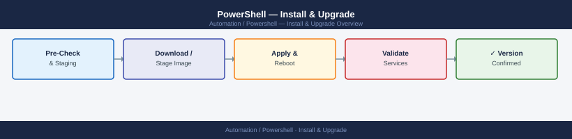

---
tags:
  - operations
  - powershell
---
# PowerShell — Install & Upgrade



```powershell
# Using winget (Windows 10/11)
winget install --id Microsoft.PowerShell --source winget

# Or via MSI — download from github.com/PowerShell/PowerShell/releases
# After install, verify:
pwsh --version
```

```powershell
# Update all user-scope modules
Get-Module -ListAvailable | Where-Object { $_.RepositorySourceLocation } |
    Select-Object -ExpandProperty Name -Unique |
    ForEach-Object {
        try {
            Update-Module $_ -Confirm:$false -ErrorAction Stop
            Write-Host "Updated: $_" -ForegroundColor Green
        } catch {
            Write-Warning "Skipped $_: $($_.Exception.Message)"
        }
    }
```

## Before you begin

- **Access:** Admin credentials on all affected systems
- **Timing:** safe to run during business hours unless a step is marked ⚠ (causes interruption)
- **Dependencies:** no active upgrades or migrations on the same infrastructure
- **Logging:** capture command output — paste into the change record on completion

---

---

## Verify

- Confirm the operation completed without errors in the log or management UI
- Verify the expected state change is visible (service running, object created, config applied)
- Document the outcome in the change record

---

## See also

- [Powershell — Deploy](../../deploy/)
