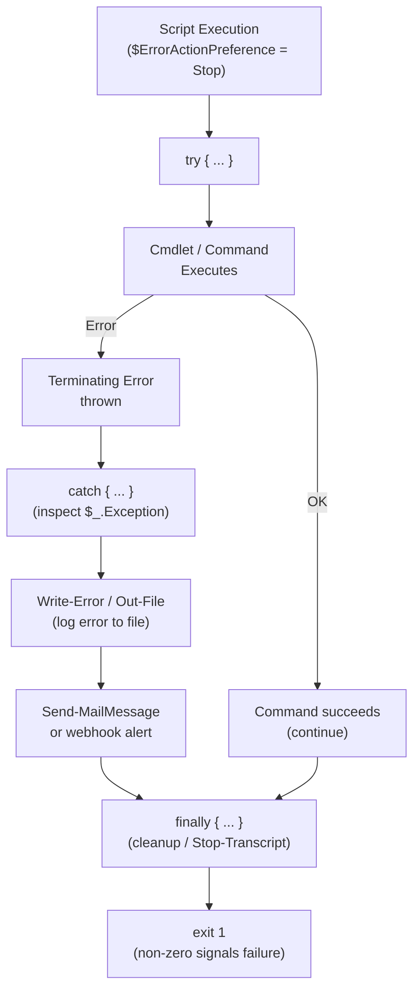

# PowerShell — Procedures


<div class="kb-summary">
Procedures reference covering Change Readiness, Incident Triage, Maintenance Window, Post-Change Validation, PowerShell Error Handling Flow.
</div>

## Change Readiness

- [ ] Script tested in non-production environment and output validated
- [ ] Execution policy on target hosts allows the script to run
- [ ] Required modules confirmed installed: `Get-Module -ListAvailable`
- [ ] Transcript logging configured to capture the change: `Start-Transcript -Path <path>`
- [ ] Rollback script or manual revert procedure documented
- [ ] Service account credentials confirmed valid for the duration of the change
- [ ] WinRM connectivity verified to all target hosts before starting

| Item | Status | Notes |
|---|---|---|
| Non-production test | | Pass / Fail |
| Execution policy | | RemoteSigned / AllSigned |
| Required modules installed | | Module names and versions |
| Transcript logging | | Log path configured |
| Rollback script | | Link to script or runbook |

## Incident Triage

- [ ] Re-run the script with `-Verbose` flag to capture detailed execution output
- [ ] Inspect `$Error[0]` or `$Error` for the most recent error details
- [ ] Check whether the service account or token used by the script has expired
- [ ] Review the PowerShell event log for the time of failure: `Get-EventLog -LogName "Windows PowerShell" -Newest 50`
- [ ] Confirm WinRM is working for remoting: `Test-WSMan -ComputerName <hostname>`
- [ ] Check that required modules are present on the target host (not just the control host)
- [ ] Review transcript files from the failed run for the exact line and error message
- [ ] Validate that file paths, registry keys, or remote share paths referenced by the script are accessible

| Question | Answer |
|---|---|
| What does `$Error[0]` show? | Run interactively to inspect |
| Is the credential expired? | Check service account password expiry |
| Is WinRM reachable? | `Test-WSMan -ComputerName <host>` |
| Are required modules present on target? | `Invoke-Command -ComputerName <host> -ScriptBlock { Get-Module -ListAvailable }` |
| Is the execution policy blocking the script? | `Get-ExecutionPolicy -List` on target |

## Maintenance Window

1. Notify team of the planned maintenance window and scope of script changes.
2. Disable scheduled tasks that would fire during the window: `Disable-ScheduledTask -TaskName <name>`.
3. Start transcript logging before executing any changes: `Start-Transcript -Path "C:\Logs\maint-$(Get-Date -f yyyyMMdd-HHmm).log"`.
4. Execute the script or change steps, monitoring output at each stage.
5. If an error occurs, stop and execute the rollback script; do not proceed to the next step.
6. Stop transcript logging on completion: `Stop-Transcript`.
7. Re-enable scheduled tasks after validation: `Enable-ScheduledTask -TaskName <name>`.
8. Retain the transcript log for the change record.

## Post-Change Validation

- [ ] Re-run the script and confirm output matches expected results
- [ ] `$Error` is empty or contains only pre-existing, acknowledged errors
- [ ] No new error entries in the PowerShell operational event log since the change
- [ ] Remote targets are accessible via WinRM: `Test-WSMan -ComputerName <host>`
- [ ] All disabled scheduled tasks have been re-enabled
- [ ] Transcript log archived and attached to the change record
- [ ] Service account credentials still valid and not expiring within 14 days
- [ ] Module versions on target hosts match the expected baseline

## PowerShell Error Handling Flow


```text
┌─────────────────────────────────────── PowerShell — Procedures ───────────────────────────────────────┐
│   ┌───────────────────────────────────────────────────────────────────────────────────────────────┐   │
│   │   Common PowerShell operational procedures: bulk host operations, AD queries, module updates  │   │
│   │     Bulk remoting: Invoke-Command -ComputerName $servers -ScriptBlock {} -ThrottleLimit 20    │   │
│   │      Pre-flight: test remoting to all targets; use -WhatIf on destructive commands first      │   │
│   └───────────────────────────────────────────────────────────────────────────────────────────────┘   │
│                                                                                                       │
│   ┌──────────────────────────────────────────────┐  ┌─────────────────────────────────────────────┐   │
│   │            Bulk Remote Operations            │  │           Module Update Procedure           │   │
│   │     $servers = Get-ADComputer -Filter *      │  │    1. List installed: Get-InstalledModule   │   │
│   │         Invoke-Command -ComputerName         │  │        2. Check updates: Find-Module        │   │
│   │         $servers.Name -ScriptBlock {}        │  │        3. Test in dev: Update-Module        │   │
│   │       -ThrottleLimit 20 (parallel cap)       │  │        4. Run scripts: verify output        │   │
│   │       $results | Export-Csv output.csv       │  │           5. Deploy to prod hosts           │   │
│   └──────────────────────────────────────────────┘  └─────────────────────────────────────────────┘   │
│                                                                                                       │
│   ┌───────────────────────────────────────────────────────────────────────────────────────────────┐   │
│   │         -ThrottleLimit = max concurrent remote sessions in Invoke-Command; default 32         │   │
│   │    -WhatIf        = simulates what would happen; use before Remove-Item, Stop-Service, etc.   │   │
│   │     Transcript     = Start-Transcript; logs all input/output to file; use for audit trail     │   │
│   └───────────────────────────────────────────────────────────────────────────────────────────────┘   │
└───────────────────────────────────────────────────────────────────────────────────────────────────────┘
```

### Scheduled Tasks for Automated Reports

```powershell
# Create a scheduled task to run a report script daily
$action  = New-ScheduledTaskAction -Execute 'powershell.exe' `
               -Argument '-NonInteractive -File C:\Scripts\daily-report.ps1'
$trigger = New-ScheduledTaskTrigger -Daily -At '06:00AM'
$settings = New-ScheduledTaskSettingsSet -StartWhenAvailable -RunOnlyIfNetworkAvailable

Register-ScheduledTask `
    -TaskName   'DailyServerReport' `
    -TaskPath   '\Automation\' `
    -Action     $action `
    -Trigger    $trigger `
    -Settings   $settings `
    -RunLevel   Highest `
    -Description 'Generate and email daily server report'

# Run the task immediately for testing
Start-ScheduledTask -TaskPath '\Automation\' -TaskName 'DailyServerReport'

# Check last run result
Get-ScheduledTaskInfo -TaskPath '\Automation\' -TaskName 'DailyServerReport' |
    Select-Object LastRunTime, LastTaskResult
```

### Report Format Reference

| Format | Cmdlet | Best for |
|---|---|---|
| CSV | `Export-Csv` | Excel, data import, simple tables |
| HTML | `ConvertTo-Html` | Emailed reports, dashboards |
| JSON | `ConvertTo-Json` | API output, structured data exchange |
| Excel | `ImportExcel` module | Rich formatting, charts |
| XML | `Export-Clixml` | PowerShell object serialisation |
| Text | `Out-File` | Logs, plain-text summaries |

```powershell
# JSON export example
Get-Process | Select-Object Name, Id, CPU |
    ConvertTo-Json -Depth 3 |
    Out-File C:\Reports\processes.json -Encoding UTF8
```

## Create and Use a PowerShell Module

`New-ModuleManifest -Path MyModule.psd1` → write functions in `.psm1` → `Import-Module ./MyModule.psd1` → verify with `Get-Command -Module MyModule`.

```powershell
# Create module manifest
New-ModuleManifest -Path MyModule.psd1 `
    -RootModule 'MyModule.psm1' `
    -ModuleVersion '1.0.0' `
    -Author 'Your Name' `
    -Description 'Helper functions for automation'

# Write functions in the .psm1 file
# MyModule.psm1
function Get-ServerStatus {
    param([string]$ComputerName)
    Test-Connection -ComputerName $ComputerName -Count 1 -Quiet
}

function Invoke-DailyReport {
    # ... report logic ...
}

# Export only public functions
Export-ModuleMember -Function Get-ServerStatus, Invoke-DailyReport

# Import and use the module
Import-Module ./MyModule.psd1

# Verify exported commands
Get-Command -Module MyModule
```

| Component | Purpose |
|---|---|
| `.psd1` manifest | Metadata: version, author, dependencies, exported members |
| `.psm1` root module | Function definitions |
| `Export-ModuleMember` | Controls which functions are public (omit to export all) |
| `Import-Module -Force` | Reload module after editing without restarting the session |

## Publish a Module to PSGallery

`Publish-Module -Name MyModule -NuGetApiKey <key> -Repository PSGallery` → verify on powershellgallery.com.

```powershell
# Register PSGallery if not already registered (it is by default)
Get-PSRepository

# Obtain an API key from https://www.powershellgallery.com/account/apikeys

# Publish the module
Publish-Module -Name MyModule -NuGetApiKey '<YOUR_API_KEY>' -Repository PSGallery -Verbose

# Verify the published module is available
Find-Module -Name MyModule -Repository PSGallery

# Install from PSGallery to confirm
Install-Module -Name MyModule -Scope CurrentUser -Force
Import-Module MyModule
Get-Command -Module MyModule
```

| Requirement | Detail |
|---|---|
| Module manifest `.psd1` | Must include `ModuleVersion` and `Description` |
| API key | Obtained from powershellgallery.com → Account → API Keys |
| `PowerShellGet` | Must be v2+ — update with `Install-Module PowerShellGet -Force` |
| Namespace uniqueness | Module name must not conflict with an existing PSGallery entry |

## Configure PowerShell Remoting over HTTPS

`Enable-PSRemoting` → configure WinRM listener on 5986 → import certificate → test: `Enter-PSSession -ComputerName <host> -UseSSL`.

```powershell
# On the remote host (run as Administrator)
Enable-PSRemoting -Force

# Create or import an SSL certificate (example using self-signed for lab)
$cert = New-SelfSignedCertificate -DnsName 'server01.corp.local' `
    -CertStoreLocation 'Cert:\LocalMachine\My'

# Create HTTPS WinRM listener on port 5986
New-WSManInstance -ResourceURI winrm/config/Listener `
    -SelectorSet @{Address='*'; Transport='HTTPS'} `
    -ValueSet @{Hostname='server01.corp.local'; CertificateThumbprint=$cert.Thumbprint}

# Open firewall port 5986
New-NetFirewallRule -DisplayName 'WinRM HTTPS' -Direction Inbound `
    -Protocol TCP -LocalPort 5986 -Action Allow

# From the management host — connect over HTTPS
Enter-PSSession -ComputerName server01.corp.local -UseSSL `
    -Credential (Get-Credential)

# Test connectivity without opening a full session
Test-WSMan -ComputerName server01.corp.local -UseSSL
```

| Port | Protocol | Use |
|---|---|---|
| 5985 | HTTP | Unencrypted — lab/trusted networks only |
| 5986 | HTTPS | Encrypted — required for production |

## Sign a Script with a Code Signing Certificate

`$cert = Get-ChildItem Cert:\CurrentUser\My -CodeSigningCert` → `Set-AuthenticodeSignature -FilePath script.ps1 -Certificate $cert` → verify signature.

```powershell
# List available code signing certificates in the personal store
Get-ChildItem Cert:\CurrentUser\My -CodeSigningCert

# Sign the script
$cert = Get-ChildItem Cert:\CurrentUser\My -CodeSigningCert | Select-Object -First 1
Set-AuthenticodeSignature -FilePath 'C:\Scripts\deploy.ps1' -Certificate $cert

# Verify the signature
Get-AuthenticodeSignature -FilePath 'C:\Scripts\deploy.ps1'

# Confirm the execution policy will accept signed scripts
Set-ExecutionPolicy AllSigned -Scope LocalMachine
# or for scripts from other sources:
Set-ExecutionPolicy RemoteSigned -Scope LocalMachine
```

| Status | Meaning |
|---|---|
| `Valid` | Signature is intact and certificate is trusted |
| `NotSigned` | Script has no digital signature |
| `HashMismatch` | File was modified after signing — do not run |
| `UnknownError` | Certificate chain cannot be verified; check trust store |
