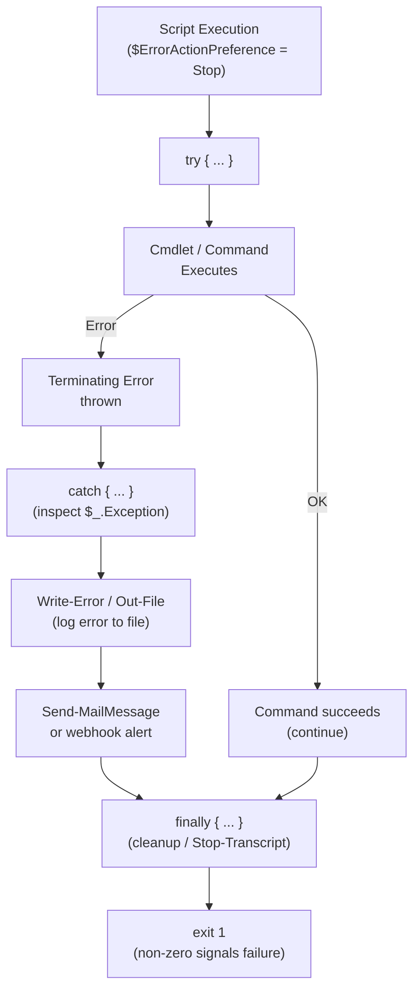

# PowerShell — Procedures

## Change Readiness

- [ ] Script tested in non-production environment and output validated
- [ ] Execution policy on target hosts allows the script to run
- [ ] Required modules confirmed installed: `Get-Module -ListAvailable`
- [ ] Transcript logging configured to capture the change: `Start-Transcript -Path <path>`
- [ ] Rollback script or manual revert procedure documented
- [ ] Service account credentials confirmed valid for the duration of the change
- [ ] WinRM connectivity verified to all target hosts before starting

| Item | Status | Notes |
|---|---|---|
| Non-production test | | Pass / Fail |
| Execution policy | | RemoteSigned / AllSigned |
| Required modules installed | | Module names and versions |
| Transcript logging | | Log path configured |
| Rollback script | | Link to script or runbook |

## Incident Triage

- [ ] Re-run the script with `-Verbose` flag to capture detailed execution output
- [ ] Inspect `$Error[0]` or `$Error` for the most recent error details
- [ ] Check whether the service account or token used by the script has expired
- [ ] Review the PowerShell event log for the time of failure: `Get-EventLog -LogName "Windows PowerShell" -Newest 50`
- [ ] Confirm WinRM is working for remoting: `Test-WSMan -ComputerName <hostname>`
- [ ] Check that required modules are present on the target host (not just the control host)
- [ ] Review transcript files from the failed run for the exact line and error message
- [ ] Validate that file paths, registry keys, or remote share paths referenced by the script are accessible

| Question | Answer |
|---|---|
| What does `$Error[0]` show? | Run interactively to inspect |
| Is the credential expired? | Check service account password expiry |
| Is WinRM reachable? | `Test-WSMan -ComputerName <host>` |
| Are required modules present on target? | `Invoke-Command -ComputerName <host> -ScriptBlock { Get-Module -ListAvailable }` |
| Is the execution policy blocking the script? | `Get-ExecutionPolicy -List` on target |

## Maintenance Window

1. Notify team of the planned maintenance window and scope of script changes.
2. Disable scheduled tasks that would fire during the window: `Disable-ScheduledTask -TaskName <name>`.
3. Start transcript logging before executing any changes: `Start-Transcript -Path "C:\Logs\maint-$(Get-Date -f yyyyMMdd-HHmm).log"`.
4. Execute the script or change steps, monitoring output at each stage.
5. If an error occurs, stop and execute the rollback script; do not proceed to the next step.
6. Stop transcript logging on completion: `Stop-Transcript`.
7. Re-enable scheduled tasks after validation: `Enable-ScheduledTask -TaskName <name>`.
8. Retain the transcript log for the change record.

## Post-Change Validation

- [ ] Re-run the script and confirm output matches expected results
- [ ] `$Error` is empty or contains only pre-existing, acknowledged errors
- [ ] No new error entries in the PowerShell operational event log since the change
- [ ] Remote targets are accessible via WinRM: `Test-WSMan -ComputerName <host>`
- [ ] All disabled scheduled tasks have been re-enabled
- [ ] Transcript log archived and attached to the change record
- [ ] Service account credentials still valid and not expiring within 14 days
- [ ] Module versions on target hosts match the expected baseline

## PowerShell Error Handling Flow


```

### HTML Reports with ConvertTo-Html

```powershell
# Basic HTML report
$header = "<style>body{font-family:Arial} table{border-collapse:collapse} td,th{border:1px solid #ccc;padding:6px}</style>"

Get-Service |
    Where-Object { $_.Status -eq 'Stopped' } |
    Select-Object Name, DisplayName, StartType |
    ConvertTo-Html -Title "Stopped Services" -Head $header |
    Out-File C:\Reports\stopped-services.html

# Multi-section HTML report
$htmlBody = ""
$htmlBody += "<h2>Disk Usage</h2>"
$htmlBody += Get-PSDrive -PSProvider FileSystem |
    Select-Object Name, @{N='Used(GB)';E={[math]::Round($_.Used/1GB,2)}}, @{N='Free(GB)';E={[math]::Round($_.Free/1GB,2)}} |
    ConvertTo-Html -Fragment

$htmlBody += "<h2>Top Processes by CPU</h2>"
$htmlBody += Get-Process | Sort-Object CPU -Descending | Select-Object -First 10 Name, CPU, WorkingSet |
    ConvertTo-Html -Fragment

ConvertTo-Html -Title "Server Report" -Head $header -Body $htmlBody |
    Out-File C:\Reports\server-report.html
```

### Send-MailMessage and Email Reports

```powershell
# Send a report by email (PowerShell 5.1 — deprecated but still functional)
$mailParams = @{
    To         = 'ops-team@example.com'
    From       = 'automation@example.com'
    Subject    = "Daily Server Report - $(Get-Date -Format 'yyyy-MM-dd')"
    Body       = (Get-Content C:\Reports\server-report.html -Raw)
    BodyAsHtml = $true
    SmtpServer = 'smtp.example.com'
    Port       = 587
    Credential = (Get-Credential)
    UseSsl     = $true
    Attachments = 'C:\Reports\services.csv'
}
Send-MailMessage @mailParams
```

### Scheduled Tasks for Automated Reports

```powershell
# Create a scheduled task to run a report script daily
$action  = New-ScheduledTaskAction -Execute 'powershell.exe' `
               -Argument '-NonInteractive -File C:\Scripts\daily-report.ps1'
$trigger = New-ScheduledTaskTrigger -Daily -At '06:00AM'
$settings = New-ScheduledTaskSettingsSet -StartWhenAvailable -RunOnlyIfNetworkAvailable

Register-ScheduledTask `
    -TaskName   'DailyServerReport' `
    -TaskPath   '\Automation\' `
    -Action     $action `
    -Trigger    $trigger `
    -Settings   $settings `
    -RunLevel   Highest `
    -Description 'Generate and email daily server report'

# Run the task immediately for testing
Start-ScheduledTask -TaskPath '\Automation\' -TaskName 'DailyServerReport'

# Check last run result
Get-ScheduledTaskInfo -TaskPath '\Automation\' -TaskName 'DailyServerReport' |
    Select-Object LastRunTime, LastTaskResult
```

### Report Format Reference

| Format | Cmdlet | Best for |
|---|---|---|
| CSV | `Export-Csv` | Excel, data import, simple tables |
| HTML | `ConvertTo-Html` | Emailed reports, dashboards |
| JSON | `ConvertTo-Json` | API output, structured data exchange |
| Excel | `ImportExcel` module | Rich formatting, charts |
| XML | `Export-Clixml` | PowerShell object serialisation |
| Text | `Out-File` | Logs, plain-text summaries |

```powershell
# JSON export example
Get-Process | Select-Object Name, Id, CPU |
    ConvertTo-Json -Depth 3 |
    Out-File C:\Reports\processes.json -Encoding UTF8
```
