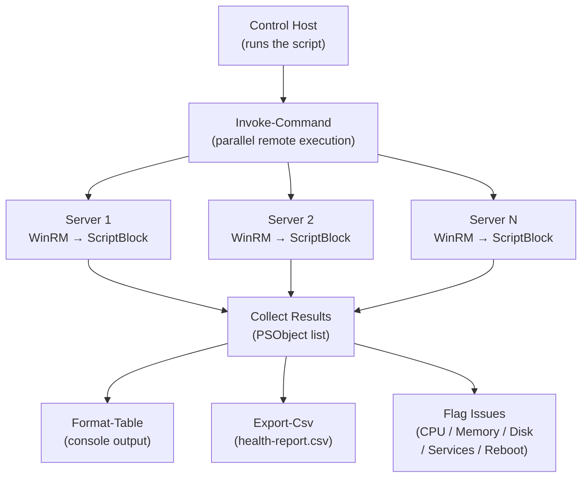

# Scripts

> Part of the [PowerShell](../index.md) reference.

---

## Remote Health Check Topology



## Windows Server Health Check (PowerShell)

Connect to remote servers via `Invoke-Command`, collect disk, memory, CPU, top processes, stopped automatic services, last boot time, and pending reboot status, then export results to CSV.

~~~powershell
#!/usr/bin/env pwsh
# windows-health-check.ps1
# Usage: ./windows-health-check.ps1 -Servers server1,server2,server3 [-ExportCsv health-report.csv]

param(
    [Parameter(Mandatory)]
    [string[]]$Servers,

    [System.Management.Automation.PSCredential]
    $Credential,

    [string]$ExportCsv = "health-report-$(Get-Date -Format 'yyyyMMdd-HHmmss').csv"
)

Set-StrictMode -Version Latest
$ErrorActionPreference = "Stop"

$Results = [System.Collections.Generic.List[PSObject]]::new()

$ScriptBlock = {
    $os      = Get-CimInstance -ClassName Win32_OperatingSystem
    $cs      = Get-CimInstance -ClassName Win32_ComputerSystem
    $cpu     = (Get-Counter '\Processor(_Total)\% Processor Time' -SampleInterval 2 -MaxSamples 2).CounterSamples |
               Measure-Object CookedValue -Average | Select-Object -ExpandProperty Average

    # Disk usage
    $disks = Get-PSDrive -PSProvider FileSystem | Where-Object { $_.Used -gt 0 } | ForEach-Object {
        $total = $_.Used + $_.Free
        $pct   = if ($total -gt 0) { [math]::Round(($_.Used / $total) * 100, 1) } else { 0 }
        [PSCustomObject]@{ Drive = $_.Name; UsedGB = [math]::Round($_.Used/1GB,2); TotalGB = [math]::Round($total/1GB,2); UsedPct = $pct }
    }
    $highDisks = $disks | Where-Object { $_.UsedPct -ge 85 }

    # Memory
    $totalMemGB = [math]::Round($cs.TotalPhysicalMemory / 1GB, 2)
    $freeMemGB  = [math]::Round($os.FreePhysicalMemory / 1MB, 2)
    $usedMemPct = [math]::Round((($totalMemGB - $freeMemGB) / $totalMemGB) * 100, 1)

    # Top 5 processes by working set
    $topProcs = Get-Process | Sort-Object WorkingSet64 -Descending |
                Select-Object -First 5 -Property Name, Id,
                    @{n='MemMB';e={[math]::Round($_.WorkingSet64/1MB,1)}}

    # Stopped automatic services
    $stoppedSvcs = Get-Service |
                   Where-Object { $_.Status -eq 'Stopped' -and $_.StartType -eq 'Automatic' } |
                   Select-Object Name, DisplayName

    # Last boot
    $lastBoot = $os.LastBootUpTime

    # Pending reboot (check common registry keys)
    $pendingReboot = $false
    $rebootKeys = @(
        'HKLM:\SOFTWARE\Microsoft\Windows\CurrentVersion\WindowsUpdate\Auto Update\RebootRequired',
        'HKLM:\SYSTEM\CurrentControlSet\Control\Session Manager\PendingFileRenameOperations',
        'HKLM:\SOFTWARE\Microsoft\Windows\CurrentVersion\Component Based Servicing\RebootPending'
    )
    foreach ($key in $rebootKeys) {
        if (Test-Path $key) { $pendingReboot = $true; break }
    }

    return [PSCustomObject]@{
        Hostname        = $env:COMPUTERNAME
        CPUPct          = [math]::Round($cpu, 1)
        MemTotalGB      = $totalMemGB
        MemUsedPct      = $usedMemPct
        HighDiskDrives  = ($highDisks | ForEach-Object { "$($_.Drive): $($_.UsedPct)%" }) -join '; '
        StoppedAutoSvcs = ($stoppedSvcs | ForEach-Object { $_.Name }) -join '; '
        LastBoot        = $lastBoot.ToString('yyyy-MM-dd HH:mm:ss')
        PendingReboot   = $pendingReboot
        TopProcs        = ($topProcs | ForEach-Object { "$($_.Name)($($_.MemMB)MB)" }) -join '; '
    }
}

Write-Host "`n=== Windows Server Health Check ===" -ForegroundColor Cyan
Write-Host "Servers: $($Servers -join ', ')"
Write-Host "Time   : $(Get-Date -Format 'yyyy-MM-dd HH:mm:ss')`n"

foreach ($Server in $Servers) {
    Write-Host "Checking $Server..." -NoNewline
    try {
        $params = @{ ComputerName = $Server; ScriptBlock = $ScriptBlock }
        if ($Credential) { $params['Credential'] = $Credential }
        $result = Invoke-Command @params
        $Results.Add($result)
        Write-Host " OK" -ForegroundColor Green
    } catch {
        Write-Host " FAILED: $($_.Exception.Message)" -ForegroundColor Red
        $Results.Add([PSCustomObject]@{ Hostname = $Server; Error = $_.Exception.Message })
    }
}

# Print table
Write-Host ""
$Results | Format-Table -AutoSize

# Flag issues
Write-Host "Issues:" -ForegroundColor Yellow
foreach ($r in $Results) {
    if ($r.CPUPct -ge 90)          { Write-Host "  [$($r.Hostname)] HIGH CPU: $($r.CPUPct)%" -ForegroundColor Red }
    if ($r.MemUsedPct -ge 90)      { Write-Host "  [$($r.Hostname)] HIGH MEMORY: $($r.MemUsedPct)%" -ForegroundColor Red }
    if ($r.HighDiskDrives)         { Write-Host "  [$($r.Hostname)] HIGH DISK: $($r.HighDiskDrives)" -ForegroundColor Red }
    if ($r.StoppedAutoSvcs)        { Write-Host "  [$($r.Hostname)] STOPPED SERVICES: $($r.StoppedAutoSvcs)" -ForegroundColor Yellow }
    if ($r.PendingReboot -eq $true){ Write-Host "  [$($r.Hostname)] PENDING REBOOT" -ForegroundColor Yellow }
}

# Export to CSV
$Results | Export-Csv -Path $ExportCsv -NoTypeInformation
Write-Host "`nExported: $ExportCsv"
~~~

#### How to run this script — step by step

**Before you start — what you need**
- Windows PowerShell 5.1 or PowerShell 7 (already on most Windows 10/11 machines)
- WinRM (Windows Remote Management) enabled on the servers you want to check — ask your IT team if unsure
- Admin credentials for the remote servers (or your account must have remote management access)

**Step 1 — Save the file**

1. Open **Notepad** (Windows key → search for Notepad)
2. Copy the entire code block above
3. Click **File → Save As**
4. Set "Save as type" to **All Files** (important — prevents Notepad adding .txt)
5. Name it `windows-health-check.ps1` and save to your Desktop

**Step 2 — Fill in your details**

The server names are passed when you run the script — no editing needed inside the file.

| Parameter | What to enter | Example |
|---|---|---|
| `-Servers` | Comma-separated list of server names or IPs | `server01,server02,192.168.1.10` |
| `-Credential` | Optional — your admin credentials if needed | Leave out if your current account has access |
| `-ExportCsv` | Optional — where to save the CSV report | Default is a timestamped file in your current folder |

**Step 3 — Open the right terminal**

- **For .ps1 (PowerShell):** Windows key → `PowerShell` → right-click → **Run as Administrator**

**Step 4 — Allow scripts to run (one-time per session)**

```powershell
Set-ExecutionPolicy -Scope Process -ExecutionPolicy Bypass
```

**Step 5 — Run it**

```bash
cd C:\Users\YourName\Desktop
.\windows-health-check.ps1 -Servers server01,server02
```

**What you should see**

A table with one row per server showing CPU%, memory%, any disks over 85%, any stopped automatic services, last boot time, and whether a reboot is pending. Below the table, any issues are highlighted in red or yellow. A CSV file is saved so you can open it in Excel.

---

## Active Directory User Audit (PowerShell)

Audit Active Directory for inactive accounts, non-expiring passwords, expired passwords, privileged group membership, and orphaned admin accounts. Exports each finding to CSV.

~~~powershell
#!/usr/bin/env pwsh
# ad-user-audit.ps1
# Usage: ./ad-user-audit.ps1 [-OutputDir C:\Reports]
# Requires: ActiveDirectory module (RSAT)

param(
    [string]$OutputDir = ".",
    [int]$InactiveDays = 90
)

Import-Module ActiveDirectory -ErrorAction Stop

$Timestamp   = Get-Date -Format 'yyyyMMdd-HHmmss'
$InactiveDate = (Get-Date).AddDays(-$InactiveDays)
$PrivGroups  = @('Domain Admins', 'Enterprise Admins', 'Schema Admins', 'Backup Operators', 'Account Operators')

Write-Host "`n=== Active Directory User Audit ===" -ForegroundColor Cyan
Write-Host "Domain  : $((Get-ADDomain).DNSRoot)"
Write-Host "Time    : $(Get-Date -Format 'yyyy-MM-dd HH:mm:ss')`n"

# --- 1. Inactive accounts (no logon > N days) ---
Write-Host "1. Accounts inactive for > $InactiveDays days..."
$Inactive = Search-ADAccount -AccountInactive -TimeSpan ([TimeSpan]::FromDays($InactiveDays)) -UsersOnly |
    Get-ADUser -Properties LastLogonDate, Enabled, DistinguishedName |
    Select-Object SamAccountName, DisplayName, Enabled, LastLogonDate, DistinguishedName
Write-Host "   Found: $($Inactive.Count)"
$Inactive | Export-Csv "$OutputDir\audit-inactive-$Timestamp.csv" -NoTypeInformation

# --- 2. Passwords set to never expire ---
Write-Host "2. Accounts with passwords set to never expire..."
$NeverExpire = Get-ADUser -Filter { PasswordNeverExpires -eq $true -and Enabled -eq $true } `
    -Properties PasswordNeverExpires, PasswordLastSet, LastLogonDate |
    Select-Object SamAccountName, DisplayName, PasswordLastSet, LastLogonDate
Write-Host "   Found: $($NeverExpire.Count)"
$NeverExpire | Export-Csv "$OutputDir\audit-never-expire-$Timestamp.csv" -NoTypeInformation

# --- 3. Accounts with expired passwords ---
Write-Host "3. Accounts with expired passwords..."
$PasswordExpired = Search-ADAccount -PasswordExpired -UsersOnly |
    Get-ADUser -Properties PasswordExpired, PasswordLastSet, Enabled |
    Where-Object { $_.Enabled } |
    Select-Object SamAccountName, DisplayName, PasswordLastSet
Write-Host "   Found: $($PasswordExpired.Count)"
$PasswordExpired | Export-Csv "$OutputDir\audit-pw-expired-$Timestamp.csv" -NoTypeInformation

# --- 4. Members of sensitive privileged groups ---
Write-Host "4. Members of sensitive groups..."
$PrivReport = [System.Collections.Generic.List[PSObject]]::new()
foreach ($GroupName in $PrivGroups) {
    try {
        $Members = Get-ADGroupMember -Identity $GroupName -Recursive |
                   Where-Object { $_.objectClass -eq 'user' } |
                   Get-ADUser -Properties LastLogonDate, Enabled, PasswordLastSet
        foreach ($m in $Members) {
            $PrivReport.Add([PSCustomObject]@{
                Group           = $GroupName
                SamAccountName  = $m.SamAccountName
                DisplayName     = $m.DisplayName
                Enabled         = $m.Enabled
                LastLogon       = $m.LastLogonDate
                PasswordLastSet = $m.PasswordLastSet
            })
        }
        Write-Host "   $GroupName : $($Members.Count) member(s)"
    } catch {
        Write-Host "   $GroupName : not found or access denied" -ForegroundColor Yellow
    }
}
$PrivReport | Export-Csv "$OutputDir\audit-priv-groups-$Timestamp.csv" -NoTypeInformation

# --- 5. Orphaned admin accounts (adminCount=1 but not in any known priv group) ---
Write-Host "5. Checking for orphaned admin accounts (adminCount=1)..."
$AdminCount1 = Get-ADUser -LDAPFilter '(adminCount=1)' -Properties adminCount, MemberOf, LastLogonDate, Enabled |
    Select-Object SamAccountName, DisplayName, Enabled, LastLogonDate,
        @{n='GroupCount';e={($_.MemberOf | Measure-Object).Count}}
$PrivGroupDNs = $PrivGroups | ForEach-Object {
    try { (Get-ADGroup -Identity $_).DistinguishedName } catch { $null }
} | Where-Object { $_ }
$Orphaned = $AdminCount1 | Where-Object {
    $user = Get-ADUser -Identity $_.SamAccountName -Properties MemberOf
    ($user.MemberOf | Where-Object { $PrivGroupDNs -contains $_ }).Count -eq 0
}
Write-Host "   Orphaned admin accounts: $($Orphaned.Count)"
$Orphaned | Export-Csv "$OutputDir\audit-orphaned-admin-$Timestamp.csv" -NoTypeInformation

# --- Summary ---
Write-Host ""
Write-Host "=== Audit Summary ===" -ForegroundColor Cyan
Write-Host "Inactive accounts (>$InactiveDays days) : $($Inactive.Count)"
Write-Host "Passwords never expire                   : $($NeverExpire.Count)"
Write-Host "Passwords expired (enabled)              : $($PasswordExpired.Count)"
Write-Host "Privileged group members                 : $($PrivReport.Count)"
Write-Host "Orphaned admin accounts                  : $($Orphaned.Count)"
Write-Host ""
Write-Host "Reports saved to: $OutputDir" -ForegroundColor Green
~~~

#### How to run this script — step by step

**Before you start — what you need**
- A Windows machine that is joined to your Active Directory domain
- RSAT (Remote Server Administration Tools) installed — go to Windows Settings → Apps → Optional features → Add a feature → search for "RSAT: Active Directory"
- A domain account with read access to Active Directory (a regular domain user is usually enough for read-only auditing)

**Step 1 — Save the file**

1. Open **Notepad** (Windows key → search for Notepad)
2. Copy the entire code block above
3. Click **File → Save As**
4. Set "Save as type" to **All Files**
5. Name it `ad-user-audit.ps1` and save to your Desktop

**Step 2 — Fill in your details**

The parameters are optional — the defaults are usually fine:

| Parameter | What to enter | Example |
|---|---|---|
| `-OutputDir` | Folder to save CSV reports | `C:\Reports` — this folder must exist |
| `-InactiveDays` | Days without login to consider inactive | Default: `90` |

**Step 3 — Open the right terminal**

- **For .ps1 (PowerShell):** Windows key → `PowerShell` → right-click → **Run as Administrator**

**Step 4 — Allow scripts to run (one-time per session)**

```powershell
Set-ExecutionPolicy -Scope Process -ExecutionPolicy Bypass
```

**Step 5 — Run it**

```bash
cd C:\Users\YourName\Desktop
.\ad-user-audit.ps1 -OutputDir C:\Reports
```

**What you should see**

Five numbered checks run in sequence. Each prints how many accounts were found. At the end a summary table shows counts for each category. Five CSV files are saved in your output folder — open them in Excel to review the details.

---

## Certificate Expiry Monitor (PowerShell)

Scan Windows servers for expiring certificates in the LocalMachine\My store and IIS SSL bindings, flag those expiring within configurable warning and critical thresholds, and send an email report.

~~~powershell
#!/usr/bin/env pwsh
# cert-expiry-monitor.ps1
# Usage: ./cert-expiry-monitor.ps1 -Servers server1,server2 -SmtpServer smtp.example.com -AlertEmail ops@example.com

param(
    [Parameter(Mandatory)]
    [string[]]$Servers,

    [System.Management.Automation.PSCredential]
    $Credential,

    [int]$WarnDays  = 30,
    [int]$CritDays  = 14,
    [string]$SmtpServer  = $env:SMTP_SERVER,
    [string]$AlertEmail  = $env:ALERT_EMAIL,
    [string]$FromEmail   = "cert-monitor@$((Get-ADDomain -ErrorAction SilentlyContinue).DNSRoot)"
)

Set-StrictMode -Version Latest

$AllCerts = [System.Collections.Generic.List[PSObject]]::new()

$CertScript = {
    param($WarnDays, $CritDays)

    $findings = [System.Collections.Generic.List[PSObject]]::new()
    $now      = Get-Date

    # LocalMachine\My store
    $certs = Get-ChildItem Cert:\LocalMachine\My
    foreach ($cert in $certs) {
        $daysLeft = ($cert.NotAfter - $now).Days
        $severity = if ($daysLeft -le $CritDays) { "CRITICAL" }
                    elseif ($daysLeft -le $WarnDays) { "WARNING" }
                    else { "OK" }
        $findings.Add([PSCustomObject]@{
            Server      = $env:COMPUTERNAME
            Subject     = $cert.Subject
            Thumbprint  = $cert.Thumbprint
            Expiry      = $cert.NotAfter.ToString('yyyy-MM-dd')
            DaysLeft    = $daysLeft
            Store       = "LocalMachine\My"
            Service     = "Certificate Store"
            Severity    = $severity
        })
    }

    # IIS SSL bindings (if IIS is installed)
    try {
        Import-Module WebAdministration -ErrorAction Stop
        $sites = Get-WebSite
        foreach ($site in $sites) {
            $bindings = $site.Bindings.Collection | Where-Object { $_.Protocol -eq 'https' }
            foreach ($binding in $bindings) {
                $hash = $binding.CertificateHash
                if (-not $hash) { continue }
                $thumbprint = ($hash | ForEach-Object { $_.ToString('X2') }) -join ''
                $cert = Get-ChildItem Cert:\LocalMachine\My |
                        Where-Object { $_.Thumbprint -eq $thumbprint } |
                        Select-Object -First 1
                if (-not $cert) { continue }
                $daysLeft = ($cert.NotAfter - $now).Days
                $severity = if ($daysLeft -le $CritDays) { "CRITICAL" }
                            elseif ($daysLeft -le $WarnDays) { "WARNING" }
                            else { "OK" }
                $findings.Add([PSCustomObject]@{
                    Server      = $env:COMPUTERNAME
                    Subject     = $cert.Subject
                    Thumbprint  = $thumbprint
                    Expiry      = $cert.NotAfter.ToString('yyyy-MM-dd')
                    DaysLeft    = $daysLeft
                    Store       = "IIS Binding"
                    Service     = "$($site.Name) ($($binding.BindingInformation))"
                    Severity    = $severity
                })
            }
        }
    } catch {
        # IIS not installed or WebAdministration not available — skip silently
    }

    return $findings
}

Write-Host "`n=== Certificate Expiry Monitor ===" -ForegroundColor Cyan
Write-Host "Servers  : $($Servers -join ', ')"
Write-Host "Warn     : < $WarnDays days | Crit: < $CritDays days`n"

foreach ($Server in $Servers) {
    Write-Host "Scanning $Server..." -NoNewline
    try {
        $params = @{
            ComputerName = $Server
            ScriptBlock  = $CertScript
            ArgumentList = $WarnDays, $CritDays
        }
        if ($Credential) { $params['Credential'] = $Credential }
        $certs = Invoke-Command @params
        $AllCerts.AddRange($certs)
        Write-Host " OK ($($certs.Count) certs)" -ForegroundColor Green
    } catch {
        Write-Host " FAILED: $($_.Exception.Message)" -ForegroundColor Red
    }
}

# Display results
Write-Host ""
$AllCerts | Sort-Object DaysLeft |
    Format-Table Server, Subject, Expiry, DaysLeft, Severity, Service -AutoSize

$CritList = $AllCerts | Where-Object { $_.Severity -eq 'CRITICAL' }
$WarnList = $AllCerts | Where-Object { $_.Severity -eq 'WARNING' }

Write-Host "CRITICAL ($($CritList.Count))  |  WARNING ($($WarnList.Count))  |  Total scanned: $($AllCerts.Count)"

# Email report if there are any alerts and SMTP is configured
if (($CritList.Count -gt 0 -or $WarnList.Count -gt 0) -and $SmtpServer -and $AlertEmail) {
    $Subject = "Certificate Expiry Alert: $($CritList.Count) CRITICAL, $($WarnList.Count) WARNING"
    $Body = "Certificate Expiry Monitor Report`n"
    $Body += "Generated: $(Get-Date -Format 'yyyy-MM-dd HH:mm:ss')`n`n"

    $Body += "CRITICAL (expiring within $CritDays days):`n"
    foreach ($c in $CritList) {
        $Body += "  $($c.Server) | $($c.Subject) | Expires: $($c.Expiry) ($($c.DaysLeft) days) | $($c.Service)`n"
    }

    $Body += "`nWARNING (expiring within $WarnDays days):`n"
    foreach ($c in $WarnList) {
        $Body += "  $($c.Server) | $($c.Subject) | Expires: $($c.Expiry) ($($c.DaysLeft) days) | $($c.Service)`n"
    }

    Send-MailMessage -To $AlertEmail -From $FromEmail -Subject $Subject `
        -Body $Body -SmtpServer $SmtpServer
    Write-Host "Alert email sent to $AlertEmail"
}
~~~

#### How to run this script — step by step

**Before you start — what you need**
- Windows PowerShell 5.1 or PowerShell 7
- WinRM enabled on the servers to scan (for remote scanning — or run locally by passing `localhost` as the server)
- SMTP server details if you want email alerts
- Admin access on the servers being scanned

**Step 1 — Save the file**

1. Open **Notepad** (Windows key → search for Notepad)
2. Copy the entire code block above
3. Click **File → Save As**
4. Set "Save as type" to **All Files**
5. Name it `cert-expiry-monitor.ps1` and save to your Desktop

**Step 2 — Fill in your details**

Parameters are passed on the command line:

| Parameter | What to enter | Example |
|---|---|---|
| `-Servers` | Comma-separated server names/IPs | `webserver01,webserver02` |
| `-WarnDays` | Days before expiry to warn | Default: `30` |
| `-CritDays` | Days before expiry for critical alert | Default: `14` |
| `-SmtpServer` | Your SMTP server address | `smtp.yourcompany.com` |
| `-AlertEmail` | Email address to send alerts to | `ops@yourcompany.com` |

**Step 3 — Open the right terminal**

- **For .ps1 (PowerShell):** Windows key → `PowerShell` → right-click → **Run as Administrator**

**Step 4 — Allow scripts to run (one-time per session)**

```powershell
Set-ExecutionPolicy -Scope Process -ExecutionPolicy Bypass
```

**Step 5 — Run it**

```bash
cd C:\Users\YourName\Desktop
.\cert-expiry-monitor.ps1 -Servers webserver01,webserver02 -SmtpServer smtp.example.com -AlertEmail ops@example.com
```

**What you should see**

A table showing every certificate found on each server, sorted by days remaining. CRITICAL certificates (expiring soon) appear first. The summary line shows counts of CRITICAL vs WARNING. If any alerts are found and SMTP is configured, an email is sent.

---

## Service Health Monitor (PowerShell)

Check that required services are running across a server fleet. Optionally attempt automatic restart for stopped services. Exits with a monitoring-compatible code.

~~~powershell
#!/usr/bin/env pwsh
# service-health-monitor.ps1
# Usage: ./service-health-monitor.ps1 [-AttemptRestart]
#
# Define $ServiceMap to match your environment.

param(
    [bool]$AttemptRestart = $false,
    [System.Management.Automation.PSCredential]$Credential
)

Set-StrictMode -Version Latest

# --- Define required services per server ---
# Format: 'ServerName' = @('ServiceName1', 'ServiceName2', ...)
$ServiceMap = [ordered]@{
    'webserver01'   = @('W3SVC', 'WAS', 'wuauserv')
    'appserver01'   = @('MyAppService', 'MSSQLServer', 'SQLServerAgent')
    'fileserver01'  = @('LanmanServer', 'LanmanWorkstation', 'W32Time')
    'dc01'          = @('ADWS', 'DNS', 'KDC', 'Netlogon', 'NTDS')
}

$LOGFILE = "service-monitor-$(Get-Date -Format 'yyyyMMdd-HHmmss').log"
$ExitCode = 0

function Write-Log {
    param([string]$Message, [string]$Level = "INFO")
    $entry = "[$(Get-Date -Format 'yyyy-MM-dd HH:mm:ss')] [$Level] $Message"
    Add-Content -Path $LOGFILE -Value $entry
    switch ($Level) {
        "ERROR" { Write-Host $entry -ForegroundColor Red }
        "WARN"  { Write-Host $entry -ForegroundColor Yellow }
        default { Write-Host $entry }
    }
}

Write-Log "=== Service Health Monitor ==="
Write-Log "Attempt restart: $AttemptRestart"
Write-Host ""

$AllResults = [System.Collections.Generic.List[PSObject]]::new()

foreach ($Server in $ServiceMap.Keys) {
    $RequiredServices = $ServiceMap[$Server]

    foreach ($ServiceName in $RequiredServices) {
        $result = [PSCustomObject]@{
            Server      = $Server
            Service     = $ServiceName
            Status      = "UNKNOWN"
            StartType   = "UNKNOWN"
            Restarted   = $false
            Error       = $null
        }

        try {
            $params = @{
                ComputerName = $Server
                ScriptBlock  = {
                    param($svc)
                    $s = Get-Service -Name $svc -ErrorAction Stop
                    return [PSCustomObject]@{ Status = $s.Status.ToString(); StartType = $s.StartType.ToString() }
                }
                ArgumentList = $ServiceName
            }
            if ($Credential) { $params['Credential'] = $Credential }
            $svcInfo = Invoke-Command @params

            $result.Status    = $svcInfo.Status
            $result.StartType = $svcInfo.StartType

            if ($svcInfo.Status -ne 'Running' -and $svcInfo.StartType -eq 'Automatic') {
                Write-Log "STOPPED (Automatic): $Server/$ServiceName" -Level "WARN"
                $script:ExitCode = 1

                if ($AttemptRestart) {
                    Write-Log "Attempting restart of $ServiceName on $Server..." -Level "WARN"
                    try {
                        $restartParams = @{
                            ComputerName = $Server
                            ScriptBlock  = { param($svc) Restart-Service -Name $svc -Force }
                            ArgumentList = $ServiceName
                        }
                        if ($Credential) { $restartParams['Credential'] = $Credential }
                        Invoke-Command @restartParams
                        $result.Restarted = $true
                        Write-Log "Restart submitted for $ServiceName on $Server." -Level "WARN"
                    } catch {
                        Write-Log "Restart FAILED for $ServiceName on $Server: $($_.Exception.Message)" -Level "ERROR"
                        $result.Error = $_.Exception.Message
                    }
                }
            }
        } catch {
            $result.Status = "ERROR"
            $result.Error  = $_.Exception.Message
            Write-Log "ERROR checking $ServiceName on $Server: $($_.Exception.Message)" -Level "ERROR"
            $script:ExitCode = 2
        }

        $AllResults.Add($result)
    }
}

# Print summary table
Write-Host ""
Write-Host "=== Service Status Summary ===" -ForegroundColor Cyan
$AllResults | Format-Table Server, Service, Status, StartType, Restarted -AutoSize

$NotRunning = $AllResults | Where-Object { $_.Status -ne 'Running' }
if ($NotRunning.Count -gt 0) {
    Write-Host "Not Running:" -ForegroundColor Red
    $NotRunning | ForEach-Object {
        Write-Host "  $($_.Server)/$($_.Service): $($_.Status) (Restarted: $($_.Restarted))" -ForegroundColor Red
    }
} else {
    Write-Host "All services running." -ForegroundColor Green
}

Write-Log "Check complete. ExitCode=$ExitCode | Log: $LOGFILE"
exit $ExitCode
~~~

#### How to run this script — step by step

**Before you start — what you need**
- Windows PowerShell 5.1 or PowerShell 7
- WinRM enabled on the servers you want to check
- Admin access to start/stop services if you want to use `-AttemptRestart`

**Step 1 — Save the file**

1. Open **Notepad** (Windows key → search for Notepad)
2. Copy the entire code block above
3. Click **File → Save As**
4. Set "Save as type" to **All Files**
5. Name it `service-health-monitor.ps1` and save to your Desktop

**Step 2 — Fill in your details**

Edit the `$ServiceMap` section inside the script to match your environment:

| Section | What to enter | Where to find it |
|---|---|---|
| Server names (e.g. `'webserver01'`) | Your actual server names or IPs | Your server list |
| Service names (e.g. `'W3SVC'`) | The service names to check on each server | Run `Get-Service` on the server to see all service names |

**Step 3 — Open the right terminal**

- **For .ps1 (PowerShell):** Windows key → `PowerShell` → right-click → **Run as Administrator**

**Step 4 — Allow scripts to run (one-time per session)**

```powershell
Set-ExecutionPolicy -Scope Process -ExecutionPolicy Bypass
```

**Step 5 — Run it**

```bash
cd C:\Users\YourName\Desktop
.\service-health-monitor.ps1
```

To also try restarting any stopped automatic services:

```text
.\service-health-monitor.ps1 -AttemptRestart $true
```

**What you should see**

Timestamped log lines as each service is checked. A summary table shows every server/service combination with its status. Any stopped automatic services are highlighted in red. The script exits with code 0 (all running), 1 (some stopped), or 2 (errors connecting). A log file is also saved.

---

## Windows: PowerShell Script Runner with Logging (CMD Batch)

A batch file that launches any PowerShell script, logs all output to a timestamped file, and shows it in the console at the same time. Useful for running scripts on a schedule or double-clicking from your Desktop.

~~~batch
@echo off
REM ps-runner.bat
REM Launches a PowerShell script and logs all output to C:\Logs\
REM
REM Usage: Just double-click, or run from Command Prompt.
REM        Edit PS_SCRIPT and LOG_DIR below to match your setup.

set PS_SCRIPT=myscript.ps1
set LOG_DIR=C:\Logs

REM Create log directory if it doesn't exist
if not exist "%LOG_DIR%" mkdir "%LOG_DIR%"

REM Build a timestamped log filename
for /f "tokens=1-3 delims=/ " %%a in ('date /t') do set DATE_PART=%%c%%b%%a
for /f "tokens=1-2 delims=: " %%a in ('time /t') do set TIME_PART=%%a%%b
set LOGFILE=%LOG_DIR%\%PS_SCRIPT%-%DATE_PART%-%TIME_PART%.log

echo === PowerShell Script Runner ===
echo Script  : %PS_SCRIPT%
echo Log file: %LOGFILE%
echo.

REM Run the PowerShell script with execution policy bypass
REM Output goes to both the console window and the log file
powershell.exe -NoProfile -ExecutionPolicy Bypass -File "%~dp0%PS_SCRIPT%" 2>&1 | tee "%LOGFILE%"

if %errorlevel% equ 0 (
    echo.
    echo Script completed successfully.
    echo Log saved to: %LOGFILE%
) else (
    echo.
    echo Script FAILED with exit code %errorlevel%.
    echo Review the log at: %LOGFILE%
)

pause
~~~

#### How to run this script — step by step

**Before you start — what you need**
- Windows PowerShell (already on Windows 10/11)
- The PowerShell script you want to run saved in the same folder as this batch file
- The `C:\Logs\` folder (the batch file creates it automatically if it doesn't exist)

**Step 1 — Save the file**

1. Open **Notepad** (Windows key → search for Notepad)
2. Copy the entire code block above
3. Click **File → Save As**
4. Set "Save as type" to **All Files** (important — prevents Notepad adding .txt)
5. Name it `ps-runner.bat` and save to your Desktop

**Step 2 — Fill in your details**

Open the saved file and update these values near the top:

| Variable | What to enter | Where to find it |
|---|---|---|
| `PS_SCRIPT` | Filename of the PowerShell script to run, e.g. `windows-health-check.ps1` | The `.ps1` file you want to run (must be in the same folder as this batch file) |
| `LOG_DIR` | Folder where log files are saved | Default: `C:\Logs` — will be created automatically |

**Step 3 — Open the right terminal**

- **For .bat / .cmd:** Open Command Prompt or just double-click the file

**Step 4 — Run it**

```bash
cd C:\Users\YourName\Desktop
ps-runner.bat
```

Or just double-click the file from your Desktop.

**What you should see**

The PowerShell script runs and its output appears in the Command Prompt window in real time. At the same time, everything is saved to a timestamped log file in `C:\Logs\`. When it finishes, the window shows either "completed successfully" or "FAILED" and tells you where the log file is. The window stays open so you can read it.

---

## Windows: PowerShell Module Auto-Installer (PowerShell)

Automatically check and install the PowerShell modules most commonly needed for infrastructure work. Includes an example of using Posh-SSH for SSH connections from PowerShell.

~~~powershell
# Install-InfraModules.ps1
# Checks and installs required PowerShell modules for infrastructure work.
# Run as Administrator for system-wide install, or without for current user only.

$RequiredModules = @(
    @{ Name = "VMware.PowerCLI";   MinVersion = "13.0.0" },
    @{ Name = "Az";                MinVersion = "10.0.0" },
    @{ Name = "AWS.Tools.Common";  MinVersion = "4.0.0"  },
    @{ Name = "Posh-SSH";          MinVersion = "3.0.0"  }
)

$InstallScope = if ($IsWindows -and ([Security.Principal.WindowsPrincipal][Security.Principal.WindowsIdentity]::GetCurrent()).IsInRole([Security.Principal.WindowsBuiltInRole]"Administrator")) {
    "AllUsers"
} else {
    "CurrentUser"
}

Write-Host "`n=== PowerShell Module Auto-Installer ===" -ForegroundColor Cyan
Write-Host "Install scope : $InstallScope"
Write-Host "Time          : $(Get-Date -Format 'yyyy-MM-dd HH:mm:ss')`n"

Write-Host ("{0,-30} {1,-15} {2,-15} {3}" -f "Module", "Required", "Installed", "Status")
Write-Host ("-" * 75)

$results = foreach ($mod in $RequiredModules) {
    $name       = $mod.Name
    $minVersion = $mod.MinVersion

    $installed = Get-Module -ListAvailable -Name $name |
                 Sort-Object Version -Descending |
                 Select-Object -First 1

    if ($installed) {
        if ([Version]$installed.Version -ge [Version]$minVersion) {
            $status = "OK"
            $color  = "Green"
        } else {
            $status = "Outdated — updating"
            $color  = "Yellow"
        }
    } else {
        $status = "Missing — installing"
        $color  = "Red"
    }

    Write-Host ("{0,-30} {1,-15} {2,-15} " -f $name, $minVersion, ($installed.Version ?? "Not installed")) -NoNewline
    Write-Host $status -ForegroundColor $color

    [PSCustomObject]@{
        Name      = $name
        Required  = $minVersion
        Installed = $installed.Version ?? "Not installed"
        Status    = $status
    }
}

Write-Host ""

# Install or update modules that need it
foreach ($r in $results) {
    if ($r.Status -ne "OK") {
        Write-Host "Installing $($r.Name)..." -ForegroundColor Yellow
        try {
            Install-Module -Name $r.Name -MinimumVersion $r.Required -Scope $InstallScope -Force -AllowClobber
            Write-Host "  $($r.Name) installed successfully." -ForegroundColor Green
        } catch {
            Write-Host "  ERROR installing $($r.Name): $_" -ForegroundColor Red
        }
    }
}

Write-Host "`nAll modules checked." -ForegroundColor Cyan

# --- Example: Using Posh-SSH for SSH from PowerShell ---
Write-Host "`n--- Posh-SSH Example (SSH from PowerShell) ---" -ForegroundColor White
Write-Host @"
# Posh-SSH lets you SSH into Linux/network devices from PowerShell.
# No need for PuTTY or plink.

# Connect to a server (prompts for username/password):
`$cred    = Get-Credential
`$session = New-SSHSession -ComputerName "192.168.1.100" -Credential `$cred

# Run a command:
`$result = Invoke-SSHCommand -SessionId `$session.SessionId -Command "df -h"
`$result.Output

# Disconnect when done:
Remove-SSHSession -SessionId `$session.SessionId
"@
~~~

#### How to run this script — step by step

**Before you start — what you need**
- Windows PowerShell 5.1 or PowerShell 7
- Internet access so PowerShell can download modules from the PowerShell Gallery
- Running as Administrator gives system-wide install; without it installs for your user only

**Step 1 — Save the file**

1. Open **Notepad** (Windows key → search for Notepad)
2. Copy the entire code block above
3. Click **File → Save As**
4. Set "Save as type" to **All Files** (important — prevents Notepad adding .txt)
5. Name it `Install-InfraModules.ps1` and save to your Desktop

**Step 2 — Fill in your details**

The `$RequiredModules` list near the top can be edited to add or remove modules:

| Field | What to enter | Example |
|---|---|---|
| `Name` | PowerShell module name from the Gallery | `"Az"` |
| `MinVersion` | Minimum version you need | `"10.0.0"` |

**Step 3 — Open the right terminal**

- **For .ps1 (PowerShell):** Windows key → `PowerShell` → right-click → **Run as Administrator**

**Step 4 — Allow scripts to run (one-time per session)**

```powershell
Set-ExecutionPolicy -Scope Process -ExecutionPolicy Bypass
```

**Step 5 — Run it**

```bash
cd C:\Users\YourName\Desktop
.\Install-InfraModules.ps1
```

**What you should see**

A table showing each module with its required version, currently installed version, and status (OK, Outdated, or Missing). Any missing or outdated modules are automatically downloaded and installed. At the end, an example snippet shows how to use Posh-SSH to connect to a Linux server directly from PowerShell.

---

## Daily Check Script

Check that scheduled PowerShell tasks ran, review log files for errors, test connectivity to key infrastructure endpoints, and verify required modules are loaded and up to date. Environment variables: `SCRIPT_DIR` (default `C:\Scripts`), `LOG_DIR` (default `C:\Logs`).

```powershell
# ps_daily_check.ps1 — PowerShell automation environment daily health check
# Run: .\ps_daily_check.ps1

$ScriptDir  = $env:SCRIPT_DIR  ?? "C:\Scripts"
$LogDir     = $env:LOG_DIR     ?? "C:\Logs"
$InfraHosts = @("vcenter.local", "192.168.1.100")   # Adjust to your environment

$Fail = 0
function Check($label, $result) {
    if ($result) { Write-Host "[OK]   $label" -ForegroundColor Green }
    else         { Write-Host "[FAIL] $label" -ForegroundColor Red; $script:Fail++ }
}

Write-Host "=== PowerShell Daily Check — $(Get-Date) ==="

# Module checks
Check "VMware.PowerCLI installed"   (Get-Module VMware.PowerCLI -ListAvailable)
Check "Az module installed"          (Get-Module Az -ListAvailable)
Check "Posh-SSH installed"           (Get-Module Posh-SSH -ListAvailable)

# Log file check - any ERROR lines in last 24h?
if (Test-Path $LogDir) {
    $recentErrors = Get-ChildItem $LogDir -Filter "*.log" | 
                    Where-Object { $_.LastWriteTime -gt (Get-Date).AddHours(-24) } |
                    Get-Content | Select-String "ERROR|CRITICAL|FAILED" | Measure-Object | Select-Object -ExpandProperty Count
    Check "No errors in recent logs ($recentErrors found)" ($recentErrors -eq 0)
}

# Connectivity checks
foreach ($h in $InfraHosts) {
    Check "Network reachable: $h" (Test-Connection $h -Count 1 -Quiet -ErrorAction SilentlyContinue)
}

Write-Host ""
Write-Host "Daily check: $Fail failure(s)"
exit ($Fail -gt 0 ? 2 : 0)
```

---

## Incident Triage Script

Captures a full PowerShell automation environment snapshot to a timestamped file. Collects: PS version, all installed modules with versions, scheduled task statuses, last 200 lines of all log files in `$LogDir`, network connectivity to all `$InfraHosts`, and execution policy settings.

```powershell
# ps_incident_triage.ps1 — Capture PowerShell environment snapshot for incident triage
# Run: .\ps_incident_triage.ps1

$LogDir     = $env:LOG_DIR ?? "C:\Logs"
$InfraHosts = @("vcenter.local", "192.168.1.100")   # Adjust to your environment
$OutFile    = "C:\Temp\ps_triage_$(Get-Date -Format 'yyyyMMdd_HHmmss').txt"

if (-not (Test-Path "C:\Temp")) { New-Item -ItemType Directory -Path "C:\Temp" | Out-Null }

$output = [System.Text.StringBuilder]::new()
function Log($msg) { $output.AppendLine($msg) | Out-Null; Write-Host $msg }

Log "=== PowerShell Incident Triage — $(Get-Date) ==="
Log ""

# PS version
Log "--- PowerShell Version ---"
Log ($PSVersionTable | Out-String)

# All installed modules with versions
Log "--- Installed Modules ---"
Log (Get-Module -ListAvailable | Sort-Object Name | Select-Object Name, Version, ModuleType | Format-Table -AutoSize | Out-String)

# Scheduled task statuses
Log "--- Scheduled Task Statuses ---"
try {
    Log (Get-ScheduledTask | Select-Object TaskName, TaskPath, State,
         @{n='LastRunTime';e={(Get-ScheduledTaskInfo $_.TaskName -ErrorAction SilentlyContinue).LastRunTime}},
         @{n='LastResult'; e={(Get-ScheduledTaskInfo $_.TaskName -ErrorAction SilentlyContinue).LastTaskResult}} |
         Format-Table -AutoSize | Out-String)
} catch {
    Log "Unable to retrieve scheduled tasks: $_"
}

# Last 200 lines of each log file
Log "--- Recent Log Content ($LogDir) ---"
if (Test-Path $LogDir) {
    Get-ChildItem $LogDir -Filter "*.log" | ForEach-Object {
        Log "--- $($_.FullName) ---"
        Log (Get-Content $_.FullName -Tail 200 | Out-String)
    }
} else {
    Log "Log directory not found: $LogDir"
}

# Network connectivity
Log "--- Network Connectivity ---"
foreach ($h in $InfraHosts) {
    $reachable = Test-Connection $h -Count 1 -Quiet -ErrorAction SilentlyContinue
    Log "$(if ($reachable) { '[REACHABLE]' } else { '[UNREACHABLE]' })  $h"
}

# Execution policy
Log ""
Log "--- Execution Policy ---"
Log (Get-ExecutionPolicy -List | Out-String)

Log ""
Log "=== Triage complete ==="

$output.ToString() | Set-Content -Path $OutFile
Write-Host ""
Write-Host "Triage output saved to: $OutFile"
```

---

## Change Pre-Check Script

Run before modifying or deploying a PowerShell script. Confirms the script exists, performs a syntax check using the PS parser, verifies all required modules are installed, tests connectivity to all target systems, and creates a timestamped backup of the existing script. Exits non-zero on any failure.

```powershell
# ps_pre_check.ps1 — Pre-change validation before deploying a PowerShell script
# Usage: .\ps_pre_check.ps1 -ScriptPath "C:\Scripts\myscript.ps1" -RequiredModules @("Az","Posh-SSH")
param(
    [Parameter(Mandatory)]
    [string]$ScriptPath,

    [string[]]$RequiredModules = @("Az", "Posh-SSH", "VMware.PowerCLI"),
    [string[]]$TargetHosts     = @("vcenter.local", "192.168.1.100")
)

$Fail = 0
function Pass($label) { Write-Host "[PASS] $label" -ForegroundColor Green }
function Fail($label) { Write-Host "[FAIL] $label" -ForegroundColor Red; $script:Fail++ }

Write-Host "=== PowerShell Change Pre-Check — $(Get-Date) ==="
Write-Host "Script: $ScriptPath"
Write-Host ""

# 1. Script file exists
if (Test-Path $ScriptPath) { Pass "Script file exists: $ScriptPath" }
else                        { Fail "Script file NOT found: $ScriptPath"; exit 2 }

# 2. Syntax check using PS parser
Write-Host ""
Write-Host "--- Syntax Check ---"
$errors = $null
[System.Management.Automation.Language.Parser]::ParseFile($ScriptPath, [ref]$null, [ref]$errors) | Out-Null
if ($errors.Count -eq 0) { Pass "Syntax check passed (0 errors)" }
else {
    foreach ($e in $errors) { Write-Host "  Line $($e.Extent.StartLineNumber): $($e.Message)" -ForegroundColor Yellow }
    Fail "Syntax check failed ($($errors.Count) error(s))"
}

# 3. Required modules
Write-Host ""
Write-Host "--- Required Modules ---"
foreach ($mod in $RequiredModules) {
    if (Get-Module $mod -ListAvailable) { Pass "Module installed: $mod" }
    else                                { Fail "Module NOT installed: $mod" }
}

# 4. Connectivity to target systems
Write-Host ""
Write-Host "--- Target System Connectivity ---"
foreach ($h in $TargetHosts) {
    if (Test-Connection $h -Count 1 -Quiet -ErrorAction SilentlyContinue) { Pass "Reachable: $h" }
    else                                                                    { Fail "UNREACHABLE: $h" }
}

# 5. Backup existing script
Write-Host ""
Write-Host "--- Backup ---"
$BackupPath = "$ScriptPath.backup_$(Get-Date -Format 'yyyyMMdd_HHmmss')"
try {
    Copy-Item $ScriptPath $BackupPath -ErrorAction Stop
    Pass "Backup created: $BackupPath"
} catch {
    Fail "Backup FAILED: $_"
}

Write-Host ""
Write-Host "Pre-check complete: $Fail failure(s)"
if ($Fail -gt 0) { exit 2 }
exit 0
```

---

## Post-Change Validation Script

Run after deploying a modified script. Executes the script in test mode where available (`-WhatIf`), checks log output for expected results, compares to a baseline saved during the pre-check, and verifies no new errors have appeared in the log.

```powershell
# ps_post_validate.ps1 — Post-change validation after deploying a PowerShell script
# Usage: .\ps_post_validate.ps1 -ScriptPath "C:\Scripts\myscript.ps1" -BaselineLog "C:\Temp\baseline.txt"
param(
    [Parameter(Mandatory)]
    [string]$ScriptPath,

    [string]$BaselineLog = "",
    [string]$LogDir      = ($env:LOG_DIR ?? "C:\Logs")
)

$Pass = 0; $Fail = 0
function Ok($label)   { Write-Host "[PASS] $label" -ForegroundColor Green; $script:Pass++ }
function Fail($label) { Write-Host "[FAIL] $label" -ForegroundColor Red;   $script:Fail++ }

Write-Host "=== PowerShell Post-Change Validation — $(Get-Date) ==="
Write-Host "Script: $ScriptPath"
Write-Host ""

# 1. Script file exists after deploy
if (Test-Path $ScriptPath) { Ok "Deployed script file exists" }
else                        { Fail "Deployed script NOT found: $ScriptPath" }

# 2. Syntax check on deployed file
$errors = $null
[System.Management.Automation.Language.Parser]::ParseFile($ScriptPath, [ref]$null, [ref]$errors) | Out-Null
if ($errors.Count -eq 0) { Ok "Deployed script syntax valid" }
else                      { Fail "Deployed script has $($errors.Count) syntax error(s)" }

# 3. Test mode run (-WhatIf) if the script supports it
Write-Host ""
Write-Host "--- Test Mode Run (-WhatIf) ---"
try {
    $testOutput = & $ScriptPath -WhatIf 2>&1
    Ok "Script executed in -WhatIf mode without terminating errors"
    Write-Host ($testOutput | Out-String)
} catch {
    # -WhatIf may not be supported — try -Confirm:$false or just parse output
    Write-Host "  Note: -WhatIf not supported by this script; skipping test run." -ForegroundColor Yellow
}

# 4. No new errors in log since deployment
Write-Host ""
Write-Host "--- Log Error Check (since $(Get-Date).AddMinutes(-10) approx) ---"
if (Test-Path $LogDir) {
    $newErrors = Get-ChildItem $LogDir -Filter "*.log" |
                 Where-Object { $_.LastWriteTime -gt (Get-Date).AddMinutes(-15) } |
                 Get-Content |
                 Select-String "ERROR|CRITICAL|FAILED" |
                 Measure-Object | Select-Object -ExpandProperty Count
    if ($newErrors -eq 0) { Ok "No new errors in logs after deployment" }
    else                   { Fail "$newErrors new error line(s) found in logs after deployment" }
} else {
    Write-Host "  Log directory not found — skipping log check" -ForegroundColor Yellow
}

# 5. Compare to baseline output
Write-Host ""
Write-Host "--- Baseline Comparison ---"
if ($BaselineLog -and (Test-Path $BaselineLog)) {
    $currentOutput = & $ScriptPath 2>&1 | Out-String
    $baselineContent = Get-Content $BaselineLog -Raw
    if ($currentOutput -eq $baselineContent) { Ok "Output matches baseline" }
    else {
        Write-Host "  Differences found between current output and baseline:" -ForegroundColor Yellow
        $diff = Compare-Object ($currentOutput -split "`n") ($baselineContent -split "`n")
        $diff | ForEach-Object { Write-Host "  $($_.SideIndicator) $($_.InputObject)" -ForegroundColor Yellow }
        Fail "Output differs from baseline — review differences above"
    }
} else {
    Write-Host "  No baseline log provided or found — skipping comparison" -ForegroundColor Yellow
}

Write-Host ""
Write-Host "Post-change validation: $Pass PASS  |  $Fail FAIL"
if ($Fail -gt 0) { exit 2 }
exit 0
```

---

## Health Check Script

Lightweight scheduled health check reporting PS version, key module inventory with versions, log error count in the last 24 hours, scheduled task last run status, and connectivity tests. Exits 0 (healthy), 1 (warning), or 2 (critical).

```powershell
# ps_health_check.ps1 — Scheduled PowerShell automation health check
# Exit codes: 0=healthy  1=warning  2=critical

$LogDir     = $env:LOG_DIR ?? "C:\Logs"
$InfraHosts = @("vcenter.local", "192.168.1.100")   # Adjust to your environment
$KeyModules = @("VMware.PowerCLI", "Az", "Posh-SSH")
$Status     = 0   # 0=OK  1=WARN  2=CRIT

function Warn  { if ($script:Status -lt 1) { $script:Status = 1 } }
function Crit  { if ($script:Status -lt 2) { $script:Status = 2 } }

Write-Host "=== PowerShell Health Check — $(Get-Date -Format 'yyyy-MM-dd HH:mm:ss') ==="
Write-Host ""

# 1. PS version
Write-Host "PowerShell version : $($PSVersionTable.PSVersion)"
Write-Host ""

# 2. Key module inventory
Write-Host "--- Module Inventory ---"
foreach ($mod in $KeyModules) {
    $installed = Get-Module $mod -ListAvailable | Sort-Object Version -Descending | Select-Object -First 1
    if ($installed) {
        Write-Host "  [OK]      $mod  $($installed.Version)" -ForegroundColor Green
    } else {
        Write-Host "  [MISSING] $mod" -ForegroundColor Red
        Warn
    }
}
Write-Host ""

# 3. Log error count last 24h
Write-Host "--- Log Errors (last 24h) ---"
if (Test-Path $LogDir) {
    $errorCount = Get-ChildItem $LogDir -Filter "*.log" |
                  Where-Object { $_.LastWriteTime -gt (Get-Date).AddHours(-24) } |
                  Get-Content |
                  Select-String "ERROR|CRITICAL|FAILED" |
                  Measure-Object | Select-Object -ExpandProperty Count
    Write-Host "  Error lines in logs: $errorCount"
    if ($errorCount -gt 0) { Warn }
} else {
    Write-Host "  Log directory not found: $LogDir" -ForegroundColor Yellow
    Warn
}
Write-Host ""

# 4. Scheduled task last run status
Write-Host "--- Scheduled Task Last Run ---"
try {
    Get-ScheduledTask | ForEach-Object {
        $info = Get-ScheduledTaskInfo $_.TaskName -ErrorAction SilentlyContinue
        if ($info -and $info.LastTaskResult -ne 0 -and $info.LastTaskResult -ne $null) {
            Write-Host "  [WARN] $($_.TaskName) last result: $($info.LastTaskResult)" -ForegroundColor Yellow
            Warn
        }
    }
    Write-Host "  Scheduled task check complete."
} catch {
    Write-Host "  Unable to check scheduled tasks: $_" -ForegroundColor Yellow
    Warn
}
Write-Host ""

# 5. Connectivity tests
Write-Host "--- Connectivity ---"
foreach ($h in $InfraHosts) {
    $reachable = Test-Connection $h -Count 1 -Quiet -ErrorAction SilentlyContinue
    if ($reachable) { Write-Host "  [OK]          $h" -ForegroundColor Green }
    else            { Write-Host "  [UNREACHABLE] $h" -ForegroundColor Red; Crit }
}
Write-Host ""

$statusLabel = switch ($Status) { 0 { "HEALTHY" } 1 { "WARNING" } 2 { "CRITICAL" } }
Write-Host "Status: $statusLabel"
exit $Status
```
