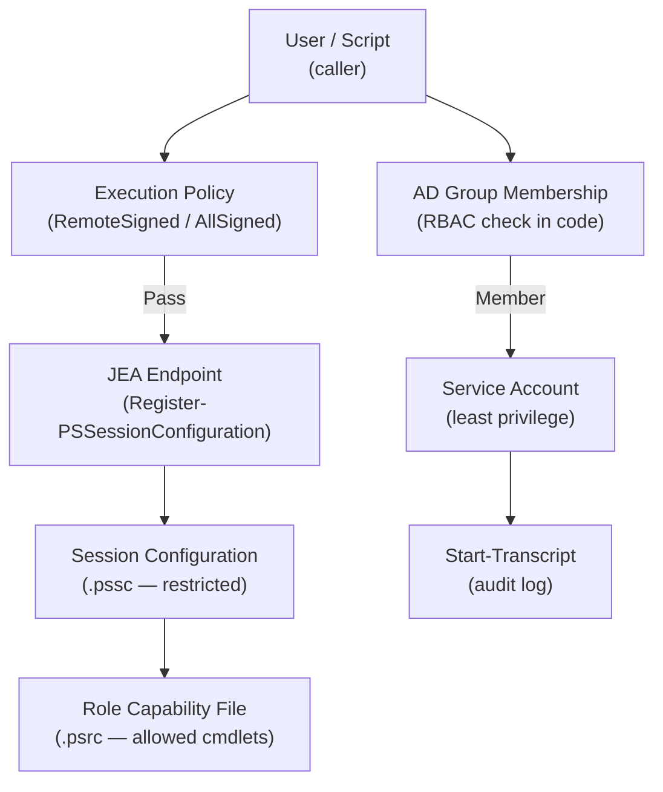

# PowerShell — Access Control


<div class="kb-summary">
> Part of the [PowerShell Security](../index.md) reference.
</div>

---

## PowerShell Access Control Architecture


┌───────────────────────────────────── PowerShell — Access Control ─────────────────────────────────────┐
│   ┌───────────────────────────────────────────────────────────────────────────────────────────────┐   │
│   │   PowerShell access control: who can run scripts, remoting access, JEA capability delegation  │   │
│   │          WinRM access: WS-Management ACL; restrict to security groups, not all users          │   │
│   │  JEA: define role capabilities (.psrc); register session config (.pssc); assign via AD groups │   │
│   └───────────────────────────────────────────────────────────────────────────────────────────────┘   │
│                                                                                                       │
│   ┌──────────────────────────────────────────────┐  ┌─────────────────────────────────────────────┐   │
│   │             WinRM Access Control             │  │              JEA Configuration              │   │
│   │       Set-PSSessionConfiguration DACL        │  │           New-PSRoleCapabilityFile          │   │
│   │            Grant to AD group only            │  │        New-PSSessionConfigurationFile       │   │
│   │        Deny interactive logon to SVC         │  │       Register-PSSessionConfiguration       │   │
│   │         HTTPS WinRM: port 5986 only          │  │       Test-PSSessionConfigurationFile       │   │
│   └──────────────────────────────────────────────┘  └─────────────────────────────────────────────┘   │
│                                                                                                       │
│   ┌───────────────────────────────────────────────────────────────────────────────────────────────┐   │
│   │  DACL         = Discretionary ACL on PS session config; controls which identities can connect │   │
│   │.psrc file   = Role Capability file; defines VisibleCmdlets, VisibleFunctions, VisibleProviders│   │
│   │       .pssc file   = Session Configuration file; maps AD groups to role capability files      │   │
│   └───────────────────────────────────────────────────────────────────────────────────────────────┘   │
└───────────────────────────────────────────────────────────────────────────────────────────────────────┘
```

## Least Privilege Reference

| Principle | Implementation |
|---|---|
| Use `RemoteSigned` execution policy | Prevent unsigned remote scripts |
| Run scripts as a service account | Not as a local admin or domain admin |
| Use JEA for constrained remoting | Limit cmdlets available in remote sessions |
| Audit with `Start-Transcript` | Log all script activity |
| Check group membership in scripts | Enforce RBAC in code |
