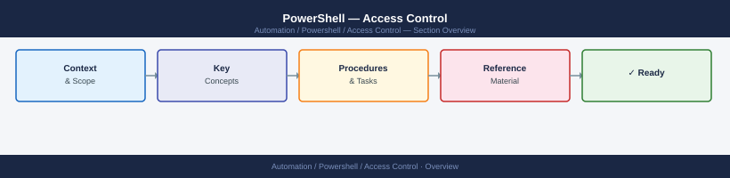
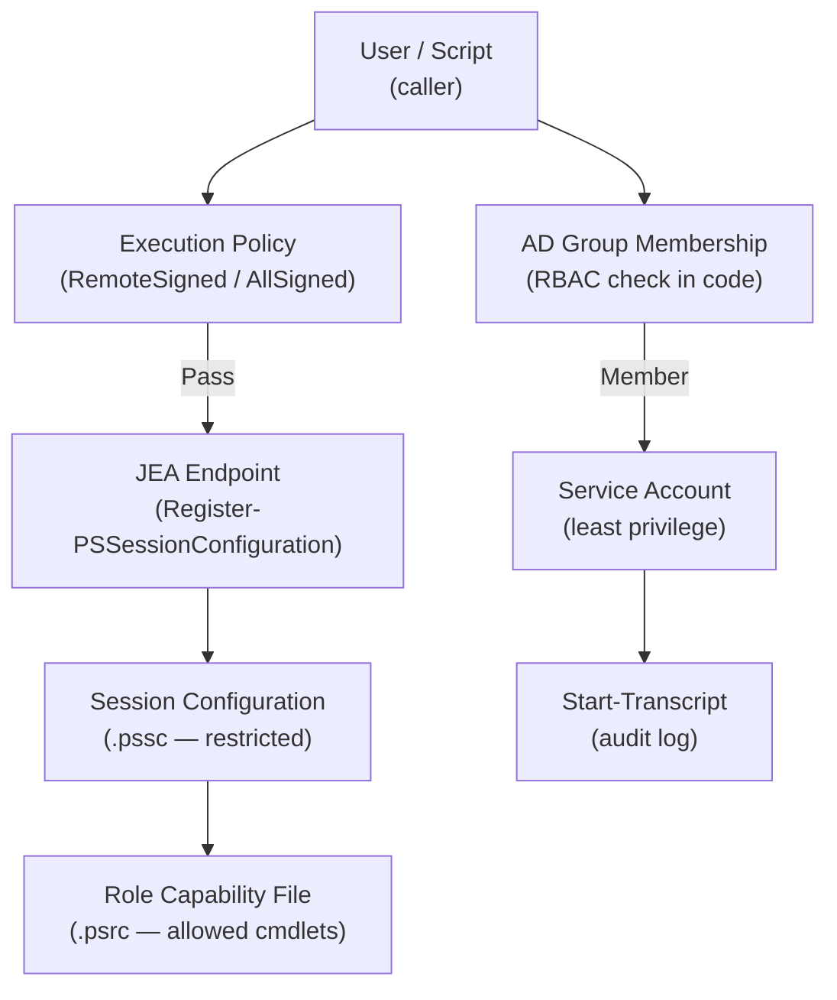

---
tags:
  - powershell
  - security
---
# PowerShell — Access Control


<div class="kb-summary">
PowerShell access control: execution policy enforcement, JEA (Just Enough Administration) configuration, module signing requirements, and constrained language mode.

*Applies to: PowerShell 7.x*
</div>



---

```d2
direction: down

root: "PowerShell\nAccess Control" {shape: hexagon}
powershell_access_control_architectu: "PowerShell Access Control Architecture" {shape: rectangle}
least_privilege_reference: "Least Privilege Reference" {shape: rectangle}
resources: Protected Resources {shape: cylinder}

root -> powershell_access_control_architectu: role
powershell_access_control_architectu -> resources: scoped
root -> least_privilege_reference: role
least_privilege_reference -> resources: scoped
```

## Before you begin

- **Access:** Admin credentials on all affected systems
- **Change management:** security changes require CAB approval in most environments
- **Rollback plan:** document current state before any security control change
- **Testing:** validate in a non-production environment first where possible

---

## PowerShell Access Control Architecture




## Least Privilege Reference

| Principle | Implementation |
|---|---|
| Use `RemoteSigned` execution policy | Prevent unsigned remote scripts |
| Run scripts as a service account | Not as a local admin or domain admin |
| Use JEA for constrained remoting | Limit cmdlets available in remote sessions |
| Audit with `Start-Transcript` | Log all script activity |
| Check group membership in scripts | Enforce RBAC in code |

---

## See also

- [PowerShell — Authentication](../authentication/)
- [PowerShell — Hardening](../hardening/)
- [PowerShell — Encryption](../encryption/)
