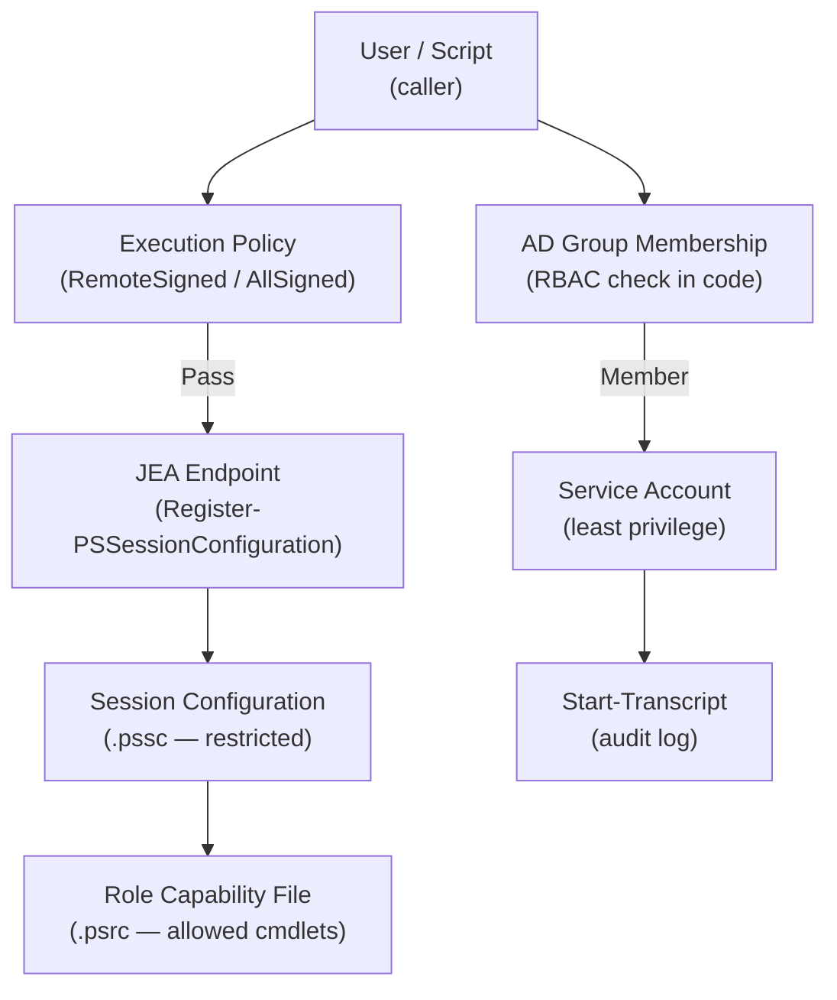

# PowerShell — Access Control

> Part of the [PowerShell Security](../) reference.

---

## PowerShell Access Control Architecture



## Execution Policy

Execution policy controls which scripts PowerShell will run. It is not a security boundary — it can be bypassed — but it prevents accidental script execution.

```powershell
# Check the current effective execution policy
Get-ExecutionPolicy -List

# Set for current user (most common — no admin required)
Set-ExecutionPolicy -Scope CurrentUser -ExecutionPolicy RemoteSigned

# Set for the current process only (temporary, safe)
Set-ExecutionPolicy -Scope Process -ExecutionPolicy Bypass

# Unblock a downloaded script without changing policy
Unblock-File -Path C:\Scripts\deploy.ps1
```

| Policy | Behaviour |
|---|---|
| `Restricted` | No scripts allowed (Windows default) |
| `AllSigned` | Only scripts signed by a trusted publisher |
| `RemoteSigned` | Remote scripts need a signature; local scripts run freely |
| `Unrestricted` | All scripts run; remote scripts prompt for confirmation |
| `Bypass` | Nothing blocked, no warnings |

## Just Enough Administration (JEA)

JEA restricts what cmdlets a user can run in a remote session, without giving full admin rights.

```powershell
# Create a role capability file
New-PSRoleCapabilityFile -Path C:\JEA\WebAdminRole.psrc `
    -VisibleCmdlets 'Get-WebSite', 'Restart-WebAppPool' `
    -VisibleFunctions 'Get-ServiceStatus'

# Create a session configuration
New-PSSessionConfigurationFile -Path C:\JEA\WebAdmin.pssc `
    -SessionType RestrictedRemoteServer `
    -RoleDefinitions @{ 'DOMAIN\WebAdmins' = @{ RoleCapabilities = 'WebAdminRole' } }

# Register the JEA endpoint
Register-PSSessionConfiguration -Name WebAdmin -Path C:\JEA\WebAdmin.pssc -Force
```

## RBAC with Active Directory Groups

Scope script access by checking group membership at runtime.

```powershell
# Check if the current user is in an AD group
function Test-GroupMembership {
    param([string]$GroupName)
    $user = [System.Security.Principal.WindowsIdentity]::GetCurrent()
    $principal = [System.Security.Principal.WindowsPrincipal]$user
    $group = [System.Security.Principal.NTAccount]$GroupName
    $sid = $group.Translate([System.Security.Principal.SecurityIdentifier])
    $principal.IsInRole($sid)
}

if (-not (Test-GroupMembership 'DOMAIN\Operators')) {
    Write-Error "Access denied — requires Operators group membership"
    exit 1
}
```

## Least Privilege Reference

| Principle | Implementation |
|---|---|
| Use `RemoteSigned` execution policy | Prevent unsigned remote scripts |
| Run scripts as a service account | Not as a local admin or domain admin |
| Use JEA for constrained remoting | Limit cmdlets available in remote sessions |
| Audit with `Start-Transcript` | Log all script activity |
| Check group membership in scripts | Enforce RBAC in code |
