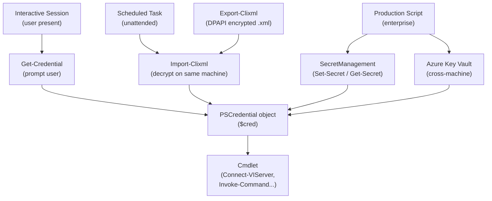

# PowerShell — Authentication

> Part of the [PowerShell Security](../index.md) reference.

---

## PowerShell Credential Storage and Flow


┌───────────────────────────────────── PowerShell — Authentication ─────────────────────────────────────┐
│   ┌───────────────────────────────────────────────────────────────────────────────────────────────┐   │
│   │ PowerShell authentication: Kerberos (domain), NTLM (fallback), certificate-based for remoting │   │
│   │     Service principal: use certificate auth for Azure/cloud (no password rotation needed)     │   │
│   │  Secrets in scripts: use SecretManagement module; back-ends: KeyVault, SecretStore, CyberArk  │   │
│   └───────────────────────────────────────────────────────────────────────────────────────────────┘   │
│                                                                                                       │
│   ┌──────────────────────────────────────────────┐  ┌─────────────────────────────────────────────┐   │
│   │                Remoting Auth                 │  │              Secret Management              │   │
│   │       Kerberos: domain joined default        │  │       Install-Module SecretManagement       │   │
│   │       NTLM: workgroup or cross-domain        │  │        Register-SecretVault -Name AKV       │   │
│   │        Certificate: mutual TLS WinRM         │  │         Get-Secret -Name MyPassword         │   │
│   │       CredSSP: avoid (double-hop only)       │  │        No ConvertTo-SecureString -Key       │   │
│   └──────────────────────────────────────────────┘  └─────────────────────────────────────────────┘   │
│                                                                                                       │
│   ┌───────────────────────────────────────────────────────────────────────────────────────────────┐   │
│   │      SecretManagement = PS module; abstraction layer for secret retrieval; vault-agnostic     │   │
│   │  CredSSP          = delegates credentials to remote host; security risk; use Kerberos or JEA  │   │
│   │  Managed Identity = Azure-side auth; PS running in Azure VM can get token without credentials │   │
│   └───────────────────────────────────────────────────────────────────────────────────────────────┘   │
└───────────────────────────────────────────────────────────────────────────────────────────────────────┘
```

## Storing Credentials Securely

Use `Export-Clixml` to save credentials encrypted with the current user's Windows Data Protection API (DPAPI) key. Only the same user on the same machine can decrypt the file.

```powershell
# Save credential to disk (encrypted — current user only)
$cred = Get-Credential
$cred | Export-Clixml -Path C:\Secrets\vcenter-cred.xml

# Load credential from disk
$cred = Import-Clixml -Path C:\Secrets\vcenter-cred.xml

# Use in a script (no interactive prompt)
Connect-VIServer -Server vcenter.example.com -Credential $cred
```

## SecretManagement Module

The `Microsoft.PowerShell.SecretManagement` module provides a consistent interface for storing and retrieving secrets from vaults.

```powershell
# Install SecretManagement and the local vault extension
Install-Module -Name Microsoft.PowerShell.SecretManagement -Scope CurrentUser
Install-Module -Name Microsoft.PowerShell.SecretStore -Scope CurrentUser

# Register the local vault
Register-SecretVault -Name LocalVault -ModuleName Microsoft.PowerShell.SecretStore -DefaultVault

# Store a secret
Set-Secret -Name VCenterPassword -Secret 'P@ssword1'

# Retrieve a secret
$pass = Get-Secret -Name VCenterPassword -AsPlainText
$cred = [PSCredential]::new('admin', (Get-Secret -Name VCenterPassword))
```

## Authentication Reference

| Method | Encryption | Portability | Best for |
|---|---|---|---|
| `Get-Credential` | In-memory only | None | Interactive scripts |
| `Export-Clixml` | DPAPI (user-bound) | Same user/machine | Scheduled tasks |
| SecretManagement | Vault-dependent | Configurable | Production scripts |
| Azure Key Vault | AES-256 | Cross-machine | Enterprise / cloud |
