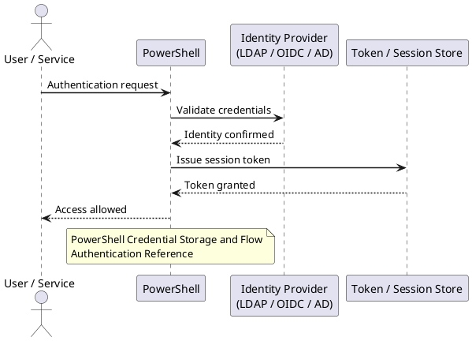

---
tags:
  - powershell
  - security
description: "PowerShell authentication: credential objects, Get-Credential, service account management, certificate-based auth, and -UseDefaultCredentials with..."
---
# PowerShell — Authentication

<div class="kb-summary">
PowerShell authentication: credential objects, `Get-Credential`, service account management, certificate-based auth, and `-UseDefaultCredentials` with Kerberos.

*Applies to: PowerShell 7.x*
</div>

---



## Before you begin

- **Access:** Admin credentials on all affected systems
- **Change management:** security changes require CAB approval in most environments
- **Rollback plan:** document current state before any security control change
- **Testing:** validate in a non-production environment first where possible

---

## PowerShell Credential Storage and Flow

```d2
direction: right

interactiveUser: "Interactive Session\n(user present" {shape: rectangle}
getCredential: "Get-Credential\n(prompt user" {shape: rectangle}
scheduledJob: "Scheduled Task\n(unattended" {shape: rectangle}
importClixml: "Import-Clixml\n(decrypt on same machine" {shape: rectangle}
exportClixml: "Export-Clixml\n(DPAPI encrypted .xml" {shape: rectangle}
prodScript: "Production Script\n(enterprise" {shape: rectangle}
secretMgmt: "SecretManagement\n(Set-Secret / Get-Secret" {shape: rectangle}
azKeyVault: "Azure Key Vault\n(cross-machine" {shape: rectangle}
psCred: "PSCredential object\n($cred" {shape: rectangle}
cmdlet: "Cmdlet\n(Connect-VIServer,\nInvoke-Command..." {shape: rectangle}

interactiveUser -> getCredential
scheduledJob -> importClixml
exportClixml -> importClixml
prodScript -> secretMgmt
prodScript -> azKeyVault
getCredential -> psCred
importClixml -> psCred
secretMgmt -> psCred
azKeyVault -> psCred
psCred -> cmdlet
```

## Authentication Reference

| Method | Encryption | Portability | Best for |
|---|---|---|---|
| `Get-Credential` | In-memory only | None | Interactive scripts |
| `Export-Clixml` | DPAPI (user-bound) | Same user/machine | Scheduled tasks |
| SecretManagement | Vault-dependent | Configurable | Production scripts |
| Azure Key Vault | AES-256 | Cross-machine | Enterprise / cloud |

---

## See also

- [PowerShell — Access Control](../access-control/)
- [PowerShell — Hardening](../hardening/)
- [PowerShell — Encryption](../encryption/)
