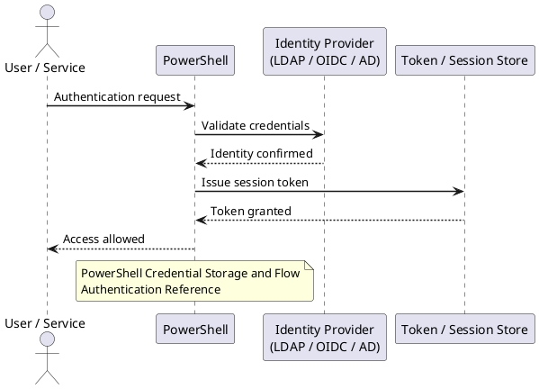
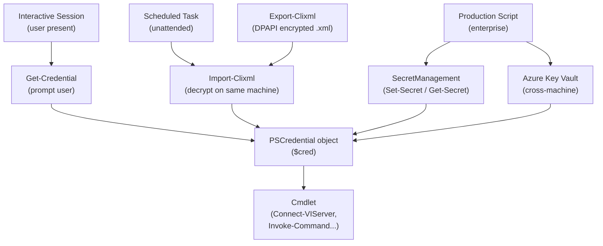

---
tags:
  - powershell
  - security
---
# PowerShell — Authentication

PowerShell authentication: credential objects, `Get-Credential`, service account management, certificate-based auth, and `-UseDefaultCredentials` with Kerberos.

*Applies to: PowerShell 7.x*

---

## Before you begin

- **Access:** Admin credentials on all affected systems
- **Change management:** security changes require CAB approval in most environments
- **Rollback plan:** document current state before any security control change
- **Testing:** validate in a non-production environment first where possible

---

## PowerShell Credential Storage and Flow

## Authentication Reference

| Method | Encryption | Portability | Best for |
|---|---|---|---|
| `Get-Credential` | In-memory only | None | Interactive scripts |
| `Export-Clixml` | DPAPI (user-bound) | Same user/machine | Scheduled tasks |
| SecretManagement | Vault-dependent | Configurable | Production scripts |
| Azure Key Vault | AES-256 | Cross-machine | Enterprise / cloud |

---

## See also

- [PowerShell — Access Control](../access-control/)
- [PowerShell — Hardening](../hardening/)
- [PowerShell — Encryption](../encryption/)
