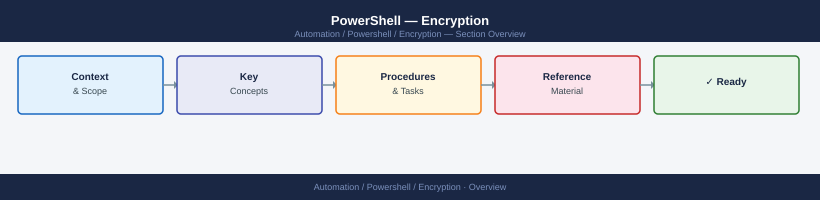
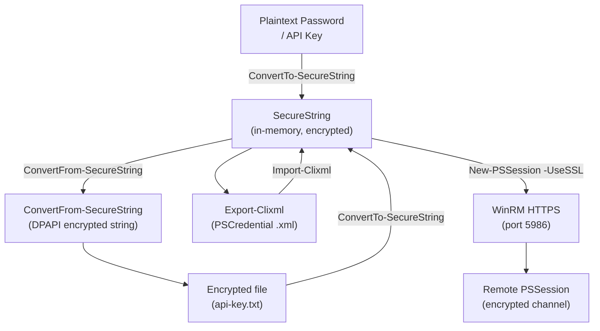

---
tags:
  - powershell
  - security
---
# PowerShell — Encryption

PowerShell encryption: `ConvertTo-SecureString`, `New-SelfSignedCertificate`, encrypting credential exports, and SecretManagement module for vault integration.

*Applies to: PowerShell 7.x*

---

## Before you begin

- **Access:** Admin credentials on all affected systems
- **Change management:** security changes require CAB approval in most environments
- **Rollback plan:** document current state before any security control change
- **Testing:** validate in a non-production environment first where possible

---

## PowerShell Encryption and Secure Communication

## Encryption Reference

| Technique | Scope | Use case |
|---|---|---|
| `SecureString` | In-memory | Pass passwords to cmdlets |
| DPAPI / `ConvertFrom-SecureString` | Current user + machine | Store encrypted values on disk |
| `Export-Clixml` | Current user + machine | Serialize full `PSCredential` objects |
| WinRM over HTTPS (port 5986) | In-transit | Secure remote sessions |
| Azure Key Vault + SecretManagement | Cross-machine | Enterprise secret storage |

---

## See also

- [PowerShell — Hardening](../hardening/)
- [PowerShell — Authentication](../authentication/)
- [PowerShell — Access Control](../access-control/)
