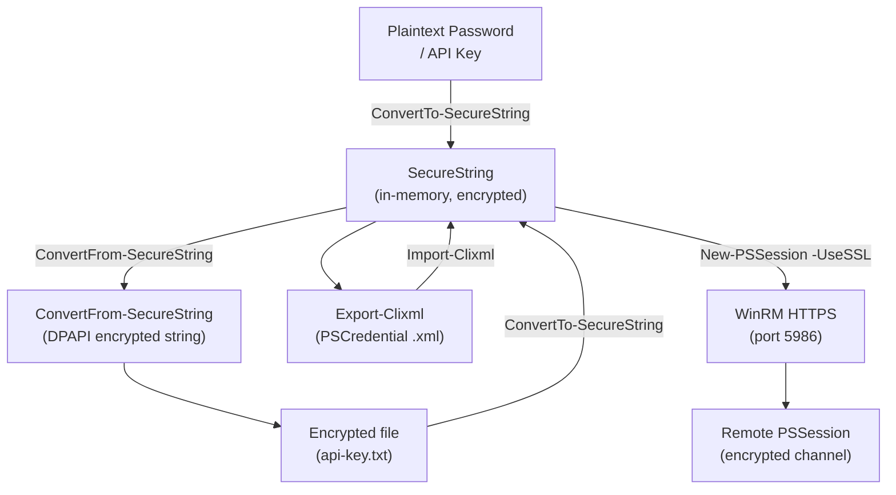

# PowerShell — Encryption


<div class="kb-summary">
> Part of the [PowerShell Security](../index.md) reference.
</div>

---

## PowerShell Encryption and Secure Communication



```text
┌─────────────────────────────────────── PowerShell — Encryption ───────────────────────────────────────┐
│   ┌───────────────────────────────────────────────────────────────────────────────────────────────┐   │
│   │      PS encryption: SecureString in-memory, DPAPI user-scope, SecretManagement for vaults     │   │
│   │ Transport: WinRM HTTPS (TLS 1.2+); enforce: winrm set winrm/config/listener @{Transport=HTTPS}│   │
│   │   Avoid: ConvertTo-SecureString with -Key flag stores key alongside data — use vault instead  │   │
│   └───────────────────────────────────────────────────────────────────────────────────────────────┘   │
│                                                                                                       │
│   ┌──────────────────────────────────────────────┐  ┌─────────────────────────────────────────────┐   │
│   │               Secret Handling                │  │              Transport Security             │   │
│   │         SecureString: in-memory only         │  │            WinRM HTTPS: port 5986           │   │
│   │          DPAPI: current user scope           │  │              TLS 1.2+ enforced              │   │
│   │       SecretManagement: AKV / KeePass        │  │         Certificate required on host        │   │
│   │       No plain-text passwords in .ps1        │  │        Disable HTTP WinRM (port 5985)       │   │
│   └──────────────────────────────────────────────┘  └─────────────────────────────────────────────┘   │
│                                                                                                       │
│   ┌───────────────────────────────────────────────────────────────────────────────────────────────┐   │
│   │    DPAPI           = Windows Data Protection API; encrypts to current user or machine scope   │   │
│   │  SecureString    = in-memory encrypted string; cannot be stored safely to disk without DPAPI  │   │
│   │    Azure Key Vault = recommended back-end for SecretManagement in cloud/hybrid environments   │   │
│   └───────────────────────────────────────────────────────────────────────────────────────────────┘   │
└───────────────────────────────────────────────────────────────────────────────────────────────────────┘
```

## Encryption Reference

| Technique | Scope | Use case |
|---|---|---|
| `SecureString` | In-memory | Pass passwords to cmdlets |
| DPAPI / `ConvertFrom-SecureString` | Current user + machine | Store encrypted values on disk |
| `Export-Clixml` | Current user + machine | Serialize full `PSCredential` objects |
| WinRM over HTTPS (port 5986) | In-transit | Secure remote sessions |
| Azure Key Vault + SecretManagement | Cross-machine | Enterprise secret storage |
