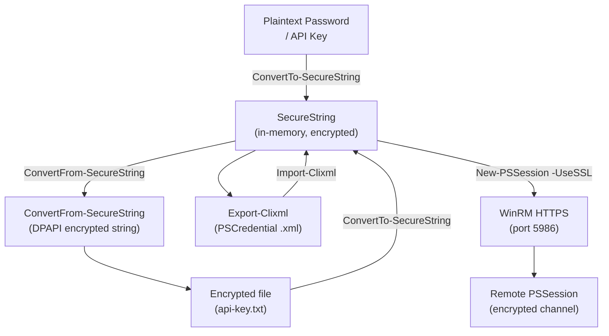

# PowerShell — Encryption

> Part of the [PowerShell Security](../) reference.

---

## PowerShell Encryption and Secure Communication



## SecureString

`SecureString` stores a string in memory as an encrypted value. It prevents the password from appearing in plain text in variables, logs, or memory dumps.

```powershell
# Convert plain text to SecureString
$secure = ConvertTo-SecureString 'P@ssword1' -AsPlainText -Force

# Prompt the user for a secure string (no echo)
$secure = Read-Host -Prompt 'Enter password' -AsSecureString

# Create a PSCredential from a SecureString
$cred = [PSCredential]::new('domain\admin', $secure)

# Extract the plain-text value (only when necessary)
$plain = $cred.GetNetworkCredential().Password
```

## Encrypting Strings with DPAPI

`ConvertTo-SecureString` and `ConvertFrom-SecureString` use Windows DPAPI to encrypt values that only the current user on the current machine can decrypt.

```powershell
# Encrypt a string and save it to a file
$secure = Read-Host -AsSecureString -Prompt 'Enter API key'
$encrypted = ConvertFrom-SecureString $secure
$encrypted | Out-File C:\Secrets\api-key.txt

# Load and decrypt on the same machine/user
$encrypted = Get-Content C:\Secrets\api-key.txt
$secure = ConvertTo-SecureString $encrypted
$plain = [System.Runtime.InteropServices.Marshal]::PtrToStringAuto(
    [System.Runtime.InteropServices.Marshal]::SecureStringToBSTR($secure)
)
```

## Secure Communication (WinRM over HTTPS)

```powershell
# Use SSL for PSSession to prevent credential interception
$sessionOption = New-PSSessionOption -SkipCACheck -SkipCNCheck
New-PSSession -ComputerName server01 -UseSSL -SessionOption $sessionOption -Credential $cred

# Verify WinRM HTTPS listener is configured on the target
winrm enumerate winrm/config/listener
```

## Encryption Reference

| Technique | Scope | Use case |
|---|---|---|
| `SecureString` | In-memory | Pass passwords to cmdlets |
| DPAPI / `ConvertFrom-SecureString` | Current user + machine | Store encrypted values on disk |
| `Export-Clixml` | Current user + machine | Serialize full `PSCredential` objects |
| WinRM over HTTPS (port 5986) | In-transit | Secure remote sessions |
| Azure Key Vault + SecretManagement | Cross-machine | Enterprise secret storage |
