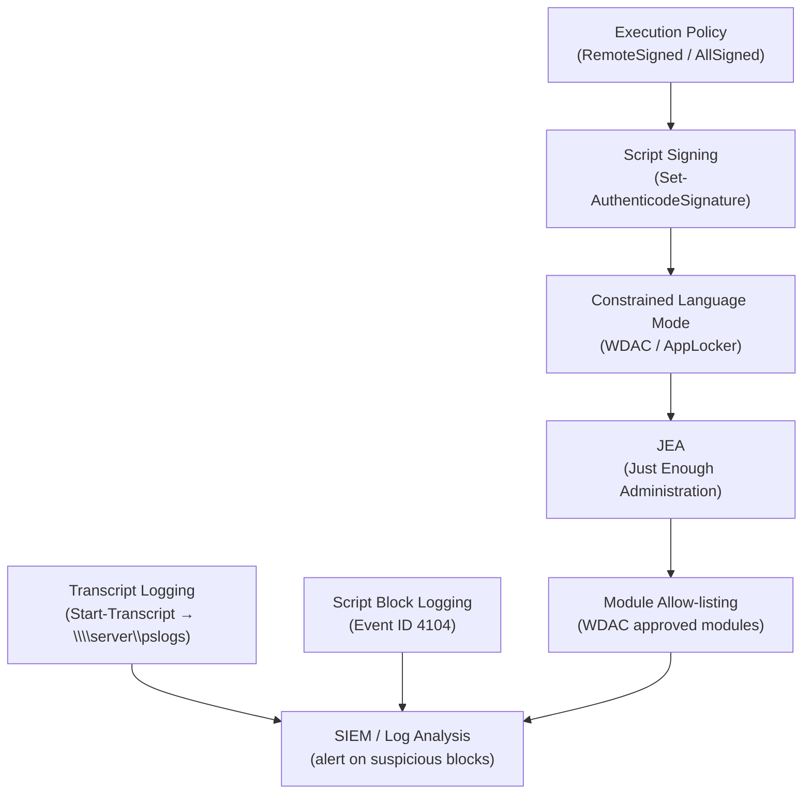

# PowerShell — Hardening


<div class="kb-summary">
> Part of the [PowerShell Security](../index.md) reference.
</div>

---

## PowerShell Hardening Layers


```
┌─────────────────────────────────────── PowerShell — Hardening ────────────────────────────────────────┐
│   ┌───────────────────────────────────────────────────────────────────────────────────────────────┐   │
│   │   PowerShell hardening: logging, execution control, JEA, AMSI, code signing — deploy via GPO  │   │
│   │         Enable via Group Policy: ScriptBlockLogging, ModuleLogging, TranscriptLogging         │   │
│   │   Set ExecutionPolicy AllSigned at machine scope; sign all production scripts with code cert  │   │
│   └───────────────────────────────────────────────────────────────────────────────────────────────┘   │
│                                                                                                       │
│   ┌──────────────────────────────────────────────┐  ┌─────────────────────────────────────────────┐   │
│   │         GPO Settings (Apply via GPO)         │  │                Host Hardening               │   │
│   │         ScriptBlockLogging: Enabled          │  │          ExecutionPolicy: AllSigned         │   │
│   │            ModuleLogging: Enabled            │  │          Constrained Language Mode          │   │
│   │        Transcription: Enabled + path         │  │         Disable PS 2.0 (no logging)         │   │
│   │        ProtectedEventLogging: Enabled        │  │         Remove PS v2 Windows feature        │   │
│   │             HTTPS WinRM: enforce             │  │             AMSI: do not disable            │   │
│   └──────────────────────────────────────────────┘  └─────────────────────────────────────────────┘   │
│                                                                                                       │
│   ┌───────────────────────────────────────────────────────────────────────────────────────────────┐   │
│   │   PS v2 removal  = Disable-WindowsOptionalFeature -FeatureName MicrosoftWindowsPowerShellV2   │   │
│   │  Code signing   = Get-AuthenticodeSignature; sign with: Set-AuthenticodeSignature -Cert $cert │   │
│   │AMSI bypass    = attackers attempt to disable; monitor for AMSI-related events in security logs│   │
│   └───────────────────────────────────────────────────────────────────────────────────────────────┘   │
└───────────────────────────────────────────────────────────────────────────────────────────────────────┘
```
```powershell

## Audit and Event Log

```powershell
# Enable script block logging (logs all script blocks to the event log)
# Registry path: HKLM:\SOFTWARE\Policies\Microsoft\Windows\PowerShell\ScriptBlockLogging
$regPath = 'HKLM:\SOFTWARE\Policies\Microsoft\Windows\PowerShell\ScriptBlockLogging'
New-Item -Path $regPath -Force | Out-Null
Set-ItemProperty -Path $regPath -Name EnableScriptBlockLogging -Value 1

# View PowerShell script block events
Get-WinEvent -LogName 'Microsoft-Windows-PowerShell/Operational' |
    Where-Object { $_.Id -eq 4104 } | Select-Object -First 20 TimeCreated, Message
```

## Hardening Reference

| Control | Recommendation |
|---|---|
| Execution policy | `RemoteSigned` minimum; `AllSigned` for production |
| Script signing | Sign all production scripts with a trusted cert |
| Language mode | Enable Constrained Language Mode via WDAC/AppLocker |
| Transcript logging | Enable system-wide; send logs to a central share |
| Script block logging | Enable event ID 4104 logging |
| Module allow-listing | Use WDAC to allow only approved modules |
| JEA | Constrain remote session cmdlets to the minimum required |
