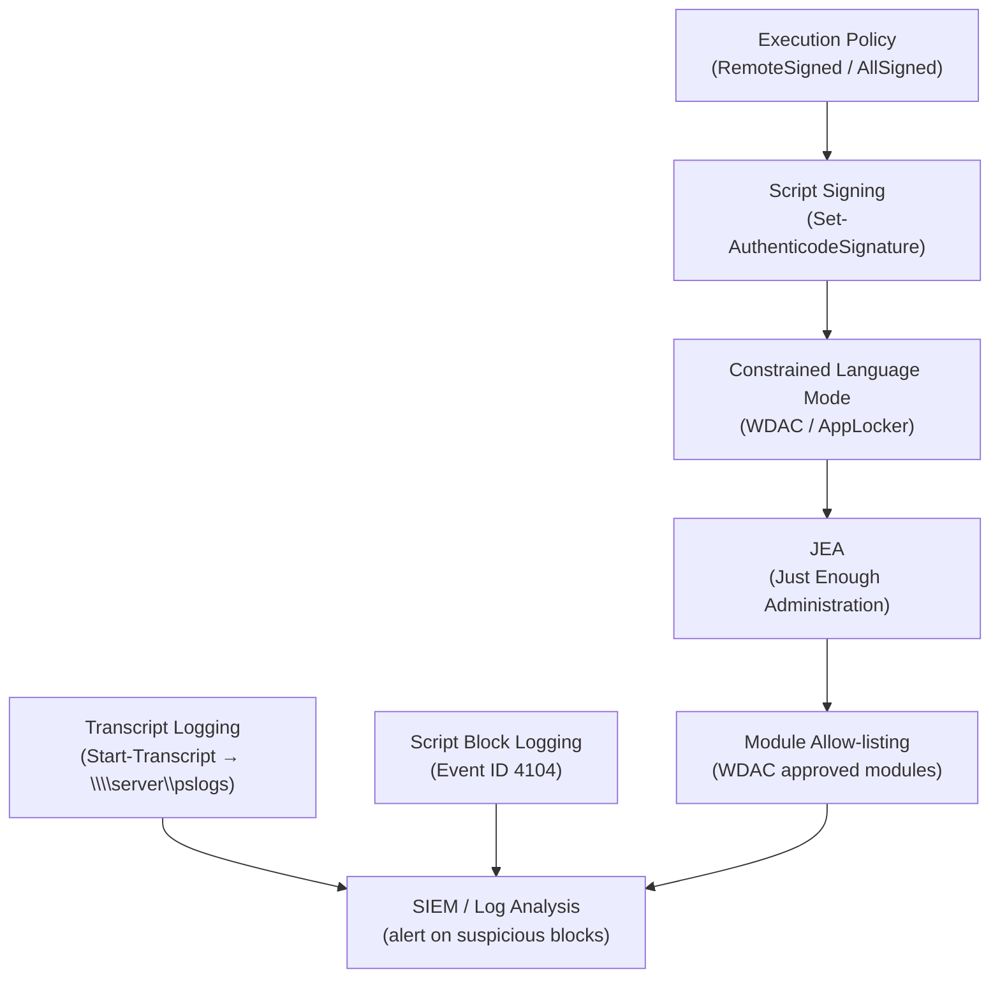

---
tags:
  - powershell
  - security
---
# PowerShell — Hardening

<div class="kb-summary">
PowerShell hardening: `Set-ExecutionPolicy AllSigned`, ScriptBlock logging, module logging, AMSI integration, and PowerShell 7 constrained language mode enforcement.

*Applies to: PowerShell 7.x*
</div>

---

```d2
direction: down

powershell_hardening_layers: "PowerShell Hardening Layers" {shape: rectangle}
audit_and_event_log: "Audit and Event Log" {shape: rectangle}
hardening_reference: "Hardening Reference" {shape: rectangle}

powershell_hardening_layers -> audit_and_event_log: hardens
audit_and_event_log -> hardening_reference: hardens
```

## Before you begin

- **Access:** Admin credentials on all affected systems
- **Change management:** security changes require CAB approval in most environments
- **Rollback plan:** document current state before any security control change
- **Testing:** validate in a non-production environment first where possible

---

## PowerShell Hardening Layers



## Audit and Event Log

```powershell
# Enable script block logging (logs all script blocks to the event log)
# Registry path: HKLM:\SOFTWARE\Policies\Microsoft\Windows\PowerShell\ScriptBlockLogging
$regPath = 'HKLM:\SOFTWARE\Policies\Microsoft\Windows\PowerShell\ScriptBlockLogging'
New-Item -Path $regPath -Force | Out-Null
Set-ItemProperty -Path $regPath -Name EnableScriptBlockLogging -Value 1

# View PowerShell script block events
Get-WinEvent -LogName 'Microsoft-Windows-PowerShell/Operational' |
    Where-Object { $_.Id -eq 4104 } | Select-Object -First 20 TimeCreated, Message
```

## Hardening Reference

| Control | Recommendation |
|---|---|
| Execution policy | `RemoteSigned` minimum; `AllSigned` for production |
| Script signing | Sign all production scripts with a trusted cert |
| Language mode | Enable Constrained Language Mode via WDAC/AppLocker |
| Transcript logging | Enable system-wide; send logs to a central share |
| Script block logging | Enable event ID 4104 logging |
| Module allow-listing | Use WDAC to allow only approved modules |
| JEA | Constrain remote session cmdlets to the minimum required |

---

## See also

- [PowerShell — Authentication](../authentication/)
- [PowerShell — Access Control](../access-control/)
- [PowerShell — Encryption](../encryption/)
