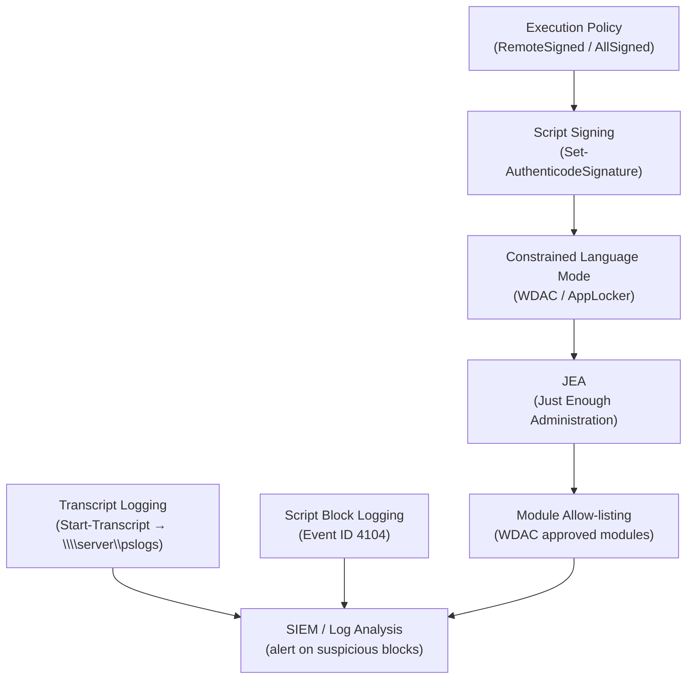

# PowerShell — Hardening

> Part of the [PowerShell Security](../) reference.

---

## PowerShell Hardening Layers



## Constrained Language Mode

Constrained Language Mode limits PowerShell to a safe subset of the language, blocking arbitrary .NET access.

```powershell
# Check the current language mode
$ExecutionContext.SessionState.LanguageMode

# Set constrained language mode (requires system configuration — not settable in-session)
# Configure via AppLocker or Windows Defender Application Control (WDAC)
# When enforced: $ExecutionContext.SessionState.LanguageMode returns 'ConstrainedLanguage'
```

## Script Signing

Code signing verifies that a script has not been tampered with since it was signed.

```powershell
# Get available code signing certificates
Get-ChildItem Cert:\CurrentUser\My -CodeSigningCert

# Sign a script with a certificate
$cert = Get-ChildItem Cert:\CurrentUser\My -CodeSigningCert | Select-Object -First 1
Set-AuthenticodeSignature -FilePath C:\Scripts\deploy.ps1 -Certificate $cert

# Verify a signature
Get-AuthenticodeSignature -FilePath C:\Scripts\deploy.ps1
```

## Transcript Logging

Enable transcript logging to create a full record of every PowerShell session.

```powershell
# Enable transcription for the current session
Start-Transcript -Path "C:\Logs\ps-$(Get-Date -f yyyyMMdd-HHmm).log" -Append

# Enable system-wide transcription via Group Policy:
# Computer Configuration → Administrative Templates → Windows Components →
# Windows PowerShell → Turn on PowerShell Transcription
# OutputDirectory: \\server\pslogs\
```

## Audit and Event Log

```powershell
# Enable script block logging (logs all script blocks to the event log)
# Registry path: HKLM:\SOFTWARE\Policies\Microsoft\Windows\PowerShell\ScriptBlockLogging
$regPath = 'HKLM:\SOFTWARE\Policies\Microsoft\Windows\PowerShell\ScriptBlockLogging'
New-Item -Path $regPath -Force | Out-Null
Set-ItemProperty -Path $regPath -Name EnableScriptBlockLogging -Value 1

# View PowerShell script block events
Get-WinEvent -LogName 'Microsoft-Windows-PowerShell/Operational' |
    Where-Object { $_.Id -eq 4104 } | Select-Object -First 20 TimeCreated, Message
```

## Hardening Reference

| Control | Recommendation |
|---|---|
| Execution policy | `RemoteSigned` minimum; `AllSigned` for production |
| Script signing | Sign all production scripts with a trusted cert |
| Language mode | Enable Constrained Language Mode via WDAC/AppLocker |
| Transcript logging | Enable system-wide; send logs to a central share |
| Script block logging | Enable event ID 4104 logging |
| Module allow-listing | Use WDAC to allow only approved modules |
| JEA | Constrain remote session cmdlets to the minimum required |
