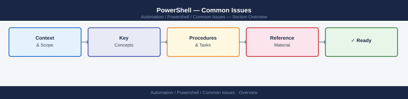
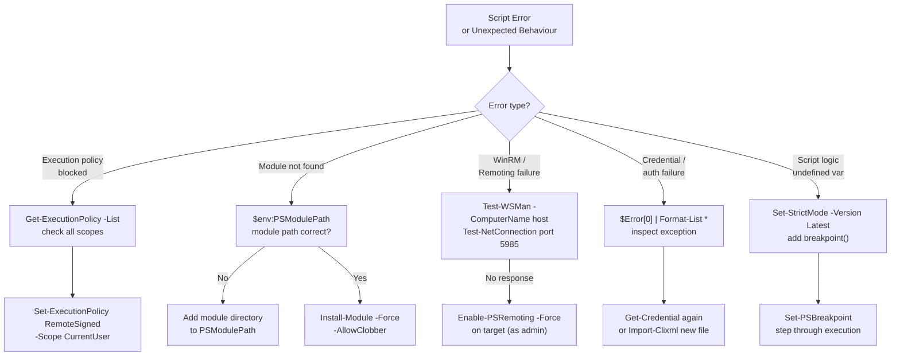

---
tags:
  - powershell
  - troubleshooting
search:
  boost: 1.5
---
# PowerShell — Common Issues


<div class="kb-summary">
PowerShell troubleshooting: execution policy blocks, module import failures, remoting authentication errors, pipeline object type mismatches, and cmdlet version conflicts.

*Applies to: PowerShell 7.x*
</div>



---

```d2
direction: down

symptom: Identify Symptom {shape: diamond}
diagnostic_flow: "Diagnostic Flow" {shape: rectangle}
powershell_troubleshooting_decision_: "PowerShell Troubleshooting Decision Flow" {shape: rectangle}
debugging_scripts: "Debugging Scripts" {shape: rectangle}
common_error_reference: "Common Error Reference" {shape: rectangle}
verify_resolution: "Verify resolution" {shape: rectangle}
resolution: Resolve or Escalate {shape: oval}

symptom -> diagnostic_flow: investigate
symptom -> powershell_troubleshooting_decision_: investigate
symptom -> debugging_scripts: investigate
symptom -> common_error_reference: investigate
symptom -> verify_resolution: investigate
diagnostic_flow -> resolution
powershell_troubleshooting_decision_ -> resolution
debugging_scripts -> resolution
common_error_reference -> resolution
verify_resolution -> resolution
```

## Diagnostic Flow

```mermaid
graph TD
    S([What is the symptom?]) --> B1{Execution policy\nblocked?}
    S --> B2{Module not\ninstalled or found?}
    S --> B3{Credential prompt\nloop?}
    S --> B4{PSRemoting\nconnection refused?}
    S --> B5{RemoteSigned or\nRestricted policy error?}
    B1 -->|Yes| D1{Scope of\npolicy block?}
    D1 -->|CurrentUser| R1[Common Error Reference\n— Set-ExecutionPolicy RemoteSigned -Scope CurrentUser]
    D1 -->|Machine| R2[Common Error Reference\n— Set-ExecutionPolicy -Scope Process for bypass]
    B2 -->|Yes| D2{PSModulePath\ncorrect?}
    D2 -->|No| R3[Common Error Reference\n— add module dir to PSModulePath]
    D2 -->|Yes| R4[Common Error Reference\n— Install-Module -Force -AllowClobber]
    B3 -->|Yes| D3{Saved credential\nstale?}
    D3 -->|Yes| R5[Debugging Scripts\n— Get-Credential again or Import-Clixml]
    D3 -->|No| R6[Debugging Scripts\n— inspect $Error[0] for root cause]
    B4 -->|Yes| R7[Common Error Reference\n— Enable-PSRemoting -Force on target]
    B5 -->|Yes| R8[Common Error Reference\n— Set-ExecutionPolicy RemoteSigned]
    classDef section fill:#1e3a5f,color:#fff,stroke:#1e3a5f
    classDef decision fill:#15803d,color:#fff,stroke:#15803d
    classDef start fill:#7c3aed,color:#fff,stroke:#7c3aed
    class R1,R2,R3,R4,R5,R6,R7,R8 section
    class B1,B2,B3,B4,B5,D1,D2,D3 decision
    class S start
```

---

## Before you begin

- **Access:** Admin credentials on all affected systems
- **Gather first:** recent error message text, event timestamps, and affected object names
- **Scope:** confirm whether the issue affects a single object, host, cluster, or site
- **Escalation:** open a vendor support ticket before running any destructive step
- **Logging:** document each command and output — required if escalation is needed

---

## PowerShell Troubleshooting Decision Flow




## Debugging Scripts

```powershell
# Set strict mode to catch undefined variables and functions
Set-StrictMode -Version Latest

# Use Write-Debug statements (only show when $DebugPreference = 'Continue')
$DebugPreference = 'Continue'
Write-Debug "Variable value: $myVar"

# Breakpoints for interactive debugging
Set-PSBreakpoint -Script C:\Scripts\deploy.ps1 -Line 42
Set-PSBreakpoint -Variable myVar -Mode ReadWrite

# Step through script in VS Code
# Set a breakpoint then press F5 or use the Debug panel

# Trace execution
Set-PSDebug -Trace 1   # trace each line
Set-PSDebug -Trace 0   # disable tracing

# Error handling pattern
try {
    Get-Content -Path 'nonexistent.txt' -ErrorAction Stop
} catch [System.IO.FileNotFoundException] {
    Write-Error "File not found: $_"
} catch {
    Write-Error "Unexpected error: $($_.Exception.Message)"
} finally {
    Write-Verbose "Cleanup complete"
}
```

## Common Error Reference

```powershell
# View full error details from $Error automatic variable
$Error[0] | Format-List * -Force
$Error[0].Exception.InnerException

# Check exit code of external tools
ping 192.168.1.1 -n 1
$LASTEXITCODE

# Suppress errors for optional operations
Get-Process -Name nonexistent -ErrorAction SilentlyContinue
```

---

## Verify resolution

- Confirm the original symptom no longer occurs
- Check logs for any residual errors related to the issue
- Monitor for 10–15 minutes to confirm the fix is stable

---

## See also

- [PowerShell — Diagnostics](../diagnostics/)
- [PowerShell — Escalation](../escalation/)
- [PowerShell — Health Checks](../../operations/health-checks/)
