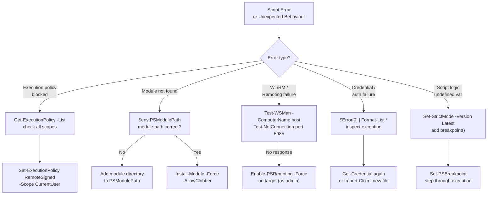

# PowerShell — Common Issues

> Part of the [PowerShell Troubleshooting](../index.md) reference.

---

## PowerShell Troubleshooting Decision Flow


```

| Policy | Behaviour |
|---|---|
| `Restricted` | No scripts allowed (Windows default) |
| `AllSigned` | Only scripts signed by a trusted publisher |
| `RemoteSigned` | Remote scripts need a signature; local scripts run freely |
| `Unrestricted` | All scripts run; remote scripts prompt for confirmation |
| `Bypass` | Nothing blocked, no warnings |

## Module Not Found Errors

```powershell
# Confirm the module is installed
Get-InstalledModule -Name ActiveDirectory -ErrorAction SilentlyContinue

# Check PSModulePath
$env:PSModulePath -split ';'

# Add a custom module path permanently (current user)
$profilePath = [System.Environment]::GetFolderPath('MyDocuments') + '\PowerShell\Modules'
[Environment]::SetEnvironmentVariable('PSModulePath', "$env:PSModulePath;$profilePath", 'User')

# Diagnose import failure with verbose output
Import-Module -Name MyModule -Verbose -ErrorAction Stop

# Check for .NET dependency issues
[System.AppDomain]::CurrentDomain.GetAssemblies() | Where-Object Location -like '*MyModule*'
```

## PowerShell Remoting Issues

```powershell
# Enable remoting on a target machine (run as admin on the target)
Enable-PSRemoting -Force -SkipNetworkProfileCheck

# Test connectivity before running commands
Test-WSMan -ComputerName server01
Test-NetConnection -ComputerName server01 -Port 5985

# Test basic remote session
$session = New-PSSession -ComputerName server01 -Credential (Get-Credential)
Invoke-Command -Session $session -ScriptBlock { hostname }
Remove-PSSession $session

# Diagnose firewall — WinRM ports
# HTTP:  5985
# HTTPS: 5986
Get-NetFirewallRule -DisplayName "Windows Remote Management*" | Select-Object DisplayName, Enabled

# Use SSL for secure remoting
$sessionOption = New-PSSessionOption -SkipCACheck -SkipCNCheck
New-PSSession -ComputerName server01 -UseSSL -SessionOption $sessionOption
```

## Debugging Scripts

```powershell
# Set strict mode to catch undefined variables and functions
Set-StrictMode -Version Latest

# Use Write-Debug statements (only show when $DebugPreference = 'Continue')
$DebugPreference = 'Continue'
Write-Debug "Variable value: $myVar"

# Breakpoints for interactive debugging
Set-PSBreakpoint -Script C:\Scripts\deploy.ps1 -Line 42
Set-PSBreakpoint -Variable myVar -Mode ReadWrite

# Step through script in VS Code
# Set a breakpoint then press F5 or use the Debug panel

# Trace execution
Set-PSDebug -Trace 1   # trace each line
Set-PSDebug -Trace 0   # disable tracing

# Error handling pattern
try {
    Get-Content -Path 'nonexistent.txt' -ErrorAction Stop
} catch [System.IO.FileNotFoundException] {
    Write-Error "File not found: $_"
} catch {
    Write-Error "Unexpected error: $($_.Exception.Message)"
} finally {
    Write-Verbose "Cleanup complete"
}
```

## Common Error Reference

```powershell
# View full error details from $Error automatic variable
$Error[0] | Format-List * -Force
$Error[0].Exception.InnerException

# Check exit code of external tools
ping 192.168.1.1 -n 1
$LASTEXITCODE

# Suppress errors for optional operations
Get-Process -Name nonexistent -ErrorAction SilentlyContinue
```
