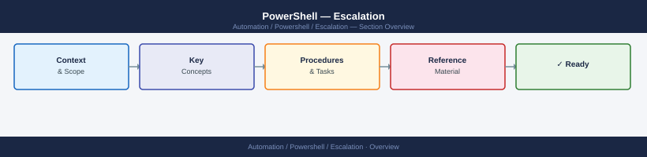

---
tags:
  - powershell
  - troubleshooting
search:
  boost: 1.5
---
# PowerShell — Escalation

<div class="kb-summary">
PowerShell escalation: when to escalate to Microsoft support, how to file a PowerShell Core bug, how to collect WinRM and DSC diagnostics, and the escalation path for remoting, module, and scheduled-task failures.

*Applies to: PowerShell 5.1 / PowerShell 7.x*
</div>



## Before you begin

- **Access:** Local admin on affected hosts; domain admin if the issue involves WinRM group policy or JEA endpoints
- **Gather first:** `$PSVersionTable`, the full error message and stack trace, and the exact command that failed
- **Scope:** confirm whether the issue is host-specific, user-specific, or affects all remoting sessions
- **Module issues:** identify the specific module and version (`Get-InstalledModule <name>`); the vendor of that module owns the bug
- **Logging:** run `Start-Transcript` before reproducing the issue to capture complete session output

---

## Severity Levels

| Severity | Definition | Escalation Path |
|---|---|---|
| Critical | WinRM broken across all servers after OS update — automation pipeline halted | Immediate: infra team + Microsoft support case |
| High | JEA endpoint not responding — privileged access broken for ops team | Same day: infra team → Microsoft support if WinRM config is correct |
| Medium | Specific module returning wrong data — automation producing incorrect results | Next business day: vendor of the module's support portal |
| Low | Script intermittently times out; DSC drift detected on non-production nodes | Team: investigate locally with verbose logging |

## Pre-Escalation Triage Checklist

| Check | Command | Expected Result |
|---|---|---|
| PS version matches expected | `$PSVersionTable` | `PSVersion: 7.4.x` or `5.1.x` |
| WinRM service running | `Get-Service WinRM` | `Status: Running` |
| WinRM listener configured | `winrm enumerate winrm/config/listener` | Listener on HTTP or HTTPS |
| Remote connectivity test | `Test-WSMan -ComputerName <target>` | No error returned |
| Execution policy allows scripts | `Get-ExecutionPolicy -List` | `RemoteSigned` or `Unrestricted` at appropriate scope |
| Module installed and version correct | `Get-InstalledModule <module>` | Expected version number |
| JEA endpoint registered | `Get-PSSessionConfiguration` | Target endpoint visible in list |
| DSC status clean | `Get-DscConfigurationStatus` | `Status: Success` on last enactment |

---

## Step-by-Step Data Collection

### 1. Collect PowerShell environment info

```powershell
# Collect all PS environment details into a single file
$outDir = "C:\Temp\ps-diag-$(Get-Date -Format yyyyMMdd-HHmmss)"
New-Item -ItemType Directory -Path $outDir | Out-Null

$PSVersionTable | ConvertTo-Json | Out-File "$outDir\PSVersionTable.json"
Get-ExecutionPolicy -List | Out-File "$outDir\ExecutionPolicy.txt"
($env:PSModulePath -split [IO.Path]::PathSeparator) | Out-File "$outDir\ModulePath.txt"
Get-InstalledModule | Select-Object Name, Version, Repository | Export-Csv "$outDir\InstalledModules.csv" -NoTypeInformation
Get-Module | Select-Object Name, Version, ModuleType, Path | Export-Csv "$outDir\LoadedModules.csv" -NoTypeInformation
[System.Environment]::OSVersion | ConvertTo-Json | Out-File "$outDir\OSVersion.json"
[System.Environment]::Is64BitOperatingSystem | Out-File "$outDir\Is64Bit.txt"

Write-Host "Diagnostics saved to $outDir"
```

### 2. Collect WinRM diagnostics

```powershell
# Full WinRM configuration
winrm get winrm/config 2>&1 | Out-File "$outDir\WinRMConfig.txt"
winrm enumerate winrm/config/listener 2>&1 | Out-File "$outDir\WinRMListeners.txt"

# Active WinRM sessions
Get-WSManInstance -ResourceURI Shell -Enumerate 2>&1 | Out-File "$outDir\WSManSessions.txt"

# WinRM event log (last 200 entries)
Get-WinEvent -LogName "Microsoft-Windows-WinRM/Operational" -MaxEvents 200 |
  Select-Object TimeCreated, Id, LevelDisplayName, Message |
  Export-Csv "$outDir\WinRMEvents.csv" -NoTypeInformation

# Test connectivity to a specific target
Test-WSMan -ComputerName <target-hostname> -ErrorAction Stop 2>&1 | Out-File "$outDir\WSManTest.txt"
```

### 3. Collect JEA endpoint diagnostics

```powershell
# All registered session configurations
Get-PSSessionConfiguration | Format-List | Out-File "$outDir\JEAEndpoints.txt"

# Test connecting to a specific JEA endpoint
$session = New-PSSession -ComputerName <target> -ConfigurationName <jea-endpoint-name>
Invoke-Command -Session $session { Get-Command }
Remove-PSSession $session
```

### 4. Collect DSC diagnostics

```powershell
# DSC configuration status and LCM settings
Get-DscConfigurationStatus | Format-List | Out-File "$outDir\DSCStatus.txt"
Get-DscLocalConfigurationManager | Format-List | Out-File "$outDir\LCMConfig.txt"
Get-DscResource | Select-Object Name, Module, Version | Export-Csv "$outDir\DSCResources.csv" -NoTypeInformation

# DSC event log
Get-WinEvent -LogName "Microsoft-Windows-DSC/Operational" -MaxEvents 100 |
  Select-Object TimeCreated, Id, LevelDisplayName, Message |
  Export-Csv "$outDir\DSCEvents.csv" -NoTypeInformation
```

### 5. Capture the issue with transcript

```powershell
# Start a transcript BEFORE reproducing the failure
Start-Transcript -Path "$outDir\Transcript.txt"

# Reproduce the failing command here:
# <your failing command>

Stop-Transcript
```

### 6. Write the timeline

```text
PowerShell version: 7.4.2 (Windows Server 2022)
Module (if applicable): <module-name> version <version>
Issue first observed: 2026-06-15 11:00 UTC
Last known good: 2026-06-15 09:30 UTC

Error message:
  <paste exact error and stack trace>

Commands run:
  1. <command 1> → <result>
  2. <command 2> → <result>

Changes in 24h before issue:
  - Windows Update applied (KB5034441)
  - Module <name> updated from 3.1.0 to 3.2.0

Blast radius:
  - All WinRM sessions to production servers failing
  - OR: Only module X failing; other automation working normally
```

---

## How to Open a Support Case

**For PowerShell Core bugs** (not Microsoft support — community issue tracker):

1. Go to **github.com/PowerShell/PowerShell/issues** and search for your error first.
2. If no existing issue: click **New issue** → choose **Bug Report**.
3. Fill in the template: PS version, OS, steps to reproduce, expected vs actual behaviour.
4. Attach the transcript and minimal reproduction script.

**For WinRM / DSC / Windows-level issues** (Microsoft support):

1. Go to **support.microsoft.com** and sign in with a Microsoft account linked to your Microsoft contract.
2. Select **Create a support request**.
3. Under **Product family**, choose **Windows Server**.
4. Under **Problem type**, select **Remote Management (WinRM/PowerShell)** or **Desired State Configuration**.
5. Under **Severity**, select:
   - **A — Critical**: All remote management broken; automation pipeline down
   - **B — High**: WinRM broken on a group of servers; workaround available
   - **C — Moderate**: Non-critical endpoint issue; reproducible but not blocking
6. In the **Description**, paste: PS version, OS version, WinRM config output, event log entries, transcript.
7. Upload the `$outDir` folder as a ZIP.

**For module-specific bugs**: use the module vendor's support portal:
- VMware PowerCLI: support.broadcom.com → VMware Products
- Dell OpenManage: dell.com/support
- AWS Tools for PowerShell: github.com/aws/aws-tools-for-powershell/issues

---

## Escalation Path

```text
Step 1 — Identify the failure layer: PowerShell itself, WinRM transport, or a specific module
         ↓
Step 2 — WinRM transport issue: infra team checks WinRM service, firewall (TCP 5985/5986),
         certificates (HTTPS listener), and group policy (WinRM settings via GPO)
         ↓
Step 3 — Module bug: vendor support portal for the module's owner
         File a GitHub issue if the module is open-source with a minimal repro script
         ↓
Step 4 — PowerShell Core bug: github.com/PowerShell/PowerShell/issues
         Include minimal repro, PS version, OS version, and full error
         ↓
Step 5 — Windows-level WinRM or DSC bug: Microsoft support case at support.microsoft.com
         Attach WinRM config, event logs, and the diagnostic directory
         ↓
Step 6 — If Microsoft case is not progressing within SLA:
         → Reply in the case: "Requesting escalation — impact: [describe production impact]"
```

---

## What NOT to Do

| Do NOT do this | Why | What to do instead |
|---|---|---|
| Run `winrm quickconfig` on production servers without change management | Resets listener config and can enable HTTP where only HTTPS was configured | Test on a non-production host first; review the exact changes quickconfig makes |
| Delete and re-create the WinRM HTTPS certificate | Breaks all in-flight remote sessions and may lock out automation accounts | Renew the cert while the existing one is still valid; update bindings after |
| Uninstall and reinstall the failing PowerShell module without version pinning | May install a newer version with additional breaking changes | Pin to the last known-good version: `Install-Module -RequiredVersion <version>` |
| Run `Set-ExecutionPolicy Unrestricted` on production servers | Allows all scripts including unsigned malicious scripts to run | Use `RemoteSigned` at machine scope; sign your own scripts |
| Attempt DSC re-enactment during a suspected corruption event | Can write partial configuration state, making recovery harder | Stop the LCM first: `Stop-DscConfiguration -Force`; then assess before re-applying |

---

## Useful Commands for Case Updates

```powershell
# Quick state snapshot — paste into every case update
$PSVersionTable
winrm get winrm/config
Get-Service WinRM | Select-Object Name, Status, StartType

# Verify WinRM connectivity (include output in case updates)
Test-WSMan -ComputerName <target>

# Check if the specific failing command reproduces with verbose output
$VerbosePreference = 'Continue'
$ErrorActionPreference = 'Stop'
# <run failing command>

# Scheduled task last result (for automation failures)
Get-ScheduledTaskInfo -TaskName 'MyAutomationTask' |
  Select-Object LastRunTime, LastTaskResult, NextRunTime

# LastTaskResult code lookup
$result = (Get-ScheduledTaskInfo -TaskName 'MyAutomationTask').LastTaskResult
"Exit code: $result (0x{0:X8})" -f $result

# Windows event log for PowerShell script block logging
Get-WinEvent -LogName "Microsoft-Windows-PowerShell/Operational" -MaxEvents 50 |
  Where-Object { $_.Id -in 4103, 4104 } |
  Select-Object TimeCreated, Id, Message |
  Format-List
```

---

## See also

- [PowerShell — Diagnostics](../diagnostics/)
- [PowerShell — Common Issues](../common-issues/)

---

## Verify resolution

- Confirm `Test-WSMan -ComputerName <target>` returns cleanly
- Re-run the failing automation script in a non-production environment first
- Check the WinRM event log and PowerShell operational log for any residual errors
- Monitor scheduled tasks for one full cycle to confirm all automation is completing successfully
