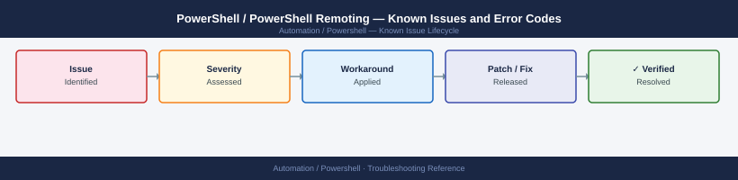

---
tags:
  - troubleshooting
  - powershell
  - automation
  - known-issues
---
# PowerShell / PowerShell Remoting — Known Issues and Error Codes

<div class="kb-summary">
Catalog of known PowerShell and WinRM bugs, error codes, and workarounds covering remoting, execution policy, and module loading.

*Applies to: PowerShell 5.1 (Windows), PowerShell 7.x (cross-platform)*
</div>



```d2
direction: down

symptom: Identify Symptom {shape: diamond}
remoting_winrm: "Remoting (WinRM)" {shape: rectangle}
execution_policy: "Execution Policy" {shape: rectangle}
module_loading: "Module Loading" {shape: rectangle}
resolution: Resolve or Escalate {shape: oval}

symptom -> remoting_winrm: investigate
symptom -> execution_policy: investigate
symptom -> module_loading: investigate
remoting_winrm -> resolution
execution_policy -> resolution
module_loading -> resolution
```

## Before you begin

- Most PowerShell issues are execution policy, WinRM configuration, or TLS version mismatches.
- `$PSVersionTable` shows current PowerShell version and platform.
- Enable transcript logging: `Start-Transcript -Path <log>` for persistent capture.

## Remoting (WinRM)

| Error / Symptom | Affected Versions | Cause | Workaround / Fix | Fixed In |
|---|---|---|---|---|
| `Access is denied` during `Enter-PSSession` | PS 5.1/7.x | Current user not in WinRM access group on target | Add user to `Remote Management Users` group on target | N/A |
| `The WinRM client cannot complete the operation` | PS 5.1 | WinRM TrustedHosts not configured for target | Add target: `Set-Item WSMan:\localhost\Client\TrustedHosts -Value "<target>"` | N/A |
| `Cannot connect to server — CredSSP not enabled` | PS 5.1 | CredSSP required but not enabled client or server side | Enable client: `Enable-WSManCredSSP -Role Client -DelegateComputer *`; enable server: `Enable-WSManCredSSP -Role Server` | N/A |

## Execution Policy

| Error / Symptom | Affected Versions | Cause | Workaround / Fix | Fixed In |
|---|---|---|---|---|
| `File ... cannot be loaded because running scripts is disabled` | All | Execution policy set to `Restricted` | Set policy: `Set-ExecutionPolicy -ExecutionPolicy RemoteSigned -Scope CurrentUser` | N/A |
| Script blocked even with `RemoteSigned` | PS 5.1 | Script downloaded from internet; has Zone.Identifier NTFS stream | Unblock: `Unblock-File -Path <script.ps1>` | N/A |

## Module Loading

| Error / Symptom | Affected Versions | Cause | Workaround / Fix | Fixed In |
|---|---|---|---|---|
| `Module not found` after install | PS 7.x on Linux | Module installed for PS 5.1 on Windows; path not shared | Reinstall module in PS 7.x scope: `Install-Module <name> -Scope CurrentUser` | N/A |
| Module version conflict | PS 5.1 | Multiple versions installed; `Import-Module` loads wrong one | Import specific version: `Import-Module <name> -RequiredVersion <ver>` | N/A |

## See also

- [PowerShell — Common Issues](../common-issues/)
