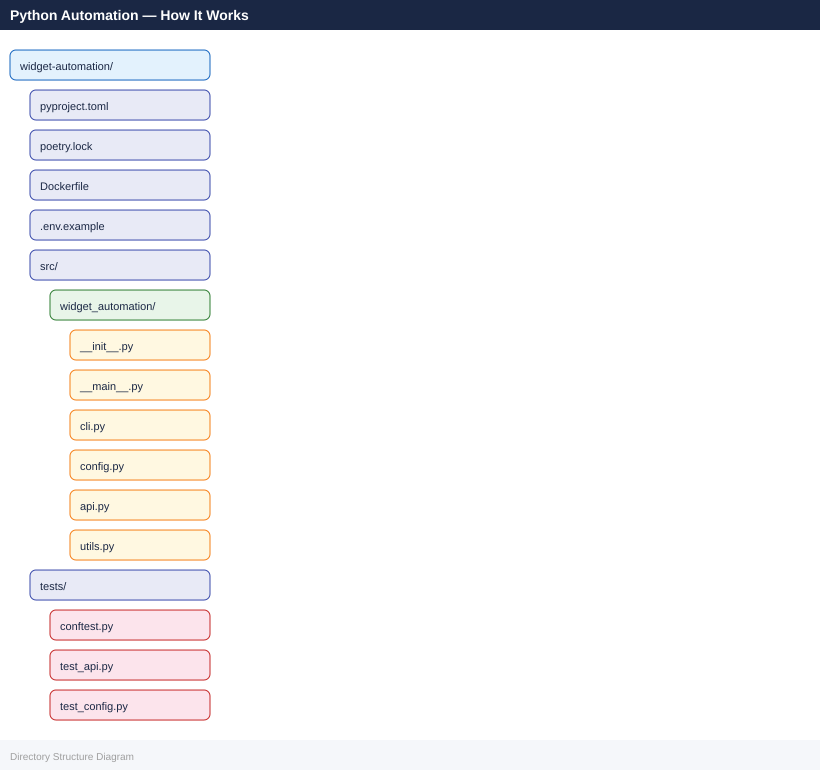

---
tags:
  - architecture
  - python
---
# Python Automation — How It Works

<div class="kb-summary">
Python is the dominant language for infrastructure automation, data pipelines, and API integration in modern enterprise environments. This page covers architecture patterns, runtime models, and execution strategies for production Python automation.

*Applies to: Python 3.x*
</div>

---

## Architecture Model

```d2
direction: right

A: "Script / Service entrypoint" {shape: rectangle}
B: "Virtual Environment\nvenv / poetry / pipenv" {shape: rectangle}
C: "Application Code" {shape: rectangle}
D: "Standard Library\nos, pathlib, subprocess, logging" {shape: rectangle}
E: "Third-Party Libraries\nrequests, boto3, paramiko, pydantic" {shape: rectangle}
F: "Internal Packages\nshared utilities, config loaders" {shape: rectangle}
G: "G" {shape: rectangle}
H: "Cloud APIs\nAWS / Azure / GCP" {shape: rectangle}
I: "Infrastructure APIs\nvSphere / NetBox / Vault" {shape: rectangle}
J: "Databases\nPostgreSQL / SQLite / Redis" {shape: rectangle}
L: "Remote Hosts\nSSH via paramiko / fabric" {shape: rectangle}

A -> B
B -> C
C -> D
C -> E
C -> F
D -> E
E -> F
G -> H
G -> I
G -> J
G -> L
```

---

## Async Patterns

Use `asyncio` when automation involves high concurrency (many API calls, multiple SSH connections).

| Scenario | Use asyncio? |
|---|---|
| Many concurrent HTTP/API calls | Yes |
| Multiple SSH connections in parallel | Yes (with `asyncssh`) |
| CPU-bound data processing | No — use `multiprocessing` |
| Simple sequential script | No — adds unnecessary complexity |

```python
import asyncio
import aiohttp

async def fetch_widget(session, name, semaphore):
    async with semaphore:
        async with session.get(f"/api/widgets/{name}") as resp:
            resp.raise_for_status()
            return await resp.json()

async def fetch_all(names):
    sem = asyncio.Semaphore(10)
    async with aiohttp.ClientSession(base_url="https://api.example.com") as s:
        return await asyncio.gather(*[fetch_widget(s, n, sem) for n in names])
```

---

## Containerisation with Docker

```dockerfile
FROM python:3.12-slim
RUN useradd --system --create-home automation
WORKDIR /app
COPY pyproject.toml poetry.lock ./
RUN pip install --no-cache-dir poetry && \
    poetry config virtualenvs.create false && \
    poetry install --only main --no-root
COPY --chown=automation:automation . .
USER automation
ENTRYPOINT ["python", "-m", "widget_automation"]
```

---

## Project Layout



---

## See also

- [Python — Design Standards](../design-standards/)
- [Python — Integrations](../integrations/)
- [Python — Deploy](../../deploy/)
