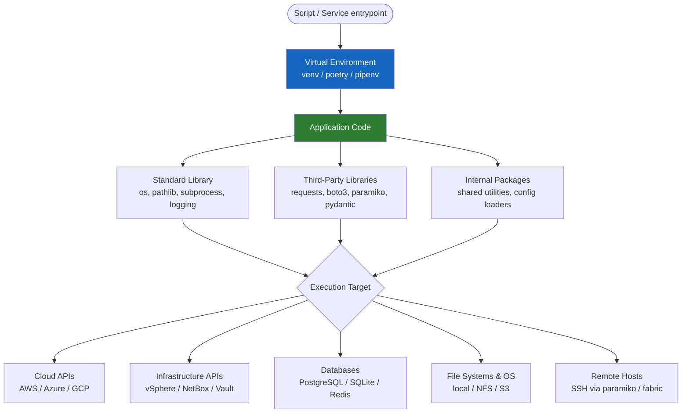

# Python Automation — How It Works


<div class="kb-summary">
Python is the dominant language for infrastructure automation, data pipelines, and API integration in modern enterprise environments. This page covers architecture patterns, runtime models, and execution strategies for production Python automation.
</div>

---

## Architecture Model


```text
┌──────────────────────────────────────── Python — How It Works ────────────────────────────────────────┐
│   ┌───────────────────────────────────────────────────────────────────────────────────────────────┐   │
│   │       CPython: source → bytecode (.pyc) → interpreted by CPython VM; no AOT compilation       │   │
│   │     Import system: finds modules via sys.path; .pth files extend path; namespace packages     │   │
│   │    async/await: coroutines on asyncio event loop; use for I/O-bound concurrency (HTTP, SSH)   │   │
│   └───────────────────────────────────────────────────────────────────────────────────────────────┘   │
│                                                                                                       │
│   ┌─────────────────────────────┐  ┌─────────────────────────────┐  ┌─────────────────────────────┐   │
│   │          Execution          │  │         Concurrency         │  │          Packaging          │   │
│   │   Source → bytecode (.pyc)  │  │    threading (GIL bound)    │  │        pyproject.toml       │   │
│   │    CPython VM interprets    │  │   multiprocessing (true //  │  │    pip install -e . (dev)   │   │
│   │    sys.path import search   │  │     asyncio (I/O bound)     │  │    build + twine publish    │   │
│   │   PYTHONDONTWRITEBYTECODE   │  │      concurrent.futures     │  │        wheel + sdist        │   │
│   └─────────────────────────────┘  └─────────────────────────────┘  └─────────────────────────────┘   │
│                                                                                                       │
│   ┌───────────────────────────────────────────────────────────────────────────────────────────────┐   │
│   │     GIL         = Global Interpreter Lock; no true thread parallelism; use multiprocessing    │   │
│   │   asyncio     = stdlib event loop; use await with async-native libraries (aiohttp, aioboto3)  │   │
│   │     concurrent.futures = ThreadPoolExecutor / ProcessPoolExecutor; simpler parallelism API    │   │
│   └───────────────────────────────────────────────────────────────────────────────────────────────┘   │
└───────────────────────────────────────────────────────────────────────────────────────────────────────┘
```

---

## Async Patterns

Use `asyncio` when automation involves high concurrency (many API calls, multiple SSH connections).

| Scenario | Use asyncio? |
|---|---|
| Many concurrent HTTP/API calls | Yes |
| Multiple SSH connections in parallel | Yes (with `asyncssh`) |
| CPU-bound data processing | No — use `multiprocessing` |
| Simple sequential script | No — adds unnecessary complexity |

```python
import asyncio
import aiohttp

async def fetch_widget(session, name, semaphore):
    async with semaphore:
        async with session.get(f"/api/widgets/{name}") as resp:
            resp.raise_for_status()
            return await resp.json()

async def fetch_all(names):
    sem = asyncio.Semaphore(10)
    async with aiohttp.ClientSession(base_url="https://api.example.com") as s:
        return await asyncio.gather(*[fetch_widget(s, n, sem) for n in names])
```

---

## Containerisation with Docker

```dockerfile
FROM python:3.12-slim
RUN useradd --system --create-home automation
WORKDIR /app
COPY pyproject.toml poetry.lock ./
RUN pip install --no-cache-dir poetry && \
    poetry config virtualenvs.create false && \
    poetry install --only main --no-root
COPY --chown=automation:automation . .
USER automation
ENTRYPOINT ["python", "-m", "widget_automation"]
```

---

## Project Layout

```text
widget-automation/
├── pyproject.toml
├── poetry.lock
├── Dockerfile
├── .env.example
├── src/
│   └── widget_automation/
│       ├── __init__.py
│       ├── __main__.py
│       ├── cli.py
│       ├── config.py
│       ├── api.py
│       └── utils.py
└── tests/
    ├── conftest.py
    ├── test_api.py
    └── test_config.py
```
