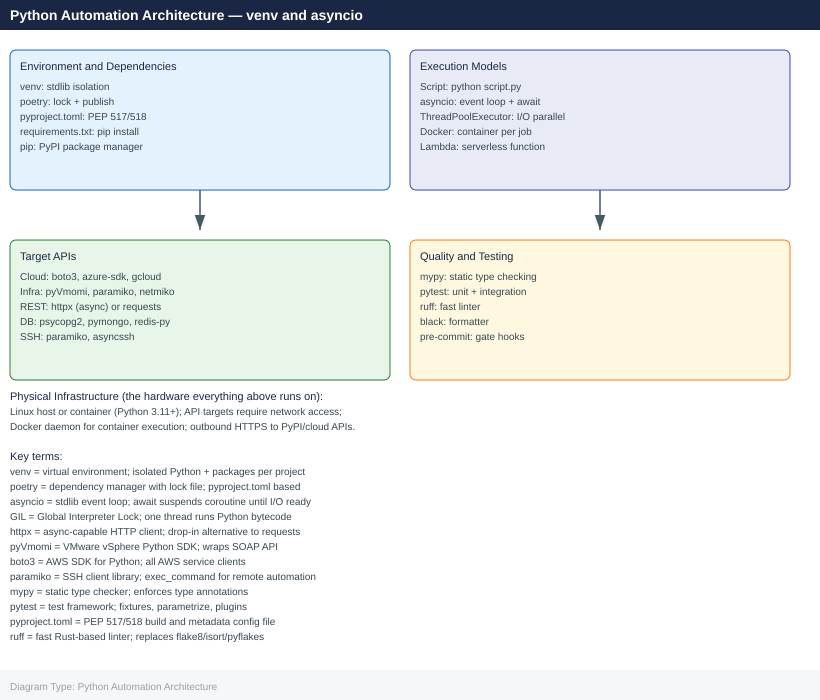
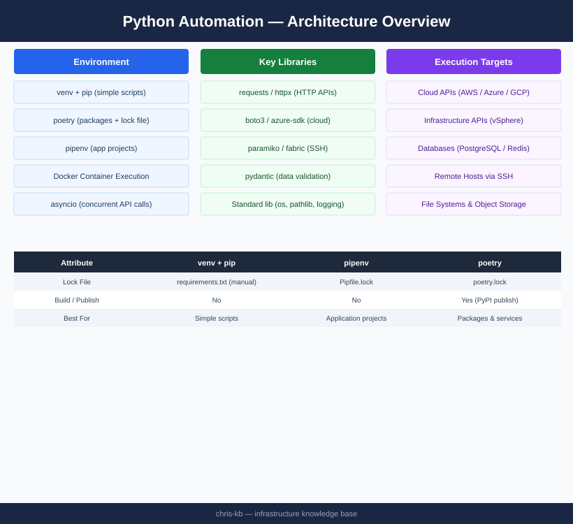

---
tags:
  - architecture
  - python
---
# Python Automation — Architecture

<div class="kb-summary">
Cross-platform automation language with virtual environment isolation, poetry/venv dependency management, asyncio for concurrent API calls, and Docker container execution; targets cloud APIs, infrastructure APIs, SSH, and databases.

*Applies to: Python 3.x*
</div>




<div class="kb-grid kb-grid-3">

<a class="kb-card" href="how-it-works/">
  <strong>How It Works</strong>
  <span>venv/poetry, execution models, asyncio patterns, Docker containerisation, project layout.</span>
</a>

<a class="kb-card" href="integrations/">
  <strong>Integrations</strong>
  <span>Integration with other platforms and external systems.</span>
</a>

<a class="kb-card" href="design-standards/">
  <strong>Design Standards</strong>
  <span>Sizing guidelines, design standards, and best practices.</span>
</a>

</div>

```d2
direction: right

center: "Python" {shape: hexagon}
virtual_environment_tools: "Virtual Environment Tools" {shape: rectangle}
architecture_model: "Architecture Model" {shape: rectangle}

center -> virtual_environment_tools
center -> architecture_model
```

## Virtual Environment Tools

| Tool | Lock file | Dependency groups | Build/publish | Best for |
|---|---|---|---|---|
| `venv` + `pip` | `requirements.txt` (manual) | No | No | Simple scripts |
| `pipenv` | `Pipfile.lock` | dev vs default | No | Application projects |
| `poetry` | `poetry.lock` | Multiple groups | Yes | Packages and services |

## Architecture Model

